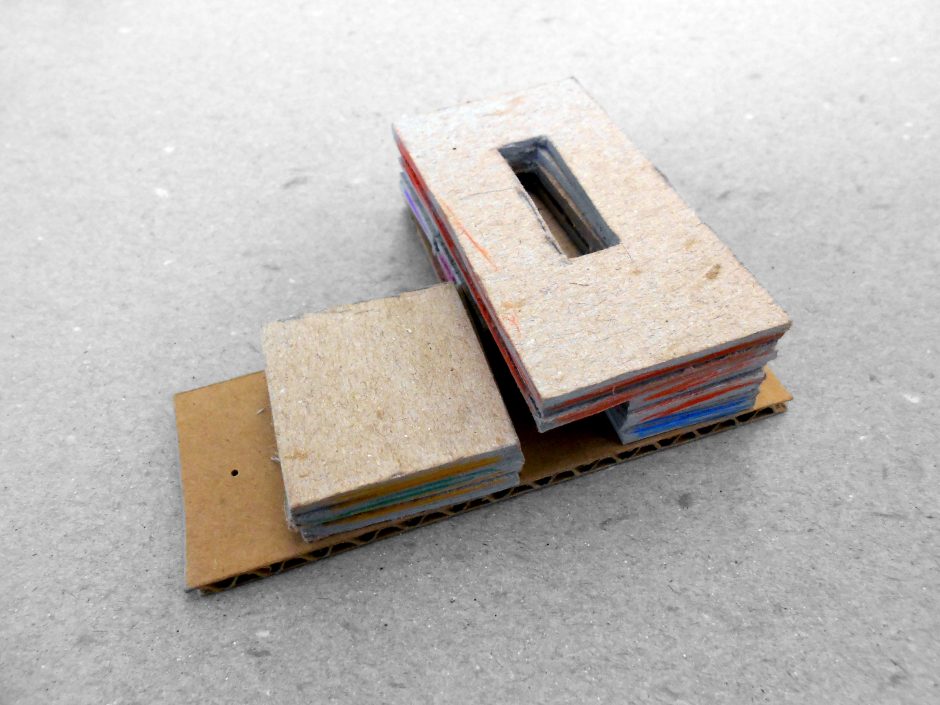
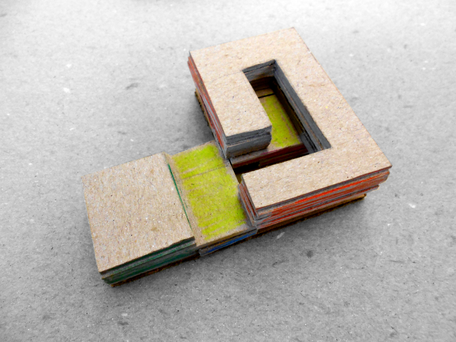
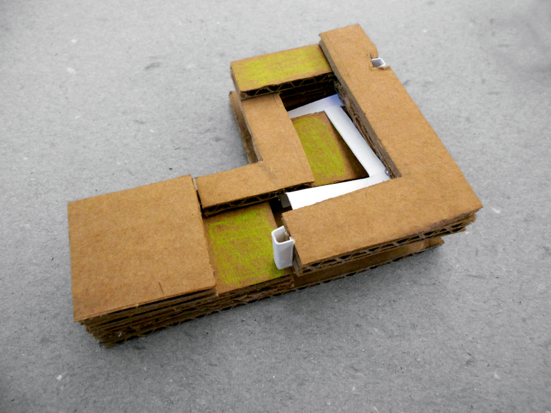
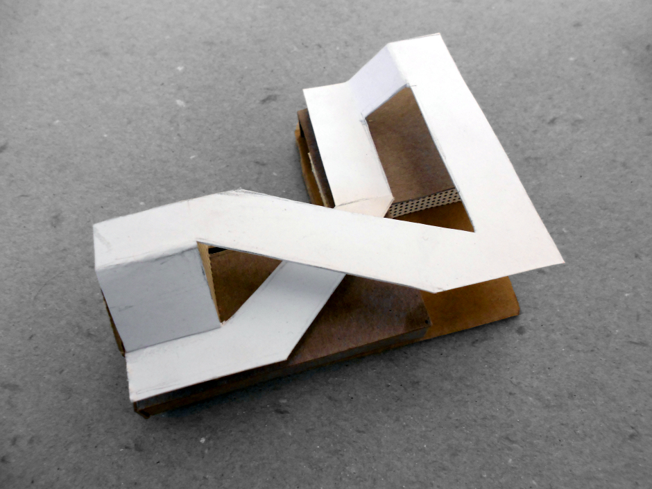
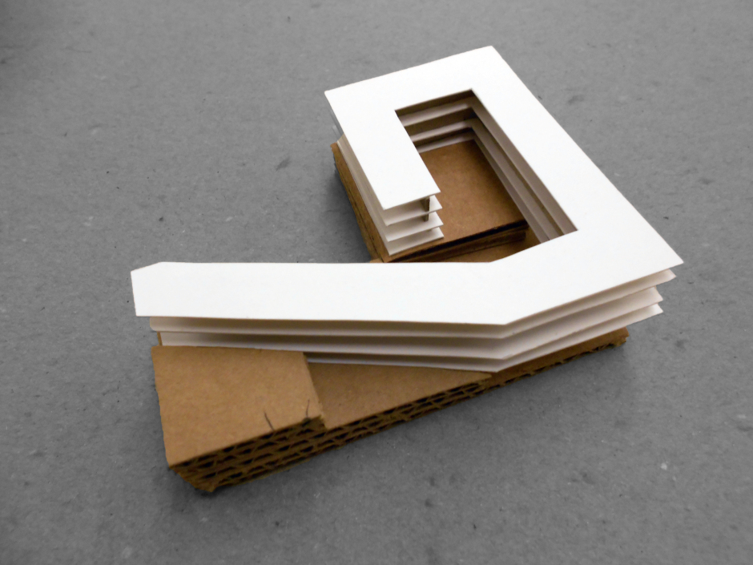
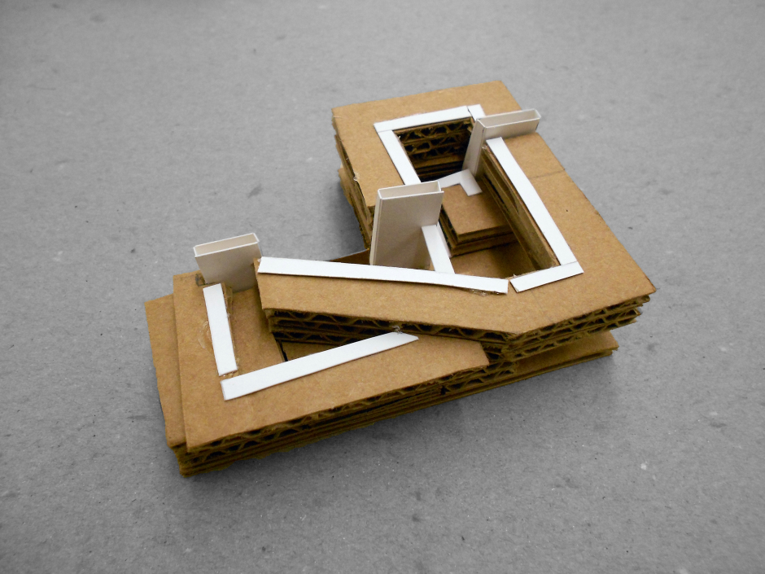

 

## Section 2: Design

### Part 2

#### Determining Direction

[This Design Sprint Wednesday video talks about how to make a decision on which direction to take with your project](https://www.youtube.com/watch?v=7BKBFOOKbNo0).

Before moving forward ask yourselves these questions in order to properly determine the scope of your project:

* How can we trim off extra, unnecessary details?
* What is the core of our concept?
* Who is responsible for which aspects of our product?
* What is the order of events?
  * What do we need to build first?
  * What comes after that... etc.

#### Iterating

Our goal is to get feedback as quickly as possible, so we can iterate on our concept.

* When is our product ready to share with others?
* Who can we share it with?
* How do we know if our product is complete?

While we build our product, we will learn that some details could be improved. It is best to learn this as quickly as possible. When our product is ready, we should share it with others and get feedback:

* What feedback did we get?
* Did they like the product?
* Did they find it confusing?

---

Header images from [learning ecologies](https://learningecologies2013.wordpress.com/2013/01/26/school-design-iterations/)
