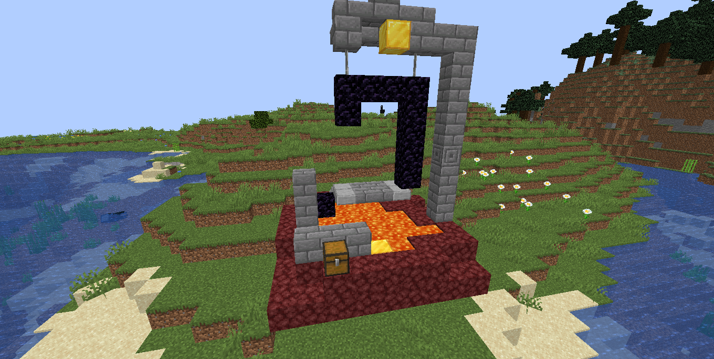
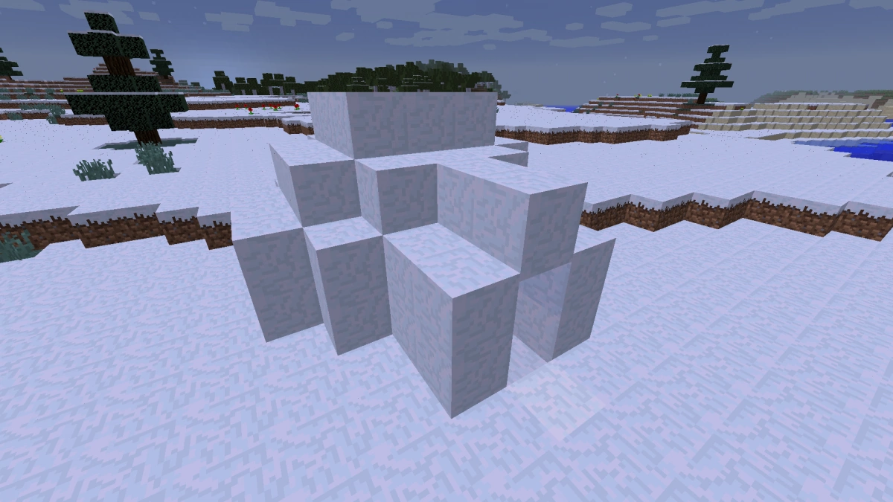
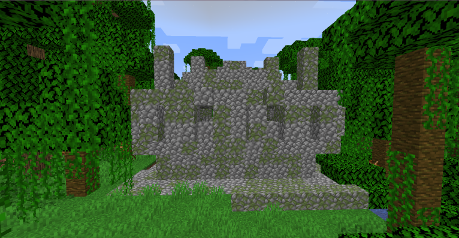
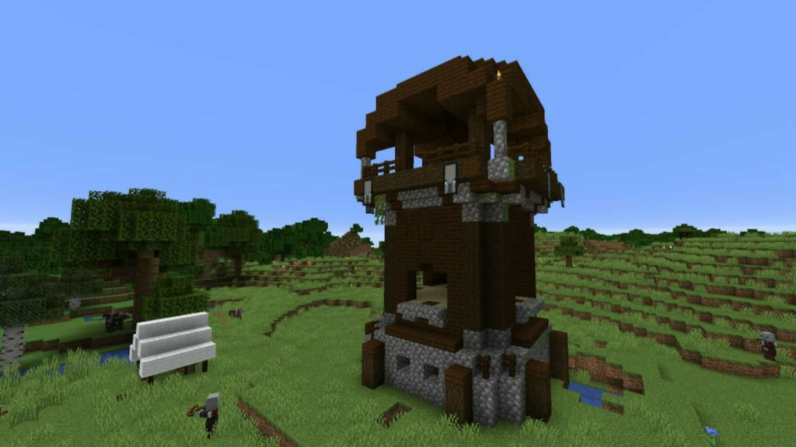

# Advanced Adventuring and Generated Structures

A generated structure is a structure that is generated when the world is created and appears artifical. For example, villages, mineshafts, and shipwrecks are all generated structures. 

It can be very useful to find these structures, as they can contain useful things like loot chests (which can contain useful items) and monster spawners (for mob farms). 

This section will describe a few structures that could be useful to you. For more information on all structures, check [the wiki](https://minecraft.fandom.com/wiki/Generated_structures).

## Aboveground Structures

### Ruined Portal (Common)

An incomplete nether portal made with obsidian, crying obsidian, and many types of stone with a netherrack platform is below it. A loot chest containing many nether related items (like golden tools, flint and steel, etc.) and gold blocks often generates with it. Note that these also generate underground and in the nether.

### Desert Pyramid (Uncommon)

Found in only deserts, desert pyramids are large buildings made of sandstone containing four loot chests hidden below terracotta. Directly below the blue terracotta and right next to the loot chests is a pressure plate that will activate a TNT trap below the pressure plate, so make sure not to drop down directly below the blue terracotta. The loot chests could contain mob drops, gold and iron ingots, horse armor, golden apples, and more.

### Igloo (Rare)

Snow buildings found in snowly plains and snowy taigas. They may contain a basement hidden under carpet. The basement contains a villager and zombie villager behind bars, a brewing stand with a weakness potion, and a loot chest that contains a golden apple and other items. The weakness potion and golden apple can be used to cure the zombie villager.

### Jungle Temple (Rare)

Overgrown cobblestone structures containing two loot chests, with one trapped with two dispensers firing arrows and the other hidden behind a lever puzzle. To get past the trap, simply walk towards the chest while making sure you are touching the right wall. You can then mine the dispenser and tripwire to disable the trap and get some extra items. To get past the puzzle, simply break through the wall containing the levers with a pickaxe. Loot chests may contain mob drops, gold and iron ingots, bamboo, enchanted books, horse armor, and more.

### Pillager Outpost (Rare)

A watchtower surrounded by up to four small structures that spawns pillagers. The watchtower is mainly made of birch planks, dark oak logs, and cobblestone. Possible items in the loot chest include dark oak logs, crossbows, arrows, iron ingots, and enchanted books.

### Woodland Mansion (Rare)

## Underwater Structures

### Ocean Ruins (Common)
### Shipwreck (Common)
### Ocean Monument (Rare)

## Underground Structures

### Dungeon (Common)
### Mineshaft (Common)

A maze with many corridors supported by wooden beams with incomplete rail systems where minecarts with chests can generate. These chests can include loot such as rails, ores, and golden apples. Cave spider spawners heavily surrounded by cobwebs can also generate here.

### Stronghold (Rare)
### Buried Treasure (Rare)

A single chest that spawns below sand in beach biomes. The chest has a high chance of containing valuable loot like ores, a heart of the sea, a potion of water breathing, and fish. Buried treasure can be located using explorer maps, which can be found in shipwrecks.

## Nether Structures

### Nether Fortress (Uncommon)
### Bastion Remnant (Uncommon)

A large, castle-like structure made of mostly basalt and blackstone. They are very dangerous, with piglins, piglin brutes (that can disable shields with axes) and hoglins that can do lots of damage and knock you into lava. But, it can be very rewarding, with many gold blocks to mine and chests that may contain gold, iron, arrows, crossbows, netherite, a lodestone, and more.

