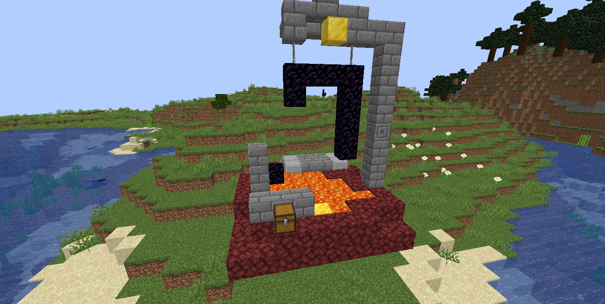
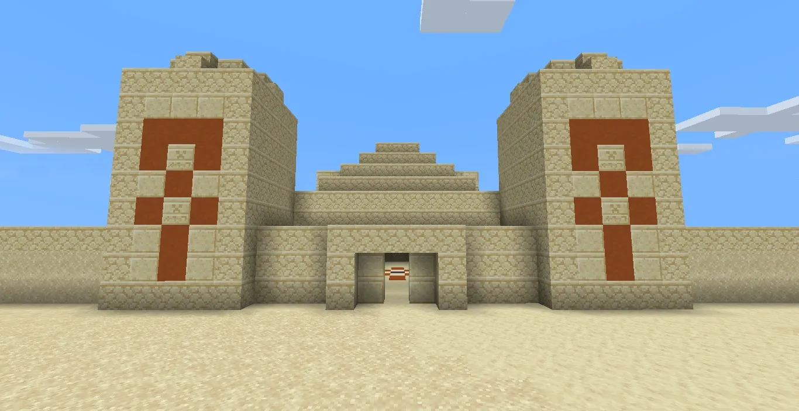
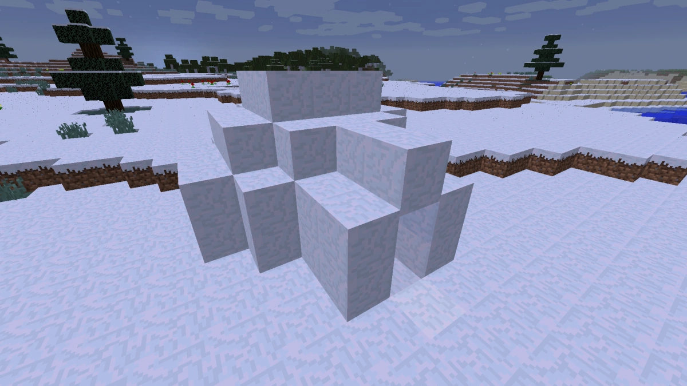
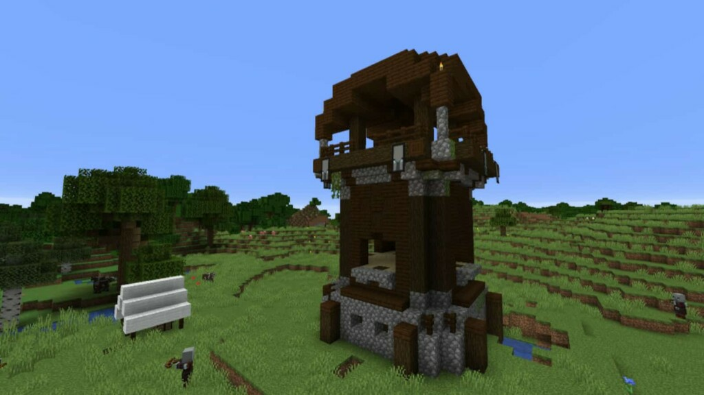
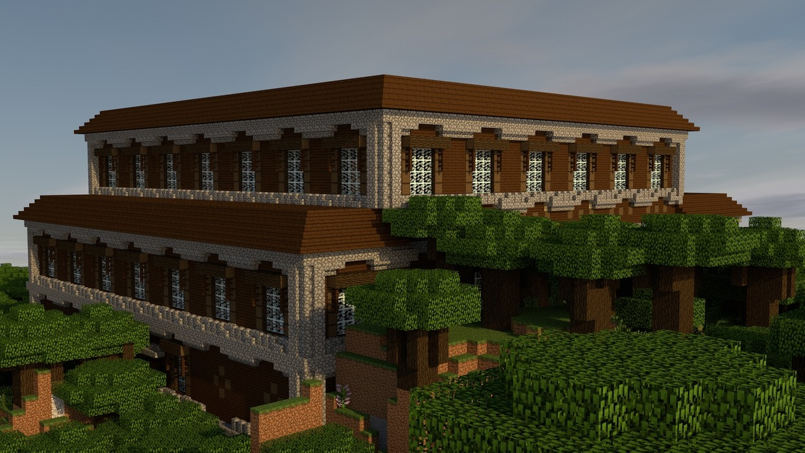
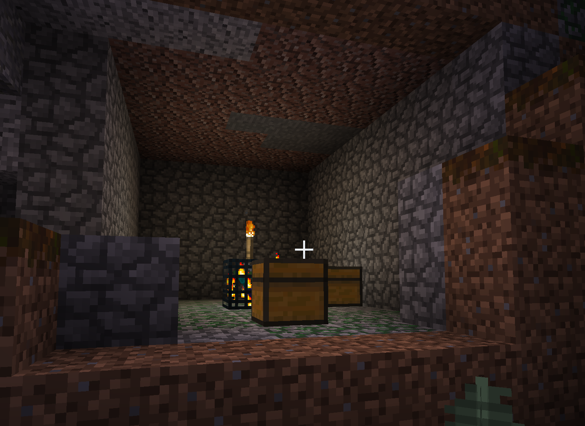
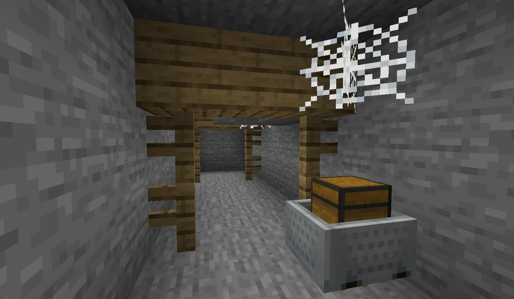
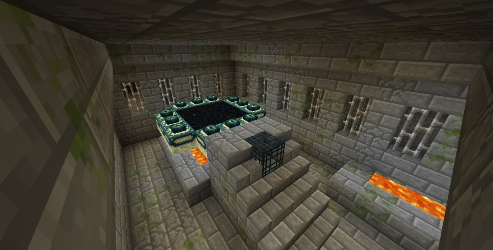
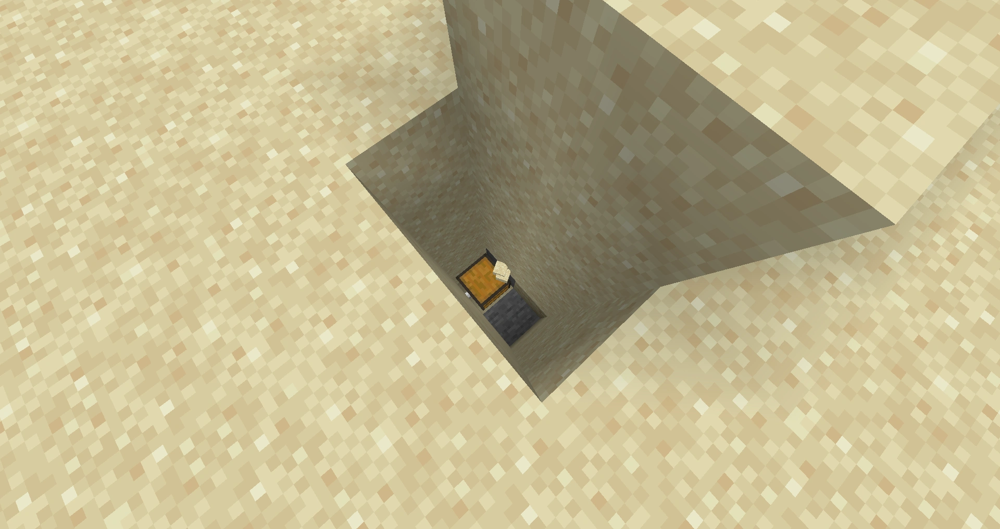
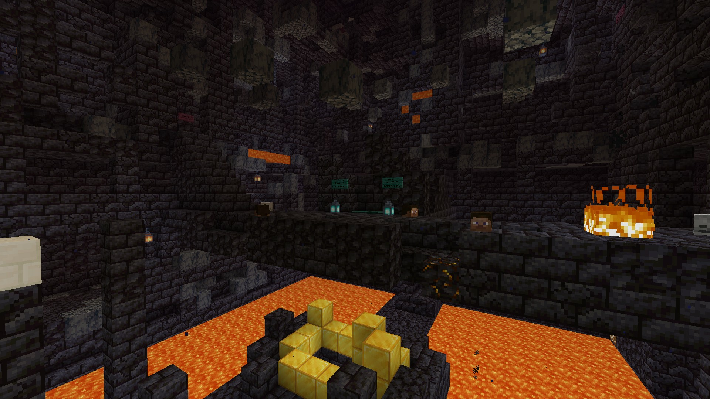

# Advanced Adventuring and Generated Structures

A generated structure is a structure that is generated when the world is created and appears artifical. For example, villages, mineshafts, and shipwrecks are all generated structures. 

It can be very useful to find these structures, as they can contain useful things like loot chests (which can contain useful items) and monster spawners (for mob farms). 

This section will describe a few structures that could be useful to you. For more information on all structures, check [the wiki](https://minecraft.fandom.com/wiki/Generated_structures).

## Aboveground Structures

### Ruined Portal (Common)

An incomplete nether portal made with obsidian, crying obsidian, and many types of stone with a netherrack platform is below it. A loot chest containing many nether related items (like golden tools, flint and steel, etc.) and gold blocks often generates with it. Note that these also generate underground and in the nether.

### Desert Pyramid (Uncommon)

Found in only deserts, desert pyramids are large buildings made of sandstone containing four loot chests hidden below terracotta. Directly below the blue terracotta and right next to the loot chests is a pressure plate that will activate a TNT trap below the pressure plate, so make sure not to drop down directly below the blue terracotta. The loot chests could contain mob drops, gold and iron ingots, horse armor, golden apples, and more.

### Igloo (Rare)

Snow buildings found in snowly plains and snowy taigas. They may contain a basement hidden under carpet. The basement contains a villager and zombie villager behind bars, a brewing stand with a weakness potion, and a loot chest that contains a golden apple and other items. The weakness potion and golden apple can be used to cure the zombie villager.

### Jungle Temple (Rare)

Overgrown cobblestone structures containing two loot chests, with one trapped with two dispensers firing arrows and the other hidden behind a lever puzzle. To get past the trap, simply walk towards the chest while making sure you are touching the right wall. You can then mine the dispenser and tripwire to disable the trap and get some extra items. To get past the puzzle, simply break through the wall containing the levers with a pickaxe. Loot chests may contain mob drops, gold and iron ingots, bamboo, enchanted books, horse armor, and more.

### Pillager Outpost (Rare)

A watchtower surrounded by up to four small structures that spawns pillagers. The watchtower is mainly made of birch planks, dark oak logs, and cobblestone. Possible items in the loot chest include dark oak logs, crossbows, arrows, iron ingots, and enchanted books.

### Woodland Mansion (Rare)

The woodland mansion is very rare and can be found only in dark forests, normally far away from spawn. A mansion is inhabited by evokers and vindicators, and is one of the few places where a totem of undying can be obtained. They can be located with woodland explorer maps, which are obtained from cartographer villagers. 

A woodland mansion naturally generates vindicators and evokers inside the mansion, but because the entrance is open and most rooms in the woodland mansion are dark, overworld monsters often spawn in woodland mansions. Make sure you are well-equipped before you attempt to clear a woodland mansion! Once ready, however, you will find a lot of loot inside a woodland mansion.

## Underwater Structures

### Ocean Ruins (Common)
Ocean ruins are underwater structures generated in normal, cold, and frozen ocean biomes, as well as their deep variants. They are composed of stone materials. All but two variants contain loot chests. They typically spawn drowned (underwater zombies) that you must fight before enjoying the loot chest. You will need some enchanted armor or a potion of water breathing to loot an ocean ruin.

### Shipwreck (Common)
A shipwreck can be found in or near the ocean and can contain up to three loot chests. Supply chests generate in the bow of the ships, treasure chests generate in the upper section of the stern, and map chests in the lower section. Any shipwreck with at least 2 chests always contains its map chest. The most valuable item in a shipwreck is a buried treasure map, which will lead you to even more loot.

### Ocean Monument (Rare)
Ocean momuments are large, heavily gaurded structures in the ocean inhabited by guardians and elder guardians. They are the only place where sponges can be found and one of the two places where prismarine can be found. It is the largest structure that does not contain a loot chest and the largest water structure. 

## Underground Structures

### Dungeon (Common)

A dungeon is a cobblestone room typically generated underground that contains a spawner and up to two loot chests. The spawner has a 50% chance of producing zombies, a 25% chance of producing skeletons, or a 25% chance of producing spiders. 

Dungeons are great for creating mob farms, so whenever possible the spawner should not be destroyed. Place light sources throughout the dungeon to prevent mobs from spawning, once your have faught off the original hoard in the dungeon.

### Mineshaft (Common)

A maze with many corridors supported by wooden beams with incomplete rail systems where minecarts with chests can generate. These chests can include loot such as rails, ores, and golden apples. Cave spider spawners heavily surrounded by cobwebs can also generate here.

### Stronghold (Rare)
Strongholds are very hard to find and for good reason -- they are the only place you can find portals to travel to the End. You can locate strongholds by throwing an eye of ender, which will go in the direction of a stronghold.

In addition to end portals, strongholds also have various types of rooms including large libraries and numerous loot chests. 

### Buried Treasure (Rare)

A single chest that spawns below sand in beach biomes. The chest has a high chance of containing valuable loot like ores, a heart of the sea, a potion of water breathing, and fish. Buried treasure can be located using explorer maps, which can be found in shipwrecks.

## Nether Structures

### Nether Fortress (Uncommon)
Nether fortresses generate in all Nether biomes. Nether fortresses are large complexes, composed of nether bricks materials, that are supported by massive pillars that tower high above the lava oceans. There are numerous loot chests inside nether fortresses, as well as many blaze spawners. Nether fortresses are also where wither skeletons can be found. Skeletons are also very common inside nether fortresses.

Nether fortresses are one of the first generated structures a player will look for, as blaze rods are necessary for brewing.

### Bastion Remnant (Uncommon)

A large, castle-like structure made of mostly basalt and blackstone. They are very dangerous, with piglins, piglin brutes (that can disable shields with axes) and hoglins that can do lots of damage and knock you into lava. But, it can be very rewarding, with many gold blocks to mine and chests that may contain gold, iron, arrows, crossbows, netherite, a lodestone, and more.
