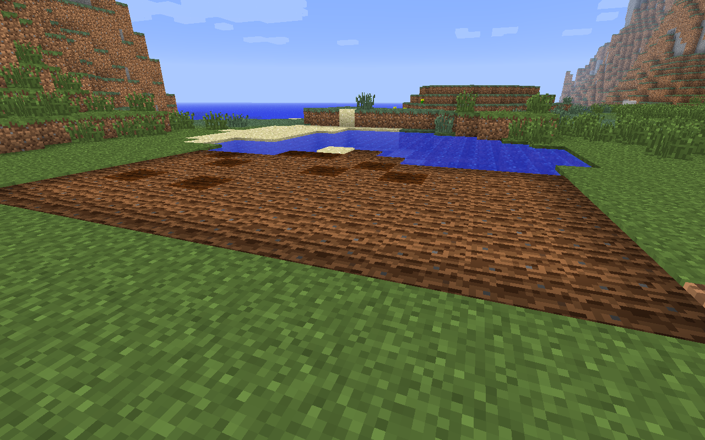

# Section 2: Advanced Survival Strategies

## Farming

A Minecraft survivor needs to quickly develop a renewable food source.

> This section is going to keep you happy and healthy throughout your Minecrafting days

The easiest source of food is getting meat from animals such as cows, pigs, and chickens. Their meat can be eaten raw or cooked; raw food has a chance of making you sick, while cooked food fills you up more. Animals, however, aren't a renewable resource (at least until you can get a breeding program started). On the other hand, wheat is an easily obtainable and fast-renewing source of food. It only requires seeds, a source of water and a hoe.

First, you need to acquire some seeds. They are dropped when long grass is destroyed. Try to start out with at least 10 seeds to get a good-sized farm going.

Use the hoe to turn some ordinary dirt blocks into farmland. Farmland needs to be hydrated by nearby water in order to remain farmland; farmland that dries out will convert back to dirt. Take a look at the screenshot below to see how far away water will hydrate farmland.

One block of water can hydrate up to 4 blocks away in all directions. Even though I plowed more than that in the picture below, the water can only hydrate the farm land up to 4 blocks away, so some of the plowed land becomes normal dirt and grass.

Plant your seeds by using them on the farmland. As long as they have a light source (the sun, torches, or other blocks) these seeds will slowly grow into wheat (the picture below has wheat in several stages of growth). The wheat will turn a yellow color when it is finished growing.

 Harvest the fully-grown wheat, which will give you wheat as well as seeds for future crops. On average, each wheat block will drop 1.5 seeds so your crop size will grow faster and faster over time. Make bread using the recipe below. Bread fills you up almost as much as cooked meat but is much more sustainable and faster to harvest.

## Ranching

As reliable as farms are, ranches offer far more utility (leather, feathers, etc...) as well as a superior source of food in terms of stats.  However, they take a bit of time to prepare and often require materials only available through a farm.  For this example, we'll be making a ranch for cows.

### Fences  

You're going to want to fence an area for your cows to keep them from wandering off.  The crafting recipes for fences are below.  

**Fence (you'll need ~8 sets)**  

**Fence Gate (at least one per pen)**  

  

You'll want to fence a decent sized area, about 8 sets of fences (24 total) will do the trick. The finished product will look something like this.  

### Herding Cattle  

Now that you have a pen, you need to herd animals into it.  For this example, we'll use cows, but you can do this with any animal.  In order to herd animals, you need to get their attention.  We can do this by using different types of "feed." Hold the appropriate feed in your hand and approach the animal; it will turn and look at you like this:  

Now the hard part, without losing the animals attention you must lead it into the pen.  Once the cow is in the pen, quickly close the gate behind you.  You will need a minimum of 2 animals to begin breeding.  

**List of Feeds**

* Chickens - seeds
* Cows, Sheep - wheat
* Pigs - carrots

Note: it is possible to herd more than one cow at a time.

### Breeding  

Once you have at least 2 cows you're all set!  Feed each cow a wheat by right-clicking.  You should see hearts appear like so:  

...after a short pause, a calf will appear!  

You will need to wait 5 minutes before you can repeat this process. Calves take 20 minutes to mature.
