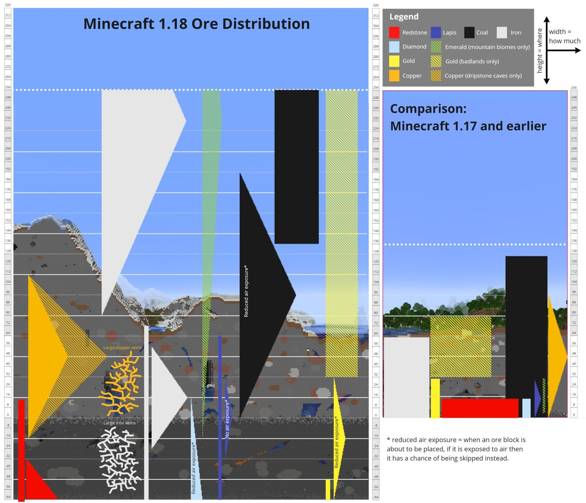
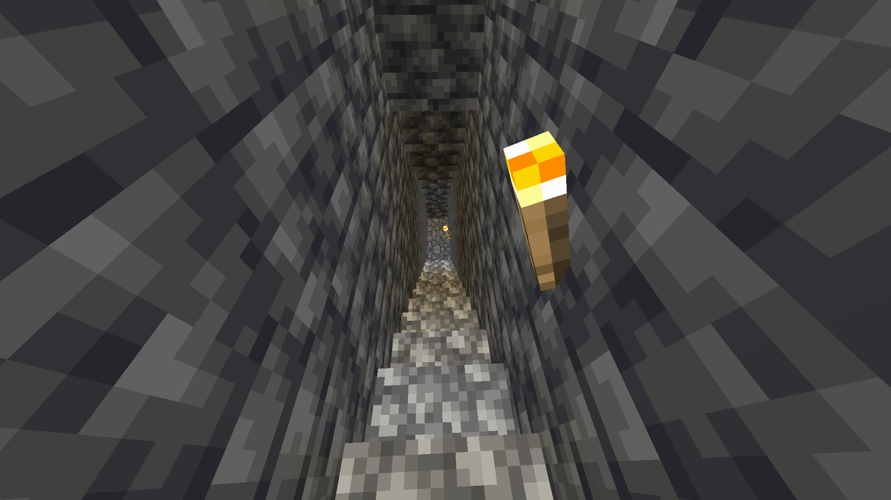
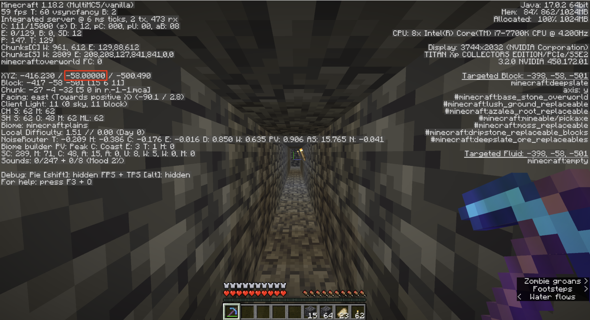
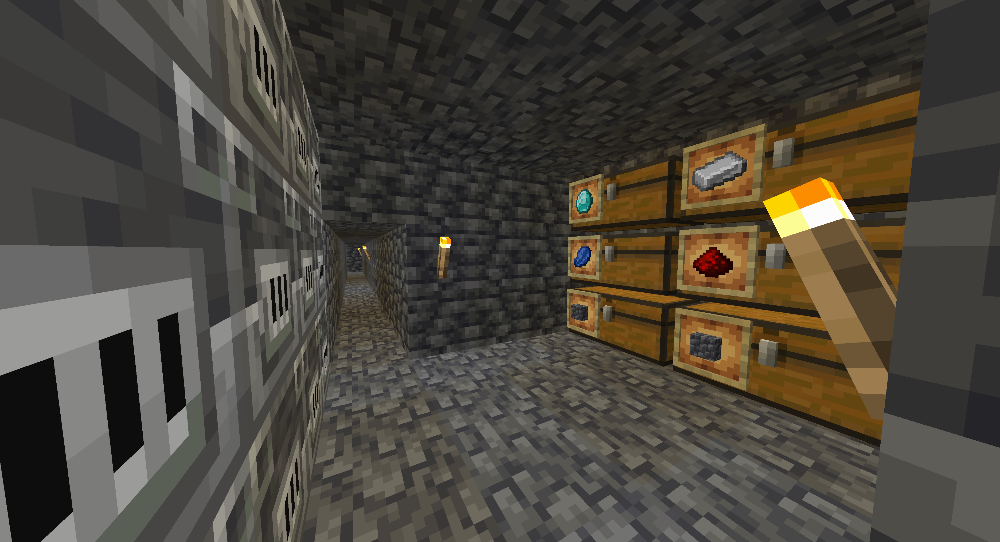
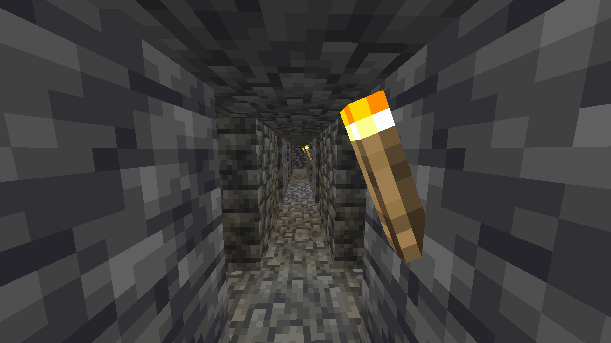
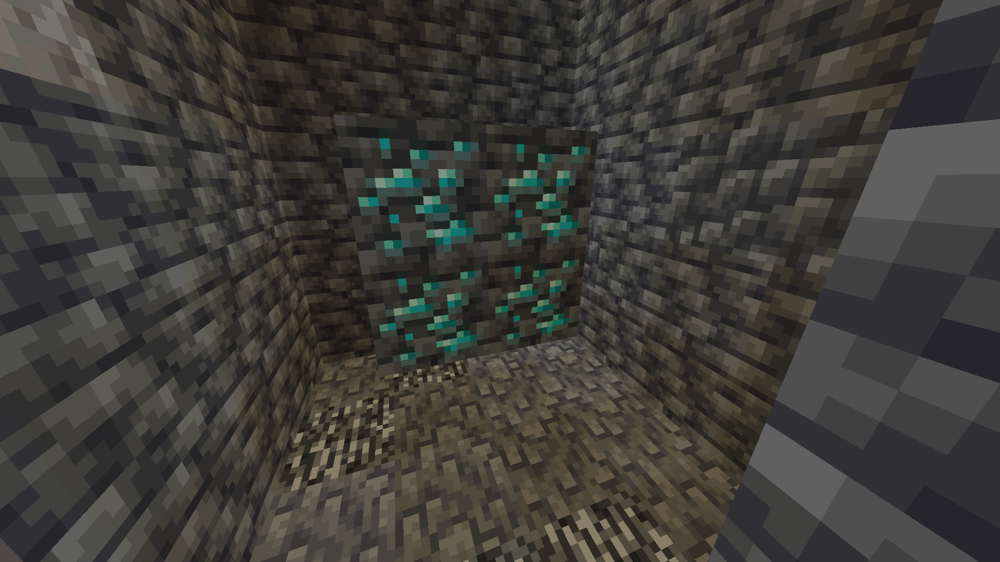
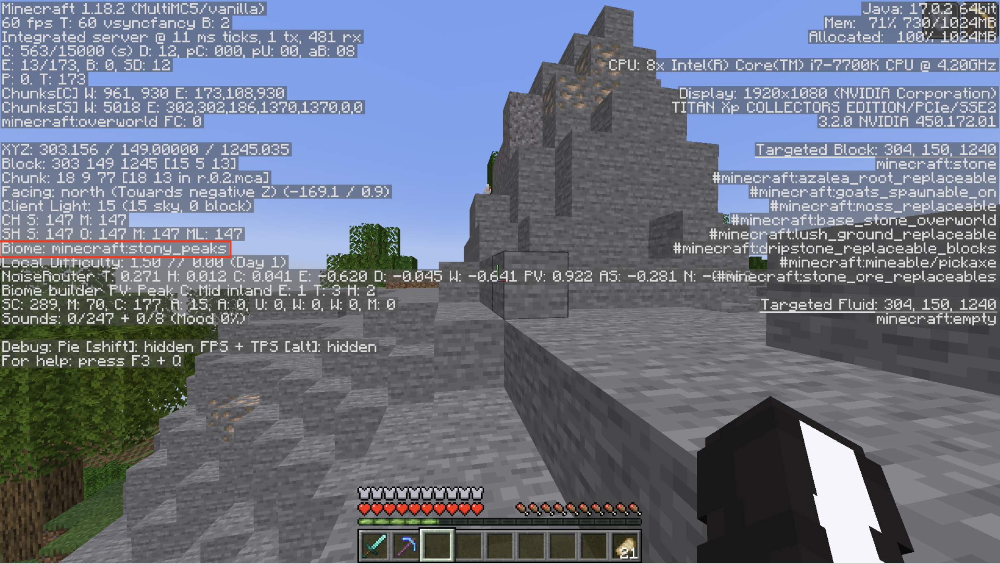
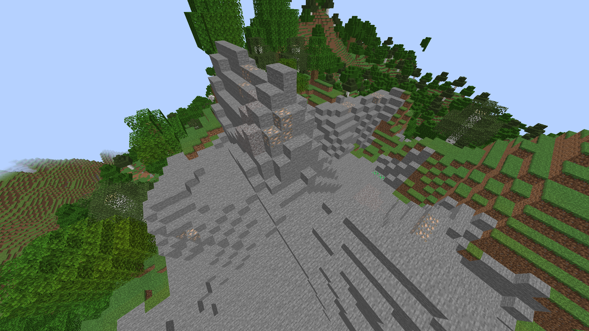

# Section 3: Mining

## Ore generation

In Minecraft, ores tend to group together at certain heights and some ores will only occur very far underground. Diamond ore, for example, spawns the most at a Y-coordinate of -58. To search for diamonds most efficiently, we need to mine at that level. This logic applys for other ores as well.

This chart tells you how fequent ores spawn at a given level.

## Basic underground mining strategies

Dig down until you hit the level where the ore you want spawns the most (check the chart above). You can check this by pressing F3. You will be mining out the level you are at and the level above it (e.g. levels -58 and -57 for diamonds).

Use the F3 key to know which level you are on.

Create an open work area where you can have chests, furnaces, and lighting. This will serve as your underground base for storing supplies and mined ore. Our mine shafts will branch off of this central area.

An efficient mining strategy is to dig 3 blocks forward, then dig out 5 blocks to either side, and repeat, as shown in the picture below. This lets us see the highest number of blocks with the fewest number of shafts. Torches should be placed every 7 blocks alongside our shaft. Any further apart, and mobs may spawn in the middle. Any closer, and we would be using more torches than needed. Try to keep all of your torches on one side. If you get lost, the torches will let you know which direction you dug in.

If you keep mining long enough, you're sure to find some good veins of ore!

## Aboveground mining

As you can see from the chart, some ores spawn the most at high Y-coordinates. This is because they generate in mountains. Mining by going to mountain biomes and digging up visible ores can be a safer alternative to underground mining.

Locate a mountain biome by exploring until you see a mountain (remember to bring enough food). You can check your biome by pressing F3. A list of mountain biomes can be found [here](https://minecraft.fandom.com/wiki/Mountains).

If you find good mountain, you'll see it can yield a lot of ore!

