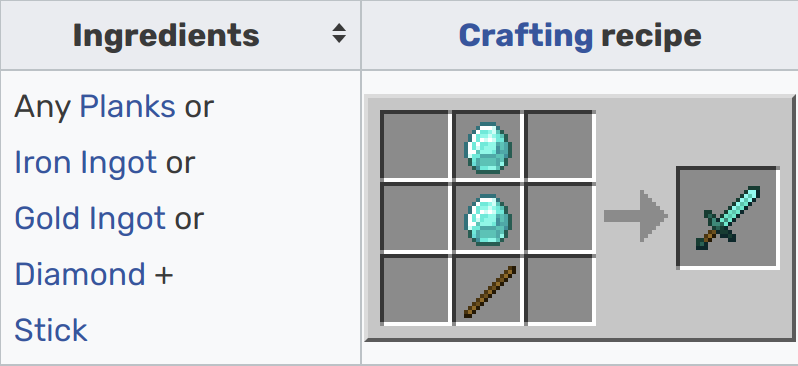
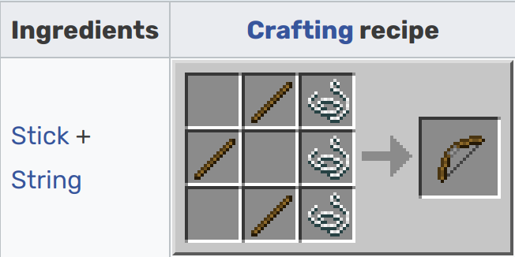
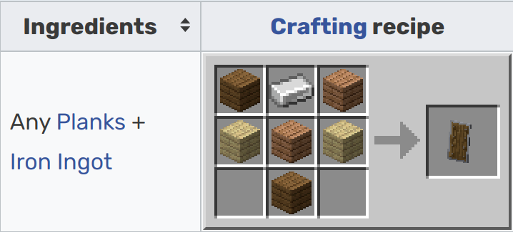
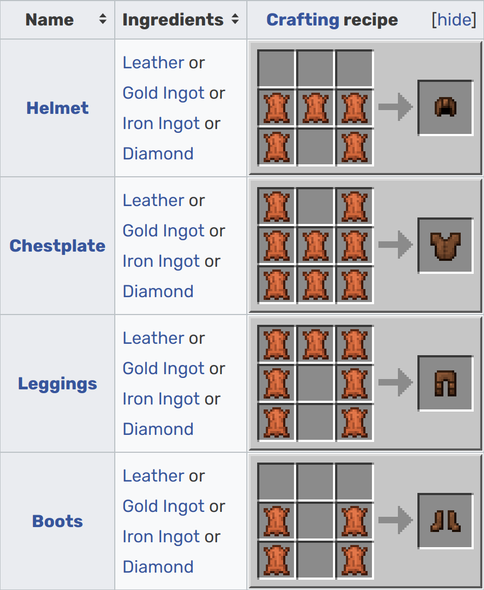

# Section 4: Fighting Mobs

A mob, or mobile entity, is defined by the Minecraft Wiki as "an AI-driven game entity resembling a living creature." 

Mobs can be separated into 3 categories: 
1. Passive mobs, which don't attack you
2. Neutral mobs, which try to attack you only if you attack them
3. Hostile mobs, or monsters, which will always try to attack you. 

Many neutral and hostile mobs may be hard to fight, so this section will teach some mob fighting strategies. If you want more detail about how to fight a specific mob, [see this tutorial](https://www.kodeclik.com/how-to-kill-mobs-minecraft/).

## Tools

### Melee Weapons
You generally want to use the best sword you can get to maximize your damage. Swords go from worst to best like this: gold, wood, stone, iron, diamond, netherite. If you are good at aiming, using axes is a better alternative to swords until you get an iron sword. To do damage with a sword, simply left click on the mob you want to attack.
|  | 
|:--:| 
| *Sword crafting recipe* |

Note that netherite swords must be upgraded from diamond swords and cannot be crafted.

### Ranged Weapons
Ranged weapons like bows and crossbows can be very useful against some mobs that you might want to stay away from, like skeletons or creepers.
|  | 
|:--:| 
| *Bow crafting recipe* |

Bows require arrows, which can be crafted from 1 flint, 1 stick, and 1 feather, or obtained from the drops of defeated skeletons.

### The Shield
A shield will block all damage from most mobs when used when held in either hand while pressing and holding the right mouse button. This makes it a very useful item, so you should get one once you have the iron for it. Put it in your offhand (by pressing f while holding it) for easiest use.
|  | 
|:--:| 
| *Shield crafting recipe* |

### Armor
Armor reduces the damage mobs can do to you, so it's useful to make armor when you can to have a better chance against mobs. Armor goes from worst to best like this: gold, leather, iron, diamond, netherite. To put on armor, simply right click while holding the armor in your hand.
|  | 
|:--:| 
| *Armor crafting recipes* |

Note that netherite armor must be upgraded from diamond swords and cannot be crafted.

## General Strategies

### Critical Hitting
Using a sword while falling (after jumping) will do extra damage. This is called a critical hit. If the mob you are fighting is pretty slow, this strategy can come in handy.

### Hit and step back
For many mobs, if you hit them and step back, they'll be prevented from hitting you because they can't reach you. This strategy is important when fighting creepers, who will explode if you remain too close to them!

### Hit from above
Many mobs cannot reach you (which means they can't attack you) if you tower up a certain height (for example, zombies can't attack you if you tower up 2 blocks), so towering up with a temporary block can be a good strategy to be able to attack a mob without them attacking you.
