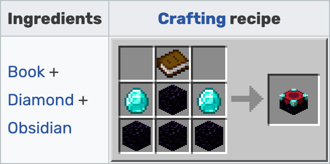

# Section 5: Enchanting

Enchanting is a mechanic that improves armor, tools, weapons and books with one or more of a variety of enchantments that improve an item's existing abilities or give them additional abilities and uses.

Enchanting is a very important technique in Minecraft. Enchanted tools, armor and weapons make success in your Minecraft adventures much more likely, and makes items more fun to use as well.

In order to enchant anything, experience is required. The easiest way to gain experience is by mining items such as coal and redstone, or raising animals. The most experience is gained, however, by fighting mobs.

|  | 
|:--:| 
| *Enchanting table crafting recipe* |

|  | 
|:--:| 
| *Bookshelf crafting recipe* |

To enchant an item, right-click on an enchanting table and place the item and 1–3 lapis lazuli in the input slots. Options will display on the right-hand side of the enchanting display.

To get the maximum enchants, surround the enchanting table with bookshelves. To get to the highest level of enchanting (level 30), you will need 15 bookshelves placed within a 5×5 square centered at the table or the block above. No other blocks can be placed in between the table and the bookshelves.

Tips:

* When first starting out, use just a few experience levels to enchant as many tools and armor pieces as possible. After that, use an anvil to combine enchantments. Later, do the opposite to try and get as many enchantments as possible on one tool/weapon, then  use an anvil again to combine when possible.
* When trying to get a specific enchantment on a tool/weapon that is already enchanted, use books. Create an enchanted book by enchanting a book on an enchantment table. Enchanted books can also be found in structures or by trading with villagers.
* As you progress above level 16, each level requires more XP than the last. Try to enchant using a level as close to yours as possible to make the high XP cost worthwhile.
* Items have a chance to get one or more extra enchantments every time you enchant them.
* Do not enchant anything weaker than iron--the lack of durability makes the cost not worth it.
* An enchanted fishing rod can pay off. "Luck of the Sea" lowers chance of "junk" catches by 2.5% per level and increases the chance of "treasure" catches by 1% per level. "Treasure" can include enchanted tools. "Lure" decreases wait time until a catch by 5 seconds per level but decreases chances of both "junk" and "treasure" catches by 1% per level, so be careful with that one if your goal is to catch treasure.
* Place 15 bookshelves around an enchantment table to get the highest level enchantments. If after establishing the 15 bookshelves you _do not_ want maximized enchantments, you can block their effect with torches.

### Anvils

An anvil can be used to combine the enchantments of two items. The items must be of the same type and material. There are two slots in the anvil, and the item in the second slot is sacrificed to improve the first.

The cost in levels depends on the enchantments. You can also repair and name items with the anvil. In survival mode, there is a limit of 39 levels for any work performed on the anvil.
