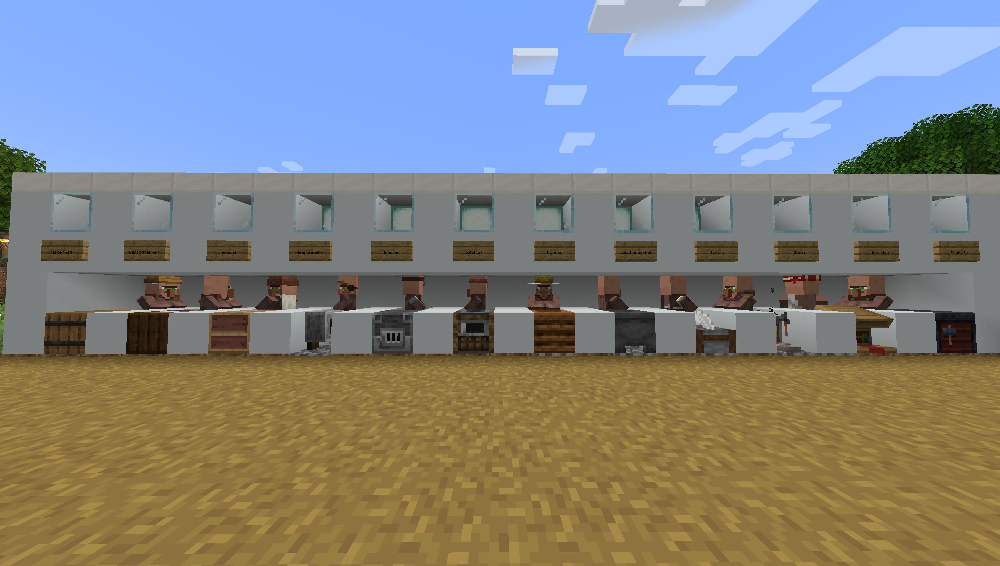
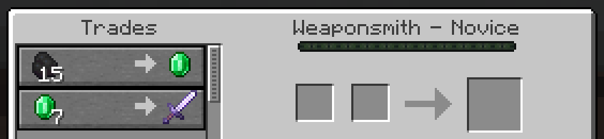

# Villager Trading

|  |
|:--:|
| *Different villager types, with their job site blocks* |

There are many kinds of villagers who provide different opportunities for trading. The types of villagers and their respective job site blocks and trades are:

| Villager    | Job Site Block   | Trades |
| ----------- | ---------------- | ---- |
|Nitwit       | n/a              | n/a |
|Unemployed   | n/a              | None until employed |
|Armorer      | Blast Furnance   | Trades foundry items and sells chain, iron and enchanted diamond armor tiers|
|Butcher      | Smoker           | Trades meats, sweet berries, rabbit stew, and dried kelp blocks |
|Cartographer | Cartography Table| Trades banners, compasses, banner patterns, papers and various maps, including explorer maps|
|Cleric       | Brewing Stand    | Trades magic items like ender pearls, redstone dust, glowstone dust, and other enchanting or potion ingredients|
|Farmer       | Composter        | Trades crops and natural foods, such as bread|
|Fisherman    | Barrel           | Trades campfires and fishing items|
|Fletcher     | Fletching Table  | Trades bows, crossbows, arrows|
|Leatherworker| Cauldron         | Trades scutes, rabbit hide, and leather-related items|
|Librarian    | Lectern          | Trades enchanted books, clocks, compasses, name tags, glass, ink sacs, lanterns, and book and quills|
|Mason        | Stonecutter      | Trades polished stones, terracotta, clay, glazed terracotta and quartz|
|Shephard     | Loom             | Trades shears, wool, dyes, paintings and beds|
|Toolsmith    | Smithing Table   | Trades minerals, bells and harvest tools|
|Weaponsmith  | Grindstone       | Trades minerals, bells and enchanted melee weapons|

## Example Trades

We won't review every type of trade, but here are some examples:

### Weaponsmith

|  |
|:--:|
| *Weaponsmiths are valuable because they will trade enchanted axes and swords.* |

TODO: Put more screenshots of example trades here

### Armorer

|  |
|:--:|
| *Armorers are valuable because they will trade enchanted diamond armor.* |

TODO: Put screenshots of example trades here

### Cleric

|  |
|:--:|
| *Clerics are valuable because they will trade emeralds and ender pearls.* |

TODO: Put screenshots of example trades here

### Librarian

|  |
|:--:|
| *Librarians are valuable because they will trade enchanted books.* |

TODO: Put screenshots of example trades here
