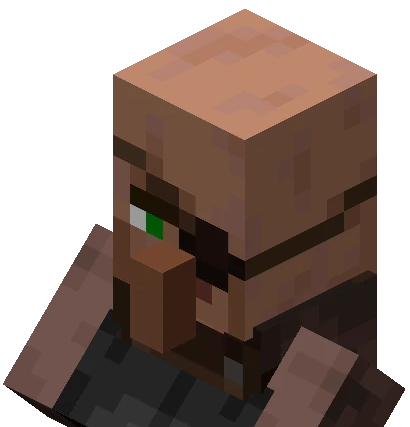
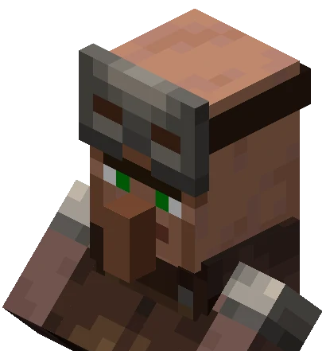

# Villager Trading

|  |
|:--:|
| *A desert village* |

Villagers are passive mobs that live in villages (naturally generated groups of buildings). They work at their jobs, breed, and interact with each other. They spawn unemployed, but can be given jobs by placing a job site block near them (there must be a job site block for every employed villager). To learn more about villagers, check out [the wiki](https://minecraft.fandom.com/wiki/Villager#Spawning).

## Villager Breeding

|  |
|:--:|
| *A building meeting villager breeding conditions* |

For 2 villagers to breed, a couple of conditions must be met:
* The building where the villagers will breed must have at least three beds with two or more empty blocks above them
* The villagers must have 3 loaves of bread, 12 carrots, 12 potatoes, or 12 beetroots in their inventory (you can give them this food by throwing it to them)

If these conditions are met, the villagers should breed in around 20 minutes. Once they have bred, a new, unemployed baby villager will appear. Baby villagers cannot trade; you will have to wait 20 minutes until they grow up to trade with them.

## Types of Villagers

|  |
|:--:|
| *Different villager types, with their job site blocks* |

There are many kinds of villagers who provide different opportunities for trading. The types of villagers and their respective job site blocks and trades are:

| Villager    | Job Site Block   | Trades |
| ----------- | ---------------- | ---- |
|Nitwit       | n/a              | n/a |
|Unemployed   | n/a              | None until employed |
|Armorer      | Blast Furnance   | Trades foundry items and sells chain, iron and enchanted diamond armor tiers|
|Butcher      | Smoker           | Trades meats, sweet berries, rabbit stew, and dried kelp blocks |
|Cartographer | Cartography Table| Trades banners, compasses, banner patterns, papers and various maps, including explorer maps|
|Cleric       | Brewing Stand    | Trades magic items like ender pearls, redstone dust, glowstone dust, and other enchanting or potion ingredients|
|Farmer       | Composter        | Trades crops and natural foods, such as bread|
|Fisherman    | Barrel           | Trades campfires and fishing items|
|Fletcher     | Fletching Table  | Trades bows, crossbows, arrows|
|Leatherworker| Cauldron         | Trades scutes, rabbit hide, and leather-related items|
|Librarian    | Lectern          | Trades enchanted books, clocks, compasses, name tags, glass, ink sacs, lanterns, and book and quills|
|Mason        | Stonecutter      | Trades polished stones, terracotta, clay, glazed terracotta and quartz|
|Shephard     | Loom             | Trades shears, wool, dyes, paintings and beds|
|Toolsmith    | Smithing Table   | Trades minerals, bells and harvest tools|
|Weaponsmith  | Grindstone       | Trades minerals, bells and enchanted melee weapons|

## Example Trades

We won't review every type of trade, but here are some examples:

### Weaponsmith

|  |
|:--:|
| *Weaponsmiths are valuable because they will trade enchanted axes and swords.* |

As you continue to trade with a villager, they will advance in the types of items they will trade. For example, a weaponsmith will start with just trading for two items:

Eventually, more trades open up:

### Armorer

|  |
|:--:|
| *Armorers are valuable because they will trade enchanted diamond armor.* |

### Cleric

|  |
|:--:|
| *Clerics are valuable because they will trade emeralds and ender pearls.* |

### Librarian

|  |
|:--:|
| *Librarians are valuable because they will trade enchanted books.* |

### Fletcher

|  |
|:--:|
| *Fletchers trade for bows and crossbows, but importantly will trade emeralds for sticks!* |

