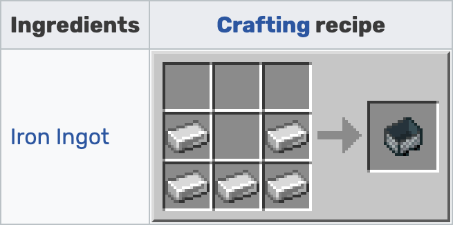
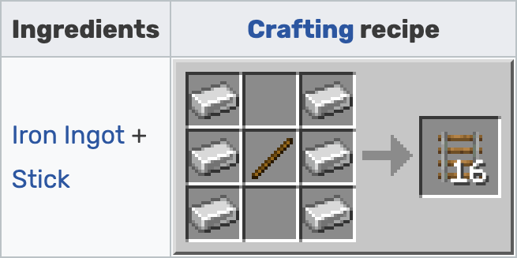
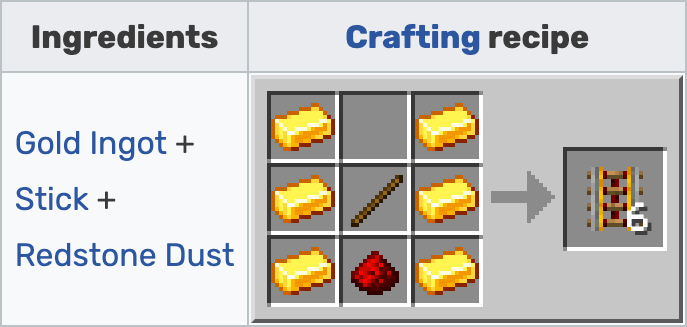

# Section 7: Minecarts and Railway Construction

As you expand your living area, you may find that traveling between areas takes up a lot of your time. Running and walking aren't particularly fast, but minecarts can make traveling significantly faster and safer.

|  | 
|:--:| 
| *Minecart crafting recipe* |

|  | 
|:--:| 
| *Rail crafting recipe* |

|  | 
|:--:| 
| *Powered rail crafting recipe* |

After placing down some track, you can place a minecart on top and right-click to enter. Once you're in the cart, pressing W will start moving you forward. Pressing the left SHIFT key will make you dismount the minecart, although it will keep moving. The wooden block at the end of this track stops the minecart before it goes too far:

You can use powered rails to keep the minecart going on long tracks, similar to redstone repeaters. They must be powered with redstone to provide any power to the minecart.

By using blocks to create tilted rails, we can make handy locations for starting minecarts without having to move manually.

Redstone can also be used to make junctions where you can select which direction the cart will take you. Three-way intersections will flip back and forth as power is supplied or cut off.

We can also make a two-way minecart station where our minecart will stop until we tell it to continue. Dig out a 3x1 trench. Put a detector rail in the middle, and two powered rails on either side (powered rails act as brakes when unpowered).

Extend the rails outward to connect to your normal railways. Place two blocks with buttons on them on top of the blocks adjacent to the powered rail segments. When you press the button, the powered rail below it should light up.

When you are on the railway, you will stop right next to one of the buttons. Press the button to power the rail underneath you, pushing you forward. The detector rail will then power the rail on the other side, pushing you along on your journey.

Your assignment is to make a minecart rail that connects three different locations. Make a start-stop point at each of the destinations. Create a stop that allows you to choose your destination (see screenshot below).

