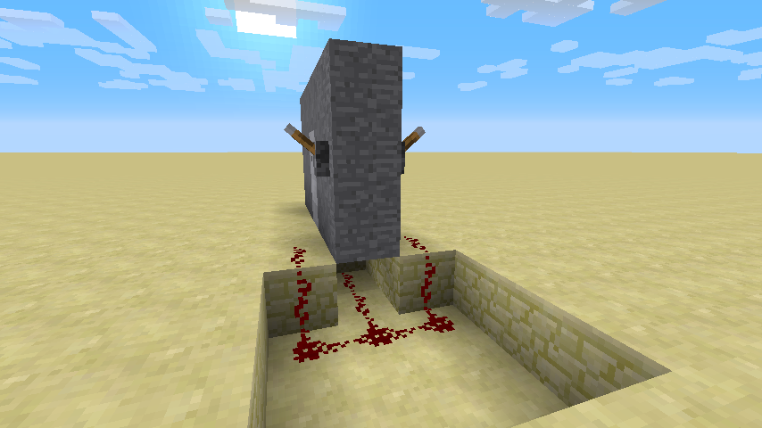
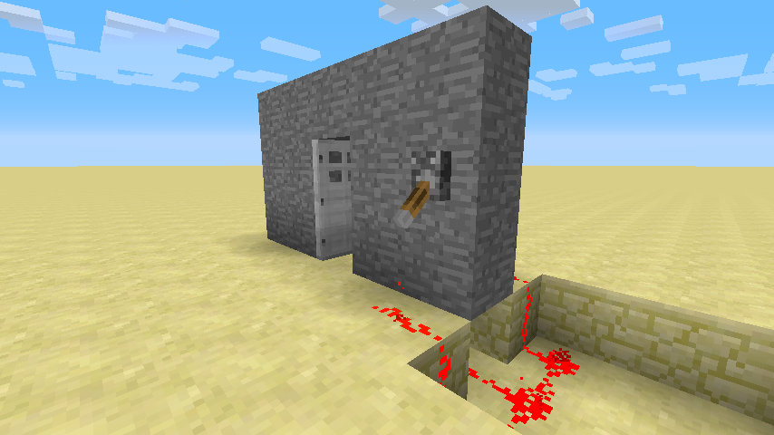

# OR Gate Doors

You can open doors using levers and redstone, and using an OR gate, you can open them from both sides.

1. Build a wall with a door in it. Place a lever on both sides of the door. Make sure the levers are at least one block away.

2. Create an OR gate around the edge of the wall, connecting the levers with redstone, and connecting the redstone current to the door underground.

Now that you have it built, you should be able to see that when either lever is pulled, the door opens. Compare this to the OR gate truth tables that you learned about in Section 3. Remember that when the lever is down, it equals 1, and when it is up, it equals 0.

You can use this in your own Minecraft world to hold open iron doors from either side.
