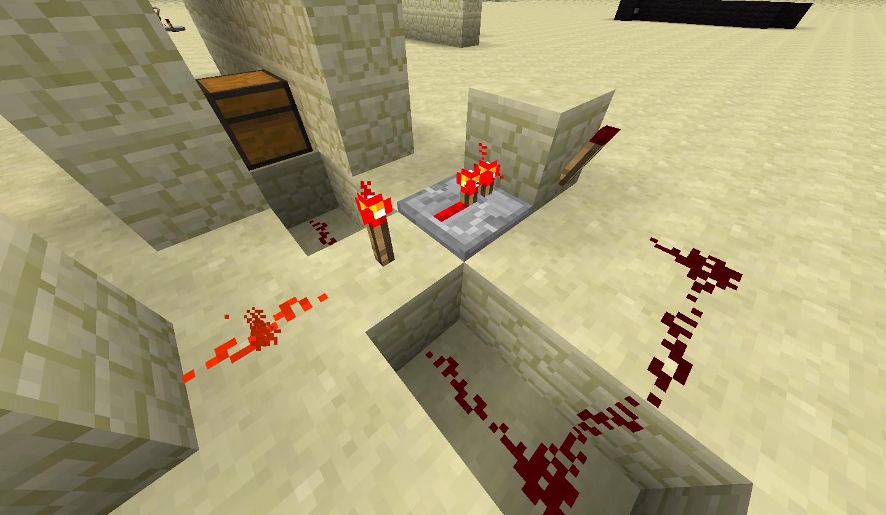
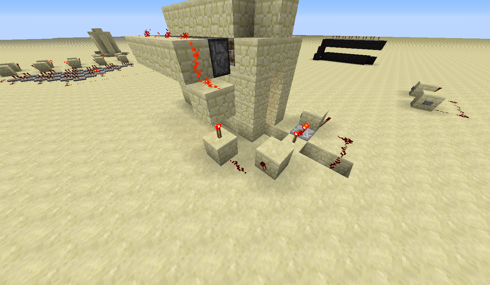
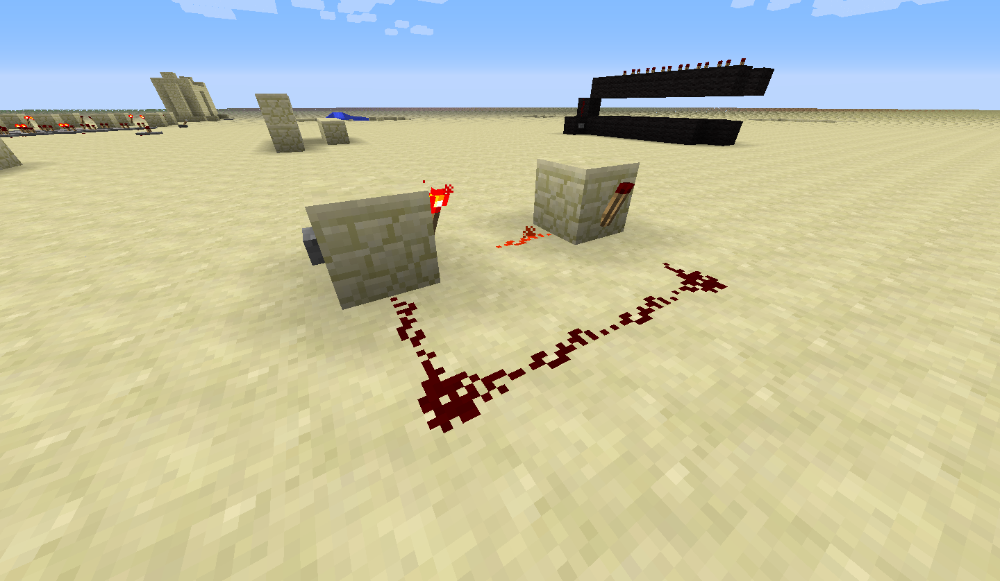
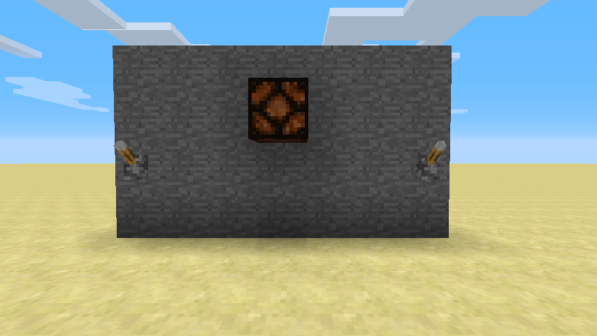
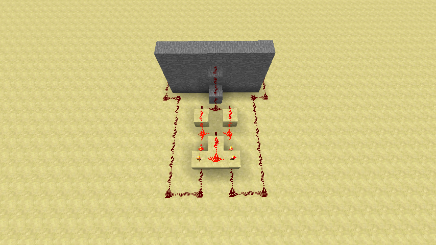

## Traps: Design and Execution

There are a few key features that every good trap must have. They must avoid suspicion and lure in victims with chests or rare items. They should have an entertaining or unique mechanism, since in the end all Minecraft traps are purely for entertainment. A trap has three main parts: the trap mechanism, the trigger, and the bait.

1. The first thing to consider when making a trap is the trap mechanism itself. How will you ensnare the player who has been snooping around your house? Obsidian can make for very strong traps as it requires diamond (and lots of time) to break; if the trapped player doesn't have a way to break obsidian, they're basically stuck! Water and lava traps can slow and even kill a player, but are significantly harder to conceal. For our trap we will be using stone and water. Stone is easier to obtain than obsidian but is still somewhat difficult to break, especially when the player is under the water we will be dropping on their head!

1. Triggers can take many forms. Tripwires and pressure plates are the most obvious, and you can place them in various ways to avoid detection (for example, only putting wood pressure plates on wood of matching color). However, buttons and levers can also be used. You can make it appear as if a button opens a specific door, when in reality it activates the trap. Levers can be used for dual purposes. For example, you may have 3 levers that act as a combination lock for a door. One combination will open the door, while incorrect combinations will trigger a trap for the trespasser. Our trap will use a trap chest as the trigger.

1. A trap chest filled with valuables is serving as the bait for this trap. However, interesting rooms, rare blocks, and even mine entrances can be used as the bait. As long as the object has something that a player would desire, it can serve as bait for a trap. Protective traps don't really have true "bait" as the trap is not supposed to be luring players in; rather, the item they are protecting is the bait in some sense. Our bait is the valuable items we will be placing inside of our trap chest.

Now that you've learned about the basics of traps, we're going to build an example trap using a trap chest, water, and pistons.

## Trap Chests

Trap chests emit a redstone signal whose power is based on the number of people who are opening the chest. We can use this redstone signal to spring a trap designed for people opening the chest. It will open a flow of water when they open the chest, and it will not stop until a reset button has been pressed.

1. Place a trap chest somewhere. They're made out of a regular chest and a tripwire. Dig a whole behind the chest and place one patch of redstone dust.

1. Dig a second hole and place a redstone repeater. Since the redstone power is proportional to the number of people opening the chest, this trap will trigger if just one person opens the chest.

1. The wiring that will make the water gate open when the chest is opened. It's a bit tricky but further down there are additional pictures for you to follow.

1. This is the "one-way gate" that prevents the water from turning off even when the trap is closed. When the button on the left is pressed, the first torch is turned off and the second one turns on (since the first one is no longer disabling it). Now the second torch is disabling the first torch as its redstone leads into the block of the first one. Toggling the button (or chest in our case) will not alter the state of the switch.

Try to think of some other ideas for traps that could be fun or useful. If we have time left over, feel free to experiment and share ideas with each other.

##Light Switches

Using XOR gates, you can create a light that you can control with multiple switches. You might have lights that work this way in your actual home! Any light that has multiple switches to control it use a XOR gate. The most common use of these is lights in stairwells.

1. Build a wall and hang a redstone lamp on it. Put a lever on each end of the wall. The idea is that the levers can be as far away as you want, but this is a simple demonstration.

2. Create a XOR gate behind the wall, pointing the output towards the wall. Use the Section 3 reference picture if you need to. Remember that you don't need to place the levers, since the redstone signal is coming from the levers you placed on the front of the wall. Connect those to the XOR gate using redstone.

3. Lead the redstone signal coming from the output of the XOR gate to the lamp through the back of the wall, as shown.

4. You're done! Flip one of the levers, and your lamp will turn on. Feel free to flip them as much as you want. The lamp will always be affected, no matter which way you flip either lever.

