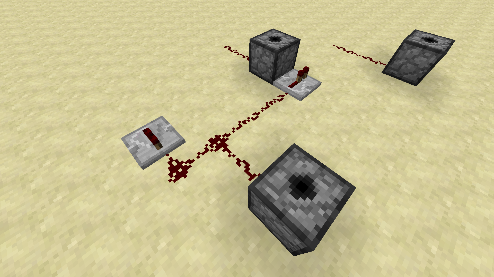
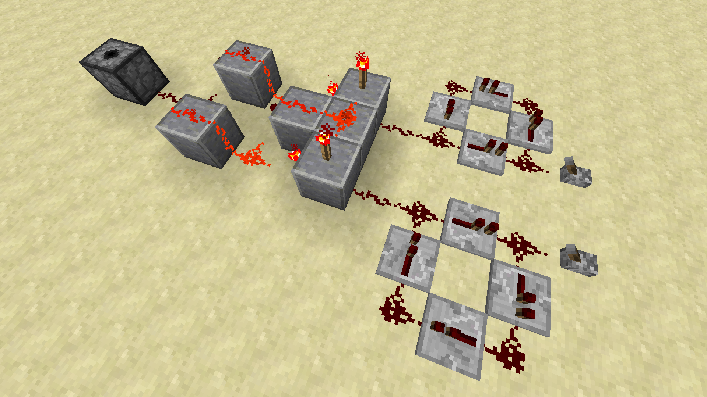
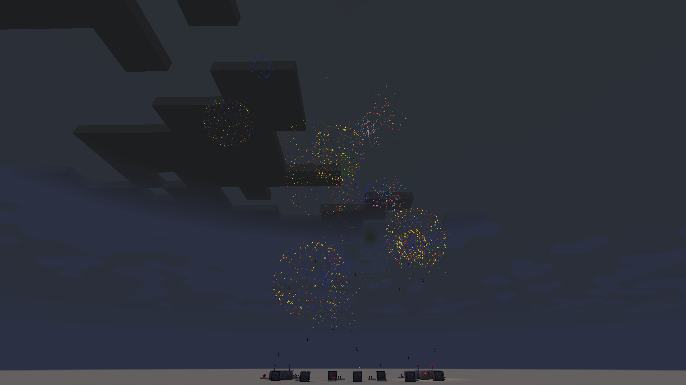
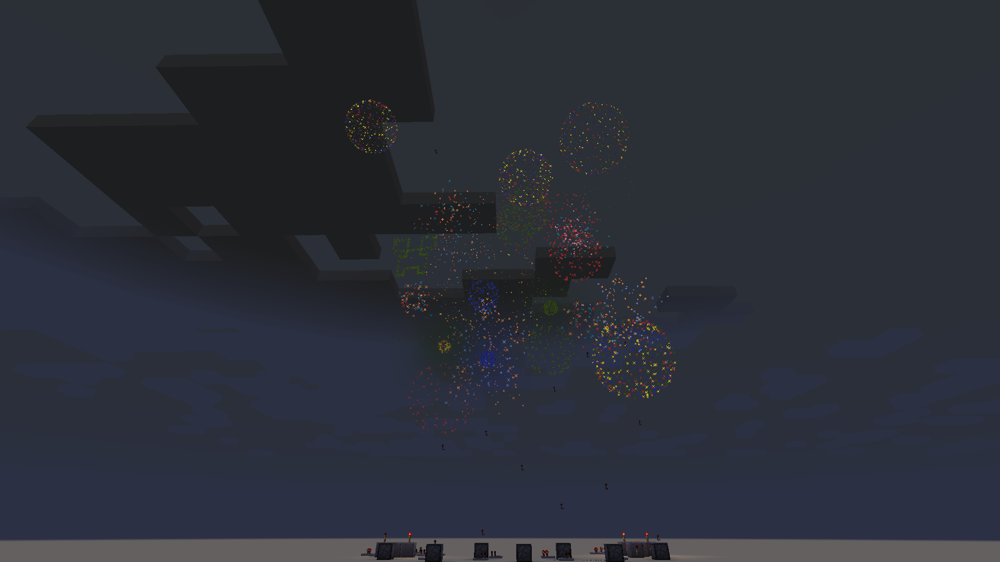

## Firework Launchers

Creating firework launchers is not only a fun way to use redstone circuits, but also needed to make a great fireworks
show! We launch fireworks using dispensers and pulsating a redstone signal.

To craft our fireworks, we need two components. A fireworks star and fireworks rocket. The fireworks star is used to
customize our explosion properties. Making a fireworks star requires one gunpowder item and at least one dye. The
remaining slots in the crafting table can be used to create multicolored fireworks by using multiple dyes or fireworks
with special effects by using items such as diamonds and feathers.

Next we create the fireworks rocket by using at least one gunpowder, paper, and fireworks star. You can add up to three
gunpowder items to increase the flight duration. You can even put additional fireworks stars in the same rocket.

That is the basics on how to craft fireworks. Here is how our example firework looks.

## Launcher Arrays

Now lets go ahead and create our fireworks show. We will start by building a simple fireworks launcher array.

1. Lets start by placing three dispensers on the ground with two redstone dusts placed behind the dispensers. The
dispensers are each two blocks apart with the middle one additionally placed two blocks behind the front two.

2. Place a redstone repeater in front the the middle dispenser and another repeater off one block to the side as shown
in the image below. Then you can hook up the redstone wiring in a line to connect them.

3. Now you can place the third repeater and connect the redstone dust as shown below.

4. Finish connecting the Redstone to the repeater placed in step 2 and add a lever behind the middle dispenser.

You're done! Feel free to add more launchers or try more complex designs. Here is another similar design using
five dispensers.

## Periodic and Randomly Timed Launchers

You can use the redstone clocks from section 2 with the logic gates from section 3 to make special firework launchers.
The AND gate launcher can create a regular periodic launching sequence. You can customize the pulsing delays by changing
the repeater timings. Some patterns you can get include 4 redstone pulses in 3 seconds with a 2 second break or 8
pulses in 3 seconds with an 8 second break.

The XOR gate launcher can create a irregular launching sequence. You can once again change the repeater timings to
change the apparent random behavior.

Try experimenting on your own to find the patterns you like. Combining the launcher array with the AND gate & XOR
gate launchers makes a great fireworks show!

