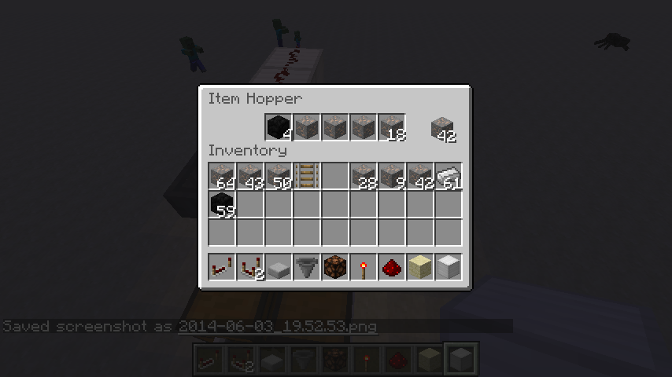
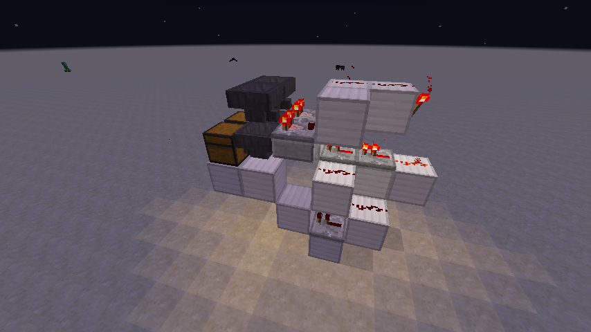

# Sorting

Sorting contraptions involve NOT gates, comparators and exploiting the special characteristics of hoppers.

Here is a screenshot of a basic sorting circuit. The hopper configuration is important here: the bottom row of hoppers must be attached to the chests (shift-click to attach a hopper to a chest) (and to place two chests next to one another, alternate normal chests with trapped chests) and the top row of hoppers must be attached to the comparators (shit-click to attach a hopper to the **side** of the comparator). This is where we exploit a special feature of comparators:

If a comparator is placed next to a container, it will provide an output based on the percentage of used space in the container. see [minecraft.gamepedia.com/Redstone_Comparator](http://minecraft.gamepedia.com/Redstone_Comparator)

There is some specific math at the above link to determine how to get the comparator to output, but with the hopper it is easy enough to just fill the hopper until you see the output occur. In this case we're going to fill the hopper so that any additional item creates the redstone signal, which will in turn power the hopper below. This also exploits a special feature of hoppers:

When powered by redstone, the hopper won't take items from the inventories of blocks directly above it, put items into an attached inventory or suck up items from the environment. However, a hopper below it can still take items from its inventory and a hopper above or beside it can still put items into it. see [minecraft.gamepedia.com/Hopper](http://minecraft.gamepedia.com/Hopper)

Build enough of the circuit to test the output signal from the top hopper. Put a single item of the type you want to sort in the first slot in the hopper. Put a single item that won't be coming through the sorting machine in the rest of slots. Fill the **last** slot until you get a signal, then take one item out. Now only those two items can enter the hopper, and the hopper below will take from the first slot (the item type you want to sort) whenever one more item lands in the topmost hopper.

Now refer to the screenshot above again and finish the circuit. The idea is the send the signal from the top hopper to the bottom hopper. This could be done any number of ways (other designs power sticky pistons with redstone blocks), but we're trying to keep our sorter size to a minimum. The configuration is comparator → two blocks with redstone dust → redstone torch. This creates a NOT gate, the torch will stay lit as long as there is not a signal from the comparator. Then back towards the bottom hopper with a redstone dust and two repeaters. As long as the bottom part of the circuit stays powered (there aren't enough items in the top hopper to power the top part of the circuit), the bottom hopper won't take items from the hopper above it.

You can now test this part of the sorter but placing the sorted item into the hopper. They should immediately fall into the bottom hopper, then the chest. (Except for one--the one downside of this design is is leaves one item in the bottom hopper.)

Now we want to create a similar circuit for the next item we want to sort. The trouble is, if we build the same circuit, it will interfere with the one next to it. So this one has to be changed up a little bit. It goes down one more block, brings the signal back towards the front and puts the NOT gate below the hopper. Refer to the screenshots below and use the completed example as a reference if you get stuck. Notice the comparator is sitting on a stone slab.

## Finish it off

Now complete your sorting machine with two essential finishing touches:

1. A way to load the machine (refer to the example map if you're having trouble thinking of a good way to accomplish this).
1. A "catch all" chest for items that don't have a specified chest in the machine.

If you have enough time, you can make your machine bigger, as well (add alternating rows of each sorting circuit type).
