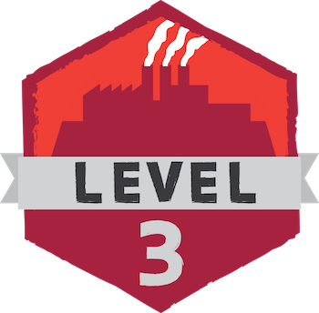

## Minecraft U Level 3:  Engineering with Redstone

Learn the basics of electricity, with in game and real world applications. We’ll go over digital circuits, like those found in smartphones and tablets, and how to use them in the Minecraft world to build yourself awesome contraptions. At the advanced level, we’ll go over what binary really is, and how to design binary logic machines with Redstone!

### Table of Contents

* Section 1: Redstone Basics
* Section 2: Basic Applications (Doors, Clocks, Cannons)
* Section 3: Logic Gates
* Section 4: Building with Logic Gates

---

* Appendix 1: Redstone Adder Circuit
* Appendix 2: Automatic Farming
* Appendix 3: OR Gate Doors
* Appendix 4: Traps & XOR Light Switches
* Appendix 5: Firework Launchers
* Appendix 6: Command Blocks
* Appendix 7: Sorting
