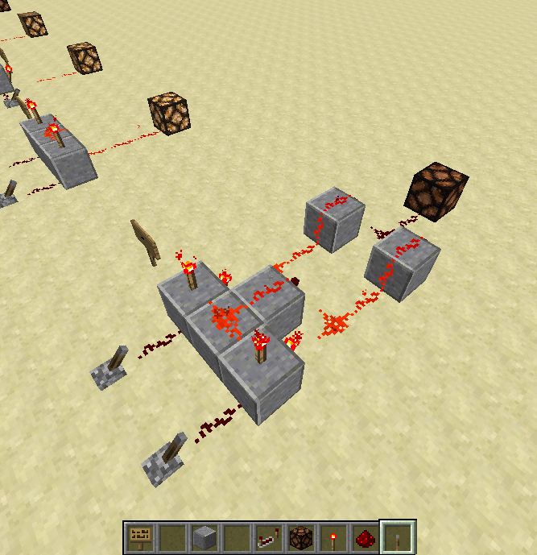
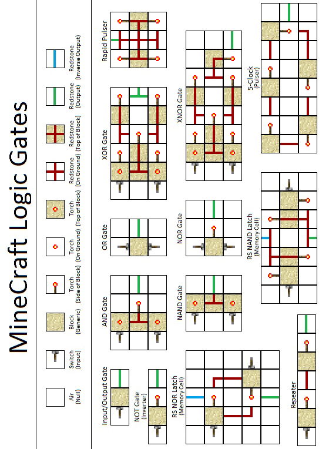

# Section 3: Logic Gates

Logic Gates are a fundamental building block for digital circuits. They perform _boolean_ functions and usually have 2 inputs and 1 output

## AND

The AND gate performs the AND logic function which mathematically works like multiplication.

In Minecraft, your AND gate will take two redstone inputs which will either be ON or OFF.  The output depends on the combination of inputs:

ON AND ON => ON  
ON AND OFF => OFF  
OFF AND ON => OFF  
OFF AND OFF => OFF  

Try these out on the above gate and see what happens. Remember that a lever is OFF if it is pointed upward.

## Truth Tables

Truth tables are an easy way for us to organize the various outputs of logic gates given different inputs.  
For boolean logic, "ON" is replaced with "True" or "1" and "OFF" is replaced with "False" or "0". For example, the AND Gate could look like this:

TRUE AND TRUE => TRUE  
TRUE AND FALSE => FALSE  
FALSE AND TRUE => FALSE  
FALSE AND FALSE => FALSE  

Which is the same as:  
1 AND 1 => 1  
1 AND 0 => 0  
0 AND 1 => 0  
0 AND 0 => 0  

We can simplify this further to just a table:  

Input | Input | Output
--- | --- | ---
1 | 1 | 1
1 | 0 | 0
0 | 1 | 0
0 | 0 | 0

<!--BREAK-->
## OR

The OR gate will only output OFF if both inputs are OFF. If either input is ON or if both are ON, the output will be on:

Input | Input | Output
--- | --- | ---
1 | 1 | 1
1 | 0 | 1
0 | 1 | 1
0 | 0 | 0

<!--BREAK-->
## NOT

A NOT gate only has one input and simply reverses that input. An ON input leads to an OFF output, and vice-versa:

Input | Output
--- | ---
0 | 1
1 | 0  

<!--BREAK-->
## NOR

A NOR gate is just an OR gate with its outputs reversed. So a NOR gate will only output ON if both inputs are OFF. Otherwise the output is OFF:

Input | Input | Output
--- | --- | ---
1 | 1 | 0
1 | 0 | 0
0 | 1 | 0
0 | 0 | 1

<!--BREAK-->
## NAND

Just as a NOR gate has the opposite outputs of an OR gate, a NAND gate has the opposite outputs of an AND gate. It will output OFF only if both inputs are ON. If either input is OFF, the output will be ON:

Input | Input | Output
--- | --- | ---
1 | 1 | 0
1 | 0 | 1
0 | 1 | 1
0 | 0 | 1

<!--BREAK-->
## XOR

An XOR (ex-or) gate is also called an "exclusive OR" gate. It will only output ON if either lever is ON. If both levers are either off or on, it will output OFF:

Input | Input | Output
--- | --- | ---
1 | 1 | 0
1 | 0 | 1
0 | 1 | 1
0 | 0 | 0

## Reference

This diagram has most of the logic gates that we've gone over, as well as some more that you may find useful.

