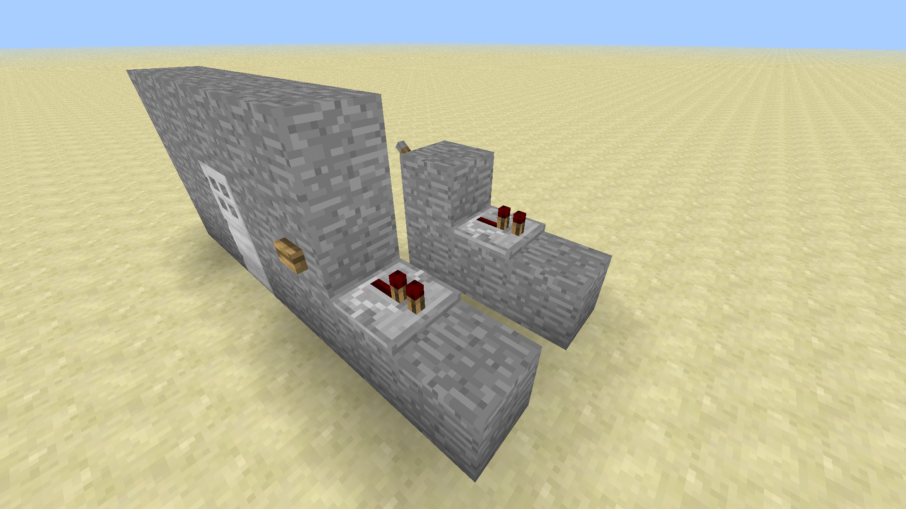

# Section 4: Applications of Logic Gates

## Locked Doors

Sometimes you may want to prevent people from entering a door using a lock. By having a lever on the inside, you can prevent the door from being opened unless the lever is in a specific state.

1. Place a door and build a wall around the door. A button should be placed one block away from the door; its block cannot be touching the door or it will open the door every time.

1. The location of the lock lever inside the door.

1. Repeaters that carry the redstone signal from both the button and the lever. Be sure to place the layer of stone underneath them so they are powered by the button and lever.

1. An AND gate. The two inputs are the lever and the button, and the output goes to the door. The output will only be ON when both the button and lever are ON as well.

1. The redstone that carries the output of the AND gate to the block directly underneath the door. Now, the door will only open when the lever is set and the button is pressed.

