# Section 1: ComputerCraft Basics

## Introduction

[ComputerCraft](http://www.computercraft.info/) is a modification for Minecraft that’s all about computer programming. It allows you to build in-game Computers and Turtles, and write programs for them using the Lua programming language. The addition of programming to Minecraft opens up a wide variety of new possibilities for automation and creativity. If you’ve never programmed before, it also serves as excellent way to learn a real world skill in a fun, familiar environment.

This will be your first taste of the ComputerCraft mod, and for some of you, your first time using a command line interface. With this knowledge, you can start using other command line software, and you'll get a solid foundation in simple programming skills.

### Installing ComputerCraft

ComputerCraft can be downloaded from [http://www.computercraft.info/download/](http://www.computercraft.info/download/) and requires Forge. The easiest way to install Forge and ComputerCraft is using MultiMC from [https://multimc.org/](https://multimc.org/). Create a new instance in MultiMC for Minecraft version `1.8.9`, the latest version of Minecraft supported by ComputerCraft. Click "Edit Instance" on the right, then "Install Forge" on the _Version_ tab.

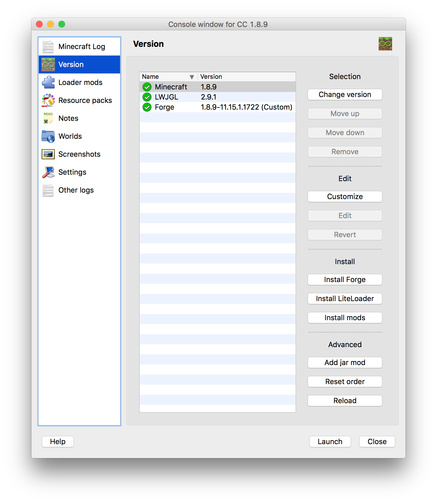

Then drag the `ComputerCraft1.79.jar` file you downloaded from computercraft.info into the window under the "Loader Mods" tab.

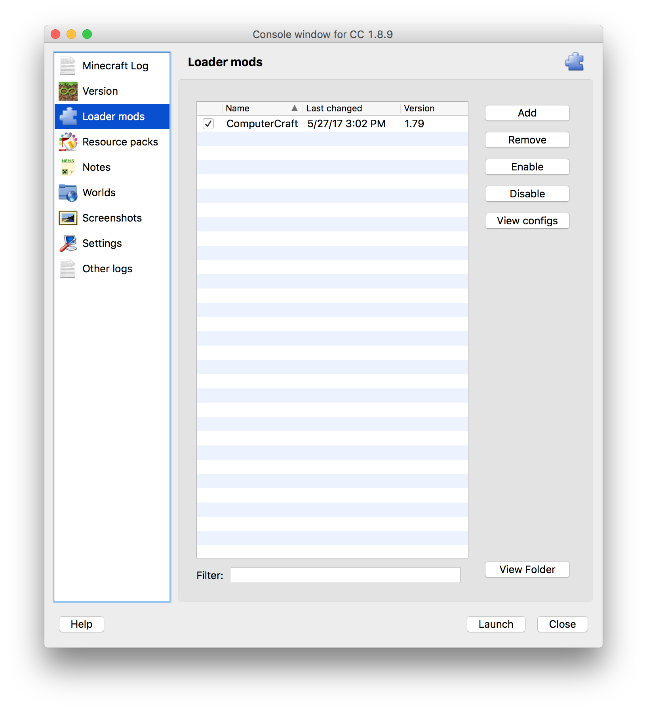

### The Command Line

* Open the ComputerCraft world
* Open your inventory and search for `computer`
* Place an _Advanced Computer_ (the yellow one) on the ground and right-click on it

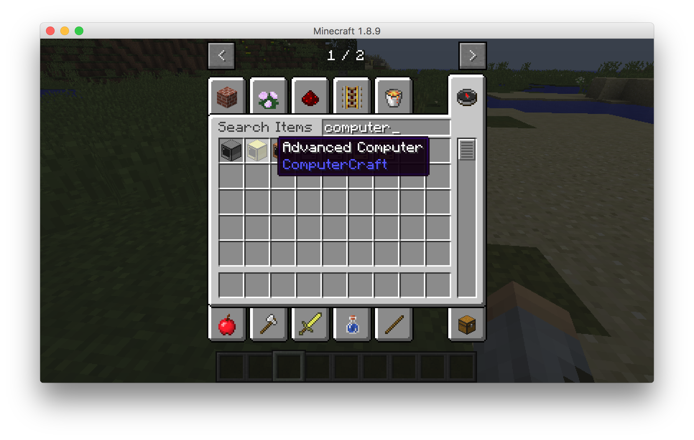

When you place a computer and right click on it, the first thing you see is this.

This is a command line. Here, we can type words to run programs, and we can look inside folders just like on a real life computer. Let's do that now.

* The `ls` command lists the contents of the current folder (aka directory)
* The `cd` command changes folders (directories)

* type `cd rom`
* type `cd programs`
* type `ls`. This will list all the programs in the _programs_ directory

Up next we'll run the edit program and see what it looks like.
Type `edit time`.

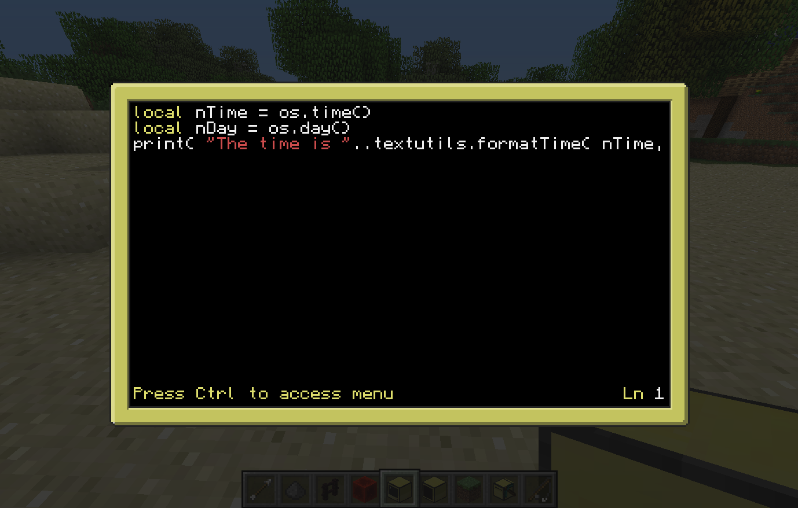

This is the program you use to edit your programs. The _edit_ program is all you need to start writing you own code in ComputerCraft.

Exit the _Edit_ program by pressing `ctrl` (control), using the arrow keys to select exit, and then hitting `enter`.

### Play text adventure Minecraft inside a ComputerCraft computer

* Type `adventure` and press `enter`
* Some of the commands available in the Adventure program:
  * `punch`
  * `take` or `grab`
  * `craft` or `make`
  * `go`
  * `eat`
  * `inventory`
  * `look`
  * `help`

If you haven't noticed by now, Adventure is really just text-based Minecraft. You're playing Minecraft on a computer inside Minecraft.

### Peripherals

Peripherals are blocks that you put next to a computer. Then you can use programs on the computer to "talk" to those peripherals. One of the most useful peripherals is the **monitor**.

#### Use a disk drive

Open your inventory and search for _Disk_. Choose the _Disk Drive_ and place it next to your computer.

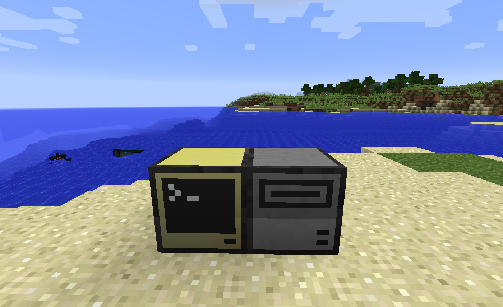

Place any music disk in the disk drive. Then right-click on your computer again and run the program _dj_ just by typing `dj`. It will play whatever music disk is in the disk drive, just like a Jukebox block.

#### Create a monitor

* Open your inventory and search for `monitor`
* Place 12 monitors in a 4 wide by 2 high pattern to create a giant widescreen monitor
* Place a computer next to the monitor, on the left side.
  * It matters what side the monitor is on, so make sure you check!

#### Paint a picture

* Right click the computer to open it, and then type `monitor right paint mypainting`
* Press escape to close the computer and then look at the monitor.

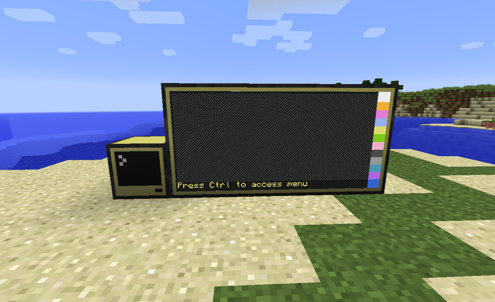

You should see something that looks like a canvas on the screen. Try right-clicking on the canvas to paint. Right-click on a color to select that color. When you're done, open the computer again, and press `ctrl` then `enter`. This will save the painting to a file called `mypainting`.

* To quit any running program without saving, hold down `ctrl + t`

* To restart the computer, hold down `ctrl + r`

# Turtles

## Intro

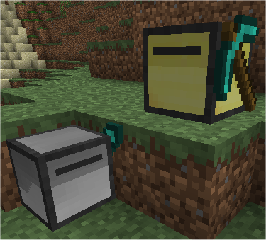

Turtles are programmable robots that you can use to collect resources, clear terrain, and other such tasks. They run an OS called turtleOS and the programs they run can be stored on internal memory or floppy disks.  There are farming, mining, crafting, and melee turtles. They are categorized based on the Diamond tool* you equip them with.

Note: Tools equipped to turtles will not wear out and turtles themselves are indestructible (unless you break them yourself).  This makes them one of the safest ways to utilize diamond tools, not to mention the time they will save you.

Like any robot, turtles require fuel.  They can get energy from anything that would work in a furnace as well as other more advanced options we'll get to later.  Different types of fuel will yield different _fuel counts_ which is the number of blocks the turtle can move with that amount of fuel.  For example, coal will give the turtle 80 fuel, so the turtle can now move 80 blocks.

### Dancing turtles

1. Open your inventory and search for `turtle`
1. Place a turtle or two on the ground
1. Right-click on the turtle
1. Run the `dance` program

## Make it move

Turtles have several default programs including the "go" program.

1. Select a turtle and put a _coal_ in its inventory.
2. type `refuel`
  1. Notice it says _Fuel level is 80_
3. type `go forward 10` and watch it go!
  1. type `refuel` and notice that the fuel level is now 70.
  2. Whenever there is no fuel source in the turtle's inventory, you can type `refuel` to check its fuel level.

The "go" program has the following format:
`go <direction> <distance>`

Note: For fast/mass refueling, type `refuel all`

## Use built-in turtle programs

### Tunnel

`tunnel` is a built in tunneling program. 

`tunnel <length>`

Make sure your turtle has plenty of fuel in slot 1! The turtle will also not place any torches, so the tunnel will be very dark! The turtle will also not return to you, so you'll have to go get it at the end of the tunnel.

### Excavate

`excavate` is a built in digging program. It will dig a square straight down until it hits bedrock. It will deposit what it mines in a chest placed behind its starting point.

`excavate <width>`

Make sure your turtle has plenty of fuel in slot 1! The turtle *will* return to its starting point. This program leaves giant holes in the ground that will kill you should you fall into them. But they are convenient for rapid descents to rare ore levels, as well as for raw materials collection.

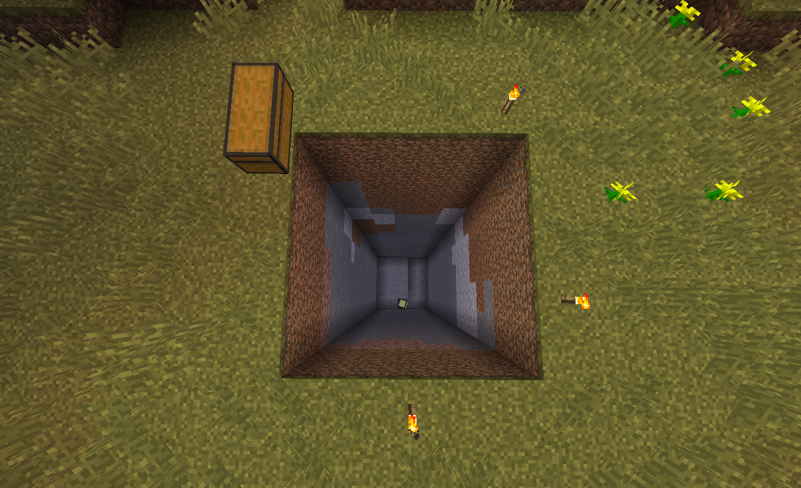

## Crafting turtles

Computers and turtles, especially the useful tool-equipped turtles, are rather expensive.

Here is the advanced computer recipe:

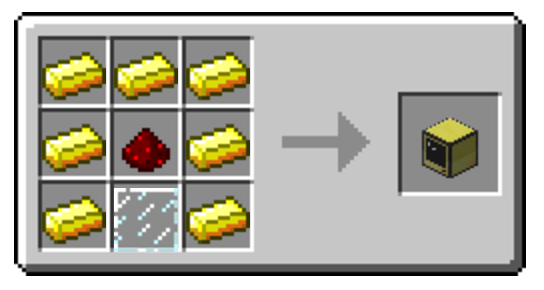

Here is the turtle recipe:

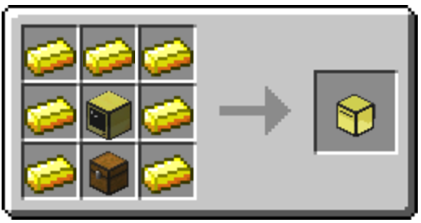

To equip a turtle, craft it with a brand new diamond tool:

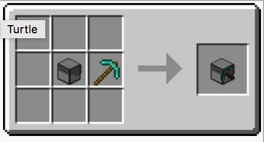
