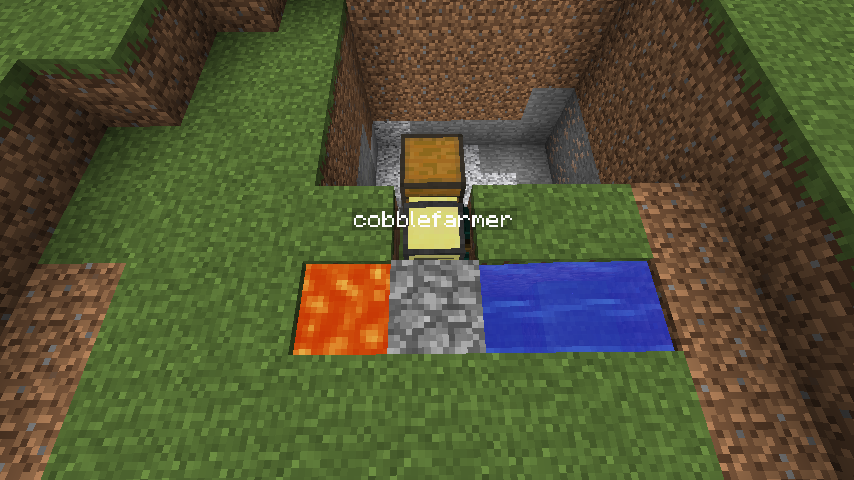

# Section 2: Cobblestone Miner

> So far all we've done is run commands that are already built into the turtles and computers. Starting in this section, we'll write some of our own programs, to make the turtle do whatever we want it to.

Let's start off with a simple program, one that will make sure you never run out of cobblestone again. If you've used a cobblestone generator before, this is similar to that, except that it's a turtle doing the harvesting, not you.

First build a simple cobblestone generator, seen here surrounded by lapis blocks for decoration.

If you mine out that cobblestone, more will replace it after it breaks. Now we need to place our turtle so it can mine the cobblestone for us. Place your turtle facing the cobblestone, and put a chest behind it. Make sure you use a `mining turtle`, and to make your code easier to write, use an `advanced mining turtle`.

Now we need to set our turtle's label, so that if we ever break him, he'll keep the programs we write. Type `label set cobblefarmer` and press `enter`.

Congrats! You've done all the actual block placing you need to. Now we can start writing code. Type `edit cobblefarm` and press `enter`. This will open the editing program and let you start writing your own code.

The editor program looks like this. Since you typed `edit cobblefarmer`, your program will be called `cobblefarmer` when you save it. To open the `SAVE/EXIT/PRINT` menu, press `control` or `ctrl` on your keyboard. The text in the corner that says `Ln 1` is the line counter. When you write code, it's split up into lines, just like regular writing. Whenever there's an error in your code, it will tell you which line the error is on, and that's when this line counter is really useful.

Let's start writing some code! Start off by copying down the code written here. This is called a while loop. The `while` command checks if something is true or false and then keeps running the code if the thing is true. The `do` part is what tells the computer that you're done defining the loop and you want it to start running code. At the end of every loop you write, you have to have the code `end`. This tells the program to end the looped section of code.

Since we wrote `while true do`, the code will run forever, because the statement `true`, by itself, will always be `true` and not `false`.

Next we'll fill in our loop with some code. All we need for this program is two commands. Copy down the code as shown below. The command `turtle.dig()` tells the turtle to mine the block in front of it. Once it mines the block, it will have it in it's inventory. The second command is to put the cobblestone into a chest, and it looks like we made a mistake! There are command for `turtle.drop()`, `turtle.dropUp()`, and `turtle.dropDown()`, but nothing for `turtle.dropBack()`. Instead we'll just use `turtle.dropUp()` and move our chest in a moment.

Once you've written you two lines of code, press `control` or `ctrl` on your keyboard to open the menu, and then press `enter` to save your program. Now press `control` again, press the `right arrow key` to move to `exit`, and then press `enter` to close the editor program.

Before we start our program, let's move our chest. We should also cover up the lava and water so it's safer to keep around, and the chest doesn't light on fire.

Now look at your turtle behind the chest and right click it. Type in `cobblefarm` and press `enter`. This will start your program! If you press `escape` and then look in the chest, you'll see that your turtle is gathering cobblestone for you.

Once the chest is full, you can open your turtle again and hold down `control` and `t` at the same time to terminate your program.

**Congratulations!** You just wrote your first simple program in ComputerCraft. In the next few sections, we'll write more useful programs, and more complex ones.
