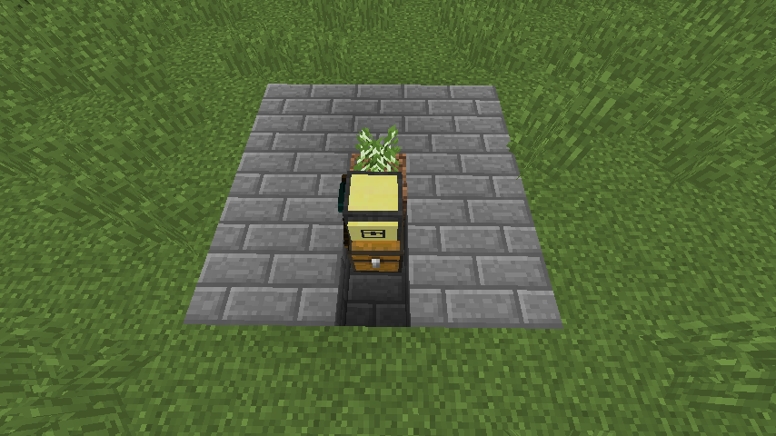

# Section 3: Chopping Trees

From now on, all the code you see in this book will be text only, not a screenshot from the game. It's still the same code, and it will work just like a screenshot would.

For this section, we should pick another repetitive task that we have to do often and give it to the turtle. Let's use tree chopping! That takes awhile, and you can always use more wood.

For this program, you need:

* An `Advanced Mining Turtle`. (Mining turtles are the most versatile, as they can break any block.)
* A birch sapling. Birch works best because it always grows straight up without branches.

Let's kick it off by putting our items in the correct places. Plant the sapling on some dirt, make sure it has plenty of room on all sides to grow, and then put the turtle down facing the sapling.

Remember to label your turtle whenever you make a new program. Use `label set treefarmer`



Now let's start writing our program. You'll want to put your code in a while loop again, since we want it to always run.

```lua
while true do

end
```

Now think about what you need to do to chop down a tree. First you have to break the wood, then move up (breaking any leaves in your way), then break again. Once there are no more blocks to chop, you have to go back to where you came from and put your spoils in a chest.

Thinking through programs like this before you write them will make it easier to organize them, and will make it more likely for your program to work on the first try.

There are a few fancy commands that let turtles look at what kind of block is in front of them. One of them is `turtle.inspect()`. We'll use this and a **variable** to look at the block in front of the turtle. A variable is just a store for some data. We can set variables to `true`, `false`, `elbow`, `1231241`, or anything else we can think of.

```lua
while true do
  local success, data = turtle.inspect()
  print(data.name)
end
```

This code will set `success` to `true` or `false` depending on if it sees a block or not. It also sets `data` to the the block it finds. You can then use `data.name` to get the name of the block as a **string**.

A **string** is a type of data in a program. You can have strings, numbers, and booleans (which are just true or false) in a program.

Here we use the `print()` function to print out the name. If you run this code while the turtle is facing a sapling, it prints out `minecraft:sapling` forever. Once the tree grows, it will print out `minecraft:log` instead.

Now that we can check what block we're looking at, we can start cutting down trees. Make sure your turtle is refueled first!

```lua
while true do
  local success, data = turtle.inspect()
  if data.name == "minecraft:log" then
    while turtle.detect() do

    end
  end
end
```

Now, even though our program checks all the time for an item, it will only start doing things if that item is a `minecraft:log`. We did this by using an **if/then statement**.

An `if/then` statement is similar to a while loop because it checks if something is true. Here we check if the item is a log or not. If it is, the code inside the statement runs, if not, then the code is skipped. The code will only run once if it does run, and then the program will continue.

We also put another while loop inside the if/then statement. This will keep doing the same thing over and over until there are no blocks in front of the turtle.

Now let's fill in the code to cut down the tree.

```lua
while true do
  local success, data = turtle.inspect()
  if data.name == "minecraft:log" then
    while turtle.detect() do
      turtle.dig()
      turtle.digUp()
      turtle.up()
    end
  end
end
```

This code will chop the tree and break leaves until it gets to the top, and then stop. After that we have to go back down. We can do that using another while loop.

```lua
while true do
  local success, data = turtle.inspect()
  if data.name == "minecraft:log" then
    while turtle.detect() do
      turtle.dig()
      turtle.digUp()
      turtle.up()
    end
    while not turtle.detectDown() do
      turtle.down()
    end
  end
end
```

Now we're back where we started, and we have a number of logs in our inventory. Try running your program! If you get an error, look for the line number in the error and double check that line.

Remember to hold down `control` + `t` to terminate the program.

We now have one more thing to do: drop all the logs and refuel. We can refuel with some of the logs we just gathered, so this turtle will be able to run forever without intervention. We should place a chest below the turtle's starting place and have the turtle put the wood into it. You'll only need to gather the logs out of the chest.


```lua
while true do
  local success, data = turtle.inspect()
  if data.name == "minecraft:log" then
    while turtle.detect() do
      turtle.dig()
      turtle.digUp()
      turtle.up()
    end
    while not turtle.detectDown() do
      turtle.down()
    end
    turtle.select(1)
    while turtle.getItemCount() > 2 do
      turtle.dropDown(1)
    end
    turtle.refuel()
  end
end
```

It's possible to have the turtle plant saplings also, but that takes a lot more code, and it's more fun to figure that out for yourself. Try looking at the ComputerCraft command reference for the commands to check the turtle's inventory for items.

**Yay!** That was your second program, and this one was much more complex. Now you've taken two boring and time consuming things and made turtles that can do them for you!
