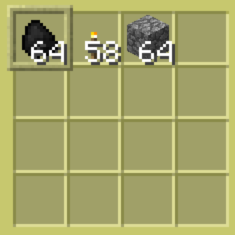

# Section 4: Advanced Mining

Another useful program! You can point this one at a wall and it will dig a two block tall and one block wide tunnel. It will also place torches every 8 blocks.

```
edit tunnel
```

We're going to be building this program with **functions**. Functions are what you use in more complex programs so that you don't have to type all of your code in the same block over and over again. Think of a function as something that does one thing really well, and if you put them together, they do a complex task.

The first function we write will check if the turtle is on solid ground, and if not, it will place a block below itself. You define functions like this.

```lua
function placeFloorBlock()
  if not turtle.detectDown() then
    turtle.select(3)
    if turtle.placeDown() then
      return true
    end
    print("Placing Floor Failed")
    return false
  end
end
```

Now you can use `placeFloorBlock()` anywhere else in this program and it will run this code.

This next function is a basic check for fuel, and if it sees that the turtle is low on fuel, it will try to refuel from inventory slot 1.

```lua
function fuel()
  if turtle.getFuelLevel() < 25 then
    turtle.select(1)
    if turtle.refuel(1) then
      return true
    end
    print("Refuelling Failed")
    return false
  end
end
```

You can see that this function returns true if the refueling was successful, and false if not.

Our next function digs our tunnel. The basic idea of this while and if loop is that if the turtle is not moving forward, it will dig, and if it can't dig, it attacks. It also detects blocks above it and digs those as well.

```lua
function DigAndMove()
  while not turtle.forward() do
    if not turtle.dig() then
      turtle.attack()
    end
  end
  while turtle.detectUp() do
    turtle.digUp()
    sleep(0.5)
  end
  placeFloorBlock()
end
```

This function turns the turtle around. Should be obvious.

```lua
function turnAround()
  turtle.turnLeft()
  turtle.turnLeft()
end
```

This is a function that turns the turtle to the right, digs out a block, checks make sure that the block didn't get filled in, and then places a torch in the space. If it fails to place a torch, it returns false, otherwise it returns true.

```lua
function placeTorch()
  turtle.turnRight()
  turtle.dig()
  if not turtle.detect() then
    turtle.select(2)
    if turtle.place() then
      turtle.turnLeft()
      return true
    end
  end
  print("Place Torch Failed")
  turtle.turnLeft()
  return false
end
```

Here we set two variables, one for the length you give as an argument, and one to use in the `moveBack` section of code.

```lua
local tArgs = { ... }
local length = tonumber(tArgs[1])
local moveBack = 0
```

The `tArgs[1]` bit of the code above is an **argument**. And argument is something you give a program when you run it. If you run a program like `go forward 10`, then your first argument (`tArgs[1]`) is `forward` and your second argument (`tArgs[2]`) is `10`.

Now we put it all together.

* First we fuel the turtle by calling `fuel()`.
* Then we call `DigAndMove()` to move the turtle forward one tunnel section.
* We increment the `blocksMovedForward` variable to keep track of where we are.
* Next we check if the block we are on is a multiple of 8.
* If it is, we call the `placeTorch()` function.
* At the end, we turn the turtle around and retrace our steps back to the start of the tunnel.

```lua
local blocksMovedForward = 0
while blocksMovedForward < length do
  fuel()
  DigAndMove()
  blocksMovedForward = blocksMovedForward + 1

  -- Add torch every 8 blocks
  if (blocksMovedForward % 8) == 0 then
    placeTorch()
  end

  if blocksMovedForward == length then
    turnAround()
    while moveBack < length do
      turtle.forward()
      sleep(1)
      print("Taking step: ")
      print(moveBack)
      moveBack = moveBack + 1
    end
  end
end
```



This is the turtle's inventory required by the program--fuel in slot 1, torches in slot 2, and floor blocks in slot 3.

Call the program, passing the length variable:

```
tunnel 50
```

...will dig a tunnel 50 blocks long.

If you have trouble with the above program, try copying it from Pastebin using the following command:

```
pastebin get Taenfb85 pastedTunnel
```

This will create a program called _pastedTunnel_, using the code at [https://pastebin.com/Taenfb85](https://pastebin.com/Taenfb85) (a copy of the tunnel program).

Compare the copied program to yours to see what the differences are.

This was a long one, but it allows you to find diamonds much easier. Try digging down to level 12 or 13 and putting six turtles running this program down, with a 2 block space between them. You'll be rich in diamonds in no time.
