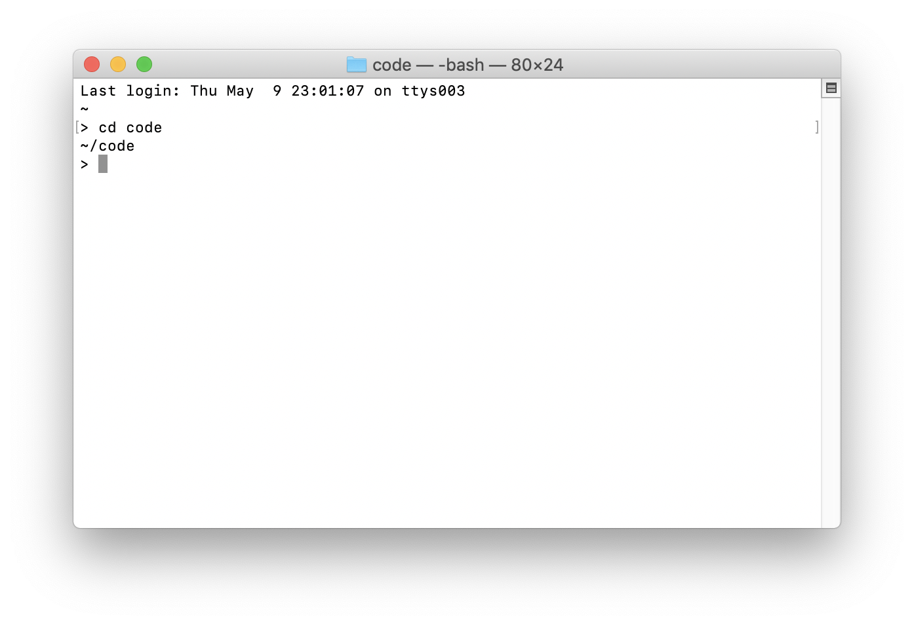

# Mac Setup Instructions

## Install the tooling

### Install MultiMC

MultiMC is the Minecraft launcher we'll be using throughout this course. It allows us to run any version of Minecraft.

[https://multimc.org/](https://multimc.org/)

### Install Java 8 (Not Java 9)

Java 8: [http://www.oracle.com/technetwork/java/javase/downloads/jdk8-downloads-2133151.html](http://www.oracle.com/technetwork/java/javase/downloads/jdk8-downloads-2133151.html)

If you already have Java 9 installed: [https://stackoverflow.com/questions/46513639/how-to-downgrade-java-from-9-to-8-on-a-macos-eclipse-is-not-running-with-java-9](https://stackoverflow.com/questions/46513639/how-to-downgrade-java-from-9-to-8-on-a-macos-eclipse-is-not-running-with-java-9)

### Getting comfortable with the command line

The next couple of tasks involve using the command line. The application you will use on the Mac is called Terminal. It can be found in Applications-->Utilities-->Terminal, or you can use [spotlight](https://support.apple.com/en-us/HT204014) to launch it by hitting `cmd+space` and then typing `Terminal`.



We're going to go over just a couple of commands. If you want more detail check out [this video](https://www.youtube.com/watch?v=5XgBd6rjuDQ "How to use the Command Line | Terminal Basics for Beginners").

Make a new directory in your Home directory for your Minecraft U Level 5 work and go into that directory. Use the `mkdir` command to make the directories and then the `cd` command to move to that directory:

```bash
mkdir mcu
cd mcu
mkdir level5
cd level5
```


### Install Brew

Now we need to install some development software on our computer. The first thing we need to install is a program called Homebrew, which will in turn help us install more software development applications. Follow the instructions on [https://brew.sh/](https://brew.sh/). To install Homebrew should look something like this:

```bash
/usr/bin/ruby -e "$(curl -fsSL https://raw.githubusercontent.com/Homebrew/install/master/install)"
```

...but make sure you follow the instructions on the website itself.

### Install Git

Now we can use Homebrew's `brew` command to install other applications. The first one we need is `git`.

>Git is a distributed version-control system for tracking changes in source code during software development

-- [Wikipedia](https://en.wikipedia.org/wiki/Git)

Run this command in the Terminal:

`brew install git`

### Install Gradle

Next we'll need Gradle. Gradle helps us build our software project.

The [Gradle installation instructions](https://gradle.org/install/) for Mac actually say to use Homebrew. To install Gradle using Homebrew run:

`brew install gradle`

## Make a Copy of the Example Mod GitHub Repository

### Create a Github account

>[GitHub](https://github.com/) is a web-based hosting service for version control using Git

GitHub is where our curriculum is hosted, as well as some other modding code that we'll be referencing throughout Level 5.

Go to GitHub and create a new account. You'll need this account to make copies of example code, and to save your changes in the cloud.

### Fork the Example Mod Repository

The first example mods we'll be exploring come from [MinecraftByExample](https://github.com/TheGreyGhost/MinecraftByExample). We'll start by forking the repository. There is a `Fork` button at the top-right of every GitHub repository. Go to MinecraftByExample and click `Fork`


### Clone your copy of the Example Mods

Next we're going to `clone` the repository, which means making a local copy of the code on our computer based on the copy storied on GitHub. Later we'll learn how to update our GitHub copy based on the changes we make on our computer.

First, on your forked copy of the MinecraftByExample repository, click `Clone or download`. Then click the link that says "Use HTTPS". Then click the copy to clipboard button.


`git clone ...`

(Don't type `...`, paste the `https://github.com...` link you just copied to your clipboard in that spot.)

You'll need to enter in your GitHub username and password.

You should now have a MinecraftByExample directory in your `Level5` folder. You can view this folder in Finder by typing:

`open .`

## Install IntelliJ

