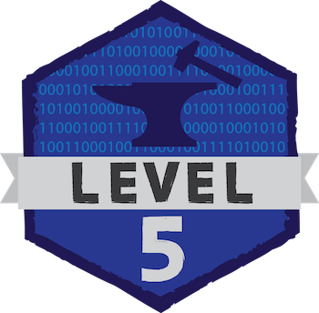

## Minecraft U Level 5: Java and Modding Minecraft

Learn the basics of Java, the most common programming language in the world, and use them to create your own modification of Minecraft. Add any item of your design to the game, expanding Minecraft in whatever direction you desire. At the end, you’ll understand the syntax and applications of Java, and how they apply to Minecraft.

### Table of Contents

* Section 0: Setting up the development environment
* Section 1: Introduction to classes and methods
* Section 2: Making basic blocks
* Section 3: Half blocks and block drops
* Section 4: Items and recipes 
* Section 5: Generating ore
* Section 6: Creating foods
