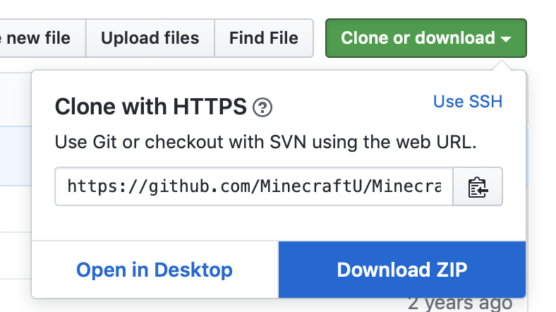
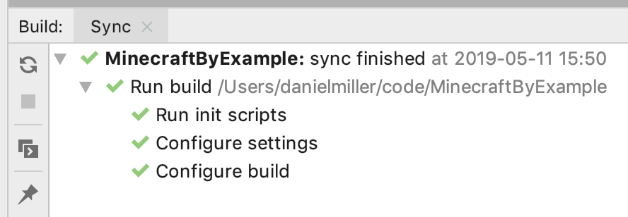
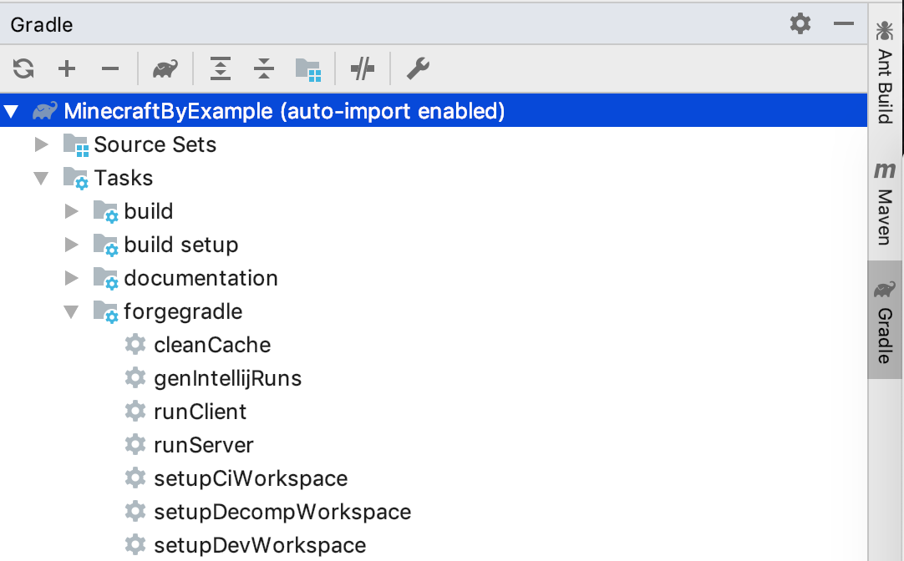

# Setup

Modding for Minecraft requires setting up a local development environment. These are all the same tools that software developers use every day.

## Install the tooling

### Install MultiMC

MultiMC is the Minecraft launcher we'll be using throughout this course. It allows us to run any version of Minecraft.

Go to [multimc.org](https://multimc.org/) and follow the download instructions for your operating system.

## Install the JDK and IntelliJ

We've separated the rest of the instructions for Windows and Macs. Please follow the instructions for the type of operating system you are using:

**[Go to the Windows instructions](windows_instructions.md)**

**[Go to the Mac instructions](mac_instructions.md)**

## Download the sample project

Go to [github.com/MinecraftU/MinecraftByExample](https://github.com/MinecraftU/MinecraftByExample), click "Clone or Download" and choose "Download ZIP".

Unzip the project in a logical location, like your desktop or home directory.

## Set up the project in IntelliJ

These instructions work for both Mac and Windows, but if you want more advanced Mac instructions, or have trouble with the instructions below, [reference the Mac command line instructions here](mac_cmd_line_instructions.md).

Open IntelliJ.

Accept the defaults in the intial setup screens.

In the next screen, choose "Import Project", navigate to your project folder, and choose the `build.gradle` file.

Wait for the project to build. A pane in the bottom of the window will look something like this:

Now on the right hand side of the window click the Gradle tab. Then open the tree Tasks-->forgegradle and double click on `setupDecompWorkspace`.

Finally, double click `runClient`. This should launch Minecraft with all the example mods loaded.
