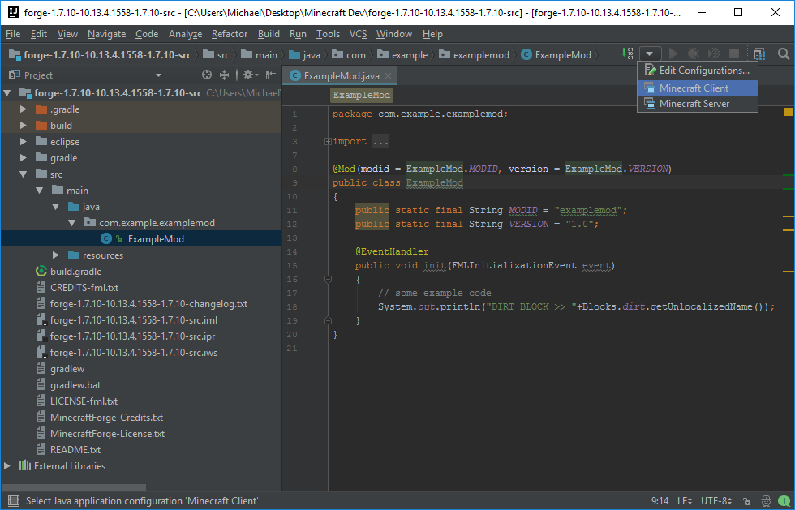

## Setup

Modding for Minecraft requires setting up a local development environment. These are all the same tools that software developers use every day.

We've separated instructions for Windows and Macs. Please follow the instructions for the type of operating system you are using:

Windows

[Mac](mac_instructions.md)

### Downloads

To get started writing mods, you'll need a good development environment. Always try to keep your enviromnet organized, since it's what you'll have to use to write all your code.

* Download IntelliJ from their site: [JetBrains IntelliJ IDEA Community Edition](http://www.jetbrains.com/idea/). Click on the `Download` button at the top of the page to take you to the downloads section. You will want to download the Community edition, which is a free version of JetBrains commercial IDE, and it has lots of the same features.

* We'll also need to download [Forge](http://files.minecraftforge.net/maven/net/minecraftforge/forge/index_1.7.10.html), which is a modding API. Under the "Download Recommended" section, click `Src`. Wait for the countdown on the top right, and click skip.  This should start downloading a file called `forge-1.7.10-10.13.#.####-src.zip`

* Also download the [Java SDK 8](http://www.oracle.com/technetwork/java/javase/downloads/jdk8-downloads-2133151.html). You will have to click the `Accept License Agreement` button to download the sofware. Download the correct version for your system from that page.

* If you are using Windows, also download [7-Zip](http://www.7-zip.org). We will need this program for creating textures later on.

### Installation

1. Install the Java SDK and 7-Zip by running the files you downloaded.

2. Run the IntelliJ installer, and follow its instructions. Make sure you have installed the Java SDK before installing IntelliJ, it will make the setup process easier.

3. Make a new folder on the desktop and name it `Minecraft Dev` and drag the `forge` folder into it. The forge folder is a .zip file so we need to extract it. Put the extracted folder into the Minecraft Dev folder as well.

Note: If you wish, you can rename the extracted `forge` folder to whatever you want your mod to be called, e.g. from `forge` to `DiamondCutter`. Keep the Forge zip file in case you want to start a fresh mod.

### Getting started for Windows

1. Hold shift and right click inside the folder you renamed. Click on `Open command window here`. Then type `gradlew setupDecompWorkspace --refresh-dependencies` and press `Enter`. This will download the Minecraft source code and decompile it so we can work with it to make our mod.

2. Once you get `BUILD SUCCESSFUL` type `gradlew idea` and press `Enter`.

3. After you get `BUILD SUCCESSFUL` again, run IntelliJ (the installation should have put a shortcut on your desktop).  You most likely won't have any setting to import (click `ok`).  Unless you have coding experience and have preferences, click `Skip All and Set Defaults`.

4. On the pop-up screen, select `Open` and navigate to the folder you renamed.

5. Find the file with the IntelliJ icon - it should be (Your_Folder_Name.ipr) and open it.

### For MAC

1. Double-click the zipped forge   
2. Drag the forge folder that is created to your desktop  
3. Download gradle: https://gradle.org/releases  
    - Find gradle version 2.5, and click the `binary only` link from the download section.
4. Unzip it and put it in the forge folder on your desktop  
5. Then press command+spacebar, type in "terminal" and press Enter (this will open a terminal window)  
6. Type "cd Desktop" and press Enter  
7. Type "cd forge" and press Tab (it should auto-complete to the folder name) and then press Enter  
8. Type "./gradle-2.5/bin/gradle setupDecompWorkspace --refresh-dependencies" and press Enter
9. After BUILD SUCCESSFUL shows up type: "./gradle-2.5/bin/gradle idea"

### Troubleshooting:

The most common error is the build failing with a message saying "JAVA_HOME does not point to JDK":

1. Click start  
2. Right-click Computer  (for Windows 8 open up file explorer and right-click "This PC")  
3. Click properties  
4. On the left side click advanced system settings  
5. At the bottom of the pop-up, click Environment Variables  
6. Under system variables (second section of pop-up) click new  
7. Name it JAVA_HOME  
8. The value should point to your JDK 8 folder (something like "C:\Program Files\Java\jdk1.8.0_131")  
9. Click ok  
10. Close and re-open command prompt and run the command again.  

### Testing

1. On the top left, double click the folder icon (the name of your folder should be next to it).
2. Double-click the folders: src > main > java > com.example.examplemod
3. There should be an `ExampleMod` class (blue circle with the letter 'c' in it) and if you double-click it you should see the following code:
    ```java
    package com.example.examplemod;

    import net.minecraft.init.Blocks;
    import cpw.mods.fml.common.Mod;
    import cpw.mods.fml.common.Mod.EventHandler;
    import cpw.mods.fml.common.event.FMLInitializationEvent;

    @Mod(modid = ExampleMod.MODID, version = ExampleMod.VERSION)
    public class ExampleMod
    {
        public static final String MODID = "examplemod";
        public static final String VERSION = "1.0";

        @EventHandler
        public void init(FMLInitializationEvent event)
        {
    		// some example code
            System.out.println("DIRT BLOCK >> "+Blocks.dirt.getUnlocalizedName());
        }
    }
    ```
4. Left-click on `ExampleMod` and press `Shift + F6`. Change the name to something that you like and click `Refactor`. This will change all instances of `ExampleMod` to a mod name of your choice. For our examples, we use `CopperMod` since our mod adds copper to the game. We'll also have to change the `MODID` and `VERSION` variables to what we want. You can delete the example `println` statement if you wish.
5. If this is your first IntelliJ project, or you don't have an SDK setup, you will need to do so now. 
    * Press `ctrl + shift + alt + s` 
    * In the `Project SDK` section click `New...` and click `JDK`
    * A _Select Home Directory for JDK_ window will appear.  Navigate to your `Java` folder which by default should be in `C:\ > Program Files > Java`  Click the jdk folder and hit `OK`  
6. Finally, select the dropdown arrow on the upper right and click it. You should see two options "Minecraft Client" and "Minecraft Server". Select `Minecraft Client` and then click the green run arrow right next to the bug icon:
  

You are done! Minecraft should launch with our example mod loaded into the game (You can verify by clicking the `Mods` button, and you will see "Example Mod" in the mods list).

### Publishing your mod

Running the command `gradlew build` or `gradle build` will package your mod into a .JAR file in the build/libs folder.  You can then add it to Minecraft like any other mod.
