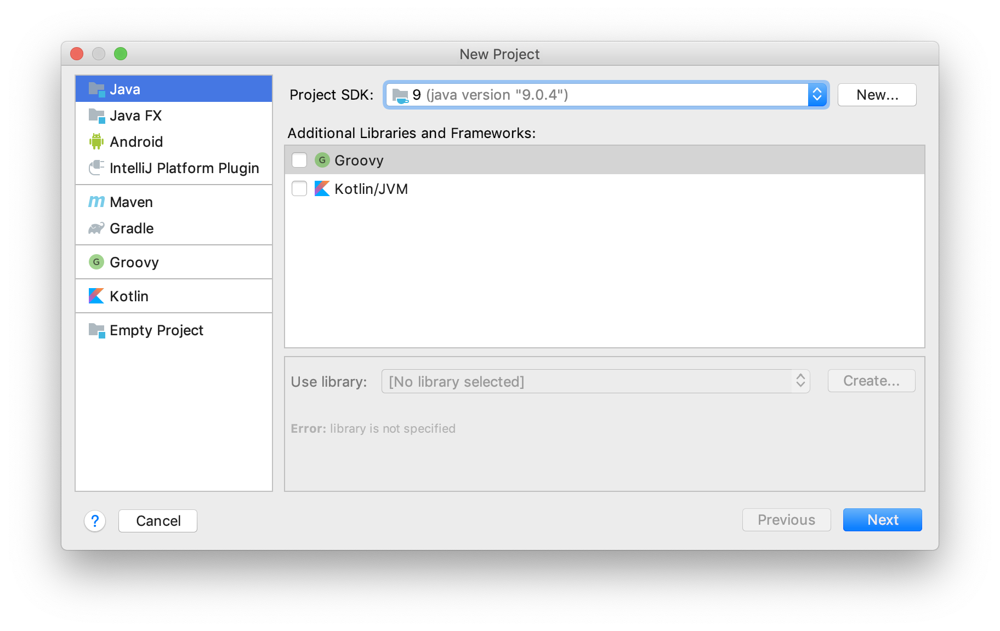
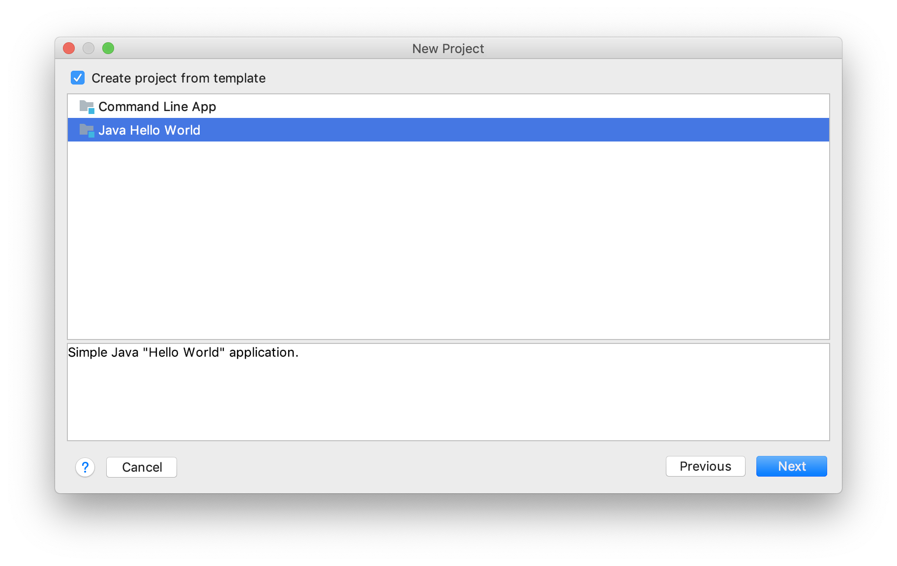
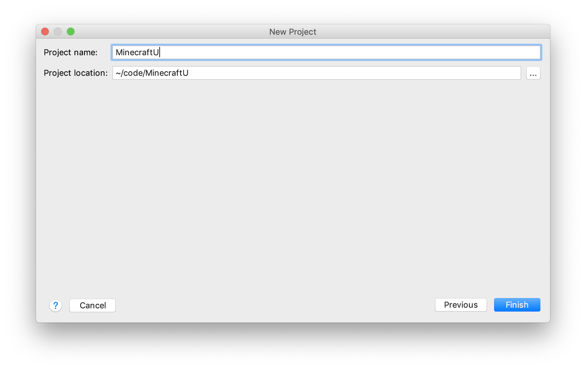
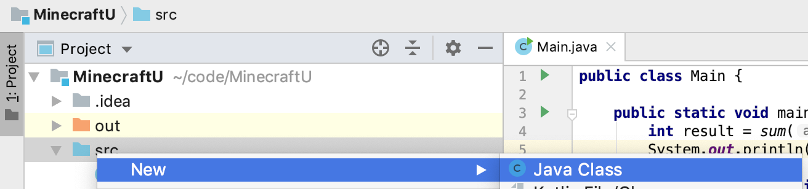

# Brief introduction to classes and methods

Before we dive into the Minecraft environment, you should understand what the words _class_ and _method_ mean in Java. At its most basic, a _class_ represents a real-world object by using code. Classes can have both state and behavior. In other words, they both store information and do something with that information. For example, in a spaceship game you may have a spaceship class that holds the position and health of the player, and it may move around space and fire blasters.

## Navigating IntelliJ

Open up IntelliJ. Choose File-->New-->Project...

Make sure Java is selected in the first window:



In the next window choose the Java Hello World template:



In the next window name your project MinecraftU:



Click Finish. It should open up a code file called `Main.java` that looks something like this:

```java
public class Main {

    public static void main(String[] args) {
        System.out.println("Hello World!");
    }
}
```

Hit the "run" button in the upper right:


A panel will pop open in the bottom part of the window and it should show some output like:

```text
Hello World!

Process finished with exit code 0
```

Contratulations, you've written and executed your first Java program (with a little help from IntelliJ), the classic _[Hello World](https://en.wikipedia.org/wiki/%22Hello,_World!%22_program)_:

>A "Hello, World!" program generally is a computer program that outputs or displays the message "Hello, World!". Such a program is very simple in most programming languages, and is often used to illustrate the basic syntax of a programming language. It is often the first program written by people learning to code.

Let's expand on this basic program. Remove the line of code in the `Main` class:

```java
public class Main {
    public static void main(String[] args) {

    }
}
```

## Writing a new method

If you remember from Level 4, a function is a block of code that performs some action.  In Java we call functions _methods_.  In this case, our method will calculate and print the sum of two integers.  

```java
public static int sum(int a, int b) {
    int total = a+b;
    return total;
}
```  

This block defines a method called `sum` that takes two _parameters_ (a and b).  The first line is called the method signature and defines its return type `int`.  In the second line, we define a new variable called `total` that is equal to `a+b`.  The third line returns `total`. (Don't worry about the word `static` for now; it's necessary here but we will explain it later.)

Finally, we're going to _call_ our `sum` function and pass it two _arguments_, in this case two integers.  These _arguement_ values fill in the _parameters_ from the method definition.  Then we'll assign the result to a variable `result` and print it.  Your final code should look something like this:  

```java
public class Main {
    public static void main(String[] args) {
        int result = sum(2,3);
        System.out.println(result);
    }

    public static int sum(int a, int b) {
        int total = a+b;
        return total;
    }
}
```

Use `System.out.println()` whenver you want to print something to the screen. To execute this code, hit the run button as before (you can also use the menu Run-->Run 'Main' or hit control+R). At the bottom it should print out the result, in this case 5.  

## Defining a new class

At the beginning of this section, you read that classes have both state and behavior. So far, we've only created a class with behavior (a method that sums two numbers). Let's create a class that also contains information. Go ahead and create a new class called `Rectangle`.

In the Project explorer on the left, open up the tree view until you see the `src` directory. Right click on `src` and choose New-->Java Class:



Name it Rectangle.

Then let's give it some properties: length, width, perimeter, area.

```java
public class Rectangle {
    public int length;
    public int width;
    public int perimeter, area;

    public Rectangle(int l, int w) {
        this.length = l;
        this.width = w;
        this.perimeter = length*2 + width*2;
        this.area = length * width;
    }

}
```  

The only new part here, is the `public Rectangle(int l, int w)` method.  This method is called the `Constructor` and will be used to _instantiate_ our object in our next section.

## Creating an object from a class

Now that a `Rectangle` class has been defined, we can _instantiate_ a `Rectangle` _object_ in our main. To _instantiate_ an object means to create an _instance_ from a class. Imagine that our class is the blueprint for constructing a particular model of car, and that objects are the actual cars that are being driven. All of these cars behave the same way and contain the same types of information (think speed, color, license plate).  Now that we have our Rectangle blueprint, we can make a couple Rectangle objects with different sizes.

In your `Main` class, in the `main` method, create a few Rectangle objects by calling the Rectangle constructor, passing in a width and a height.  We'll make the first one a 2x3 Rectangle and the second a 3x4 Rectangle.  We'll also want to print out the area and perimeter.  Your code should look like this:

```java
public static void main(String[] args) {    
    Rectangle rect1 = new Rectangle(2,3);
    Rectangle rect2 = new Rectangle(3,4);

    System.out.println("Area of rect1: " + rect1.area);
    System.out.println("Perimeter of rect1: " + rect1.perimeter);
    System.out.println("Area of rect2: " + rect2.area);
    System.out.println("Perimeter of rect2: " + rect2.perimeter);
}
```

Hit run again. Your output should look something like this:

```text
Area of rect1: 6
Perimeter of rect1: 10
Area of rect2: 12
Perimeter of rect2: 14
```
