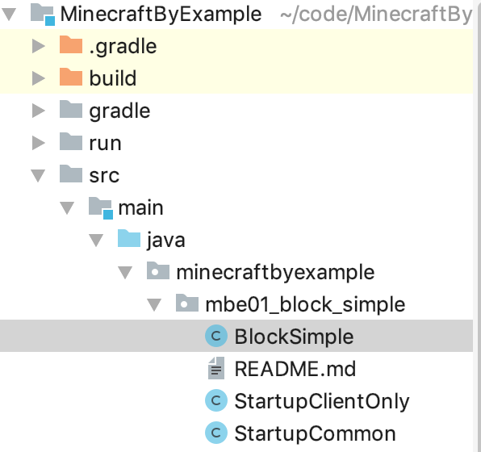
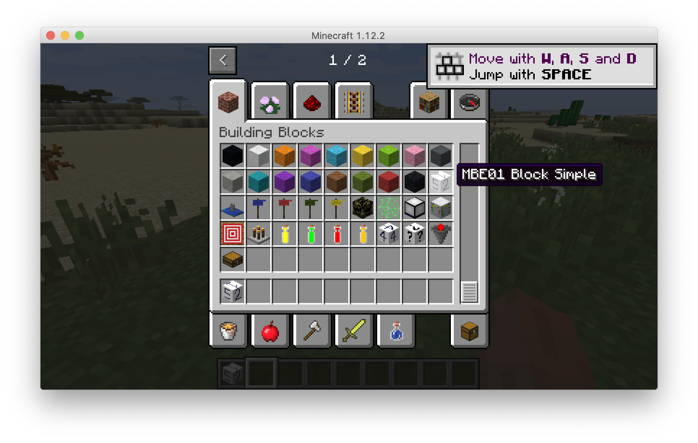
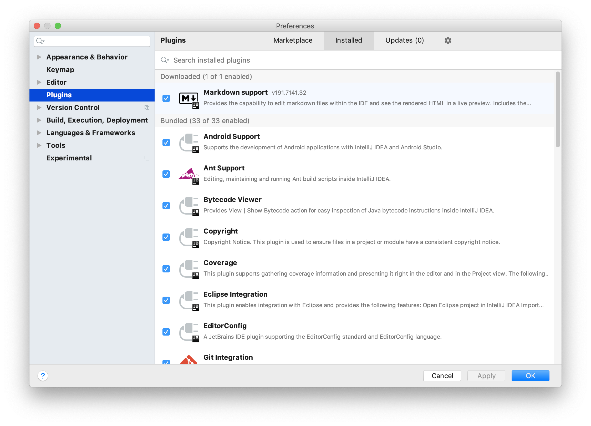
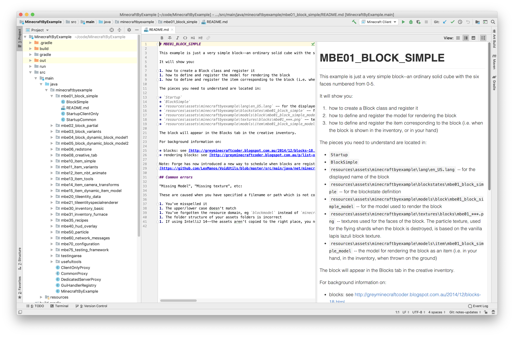
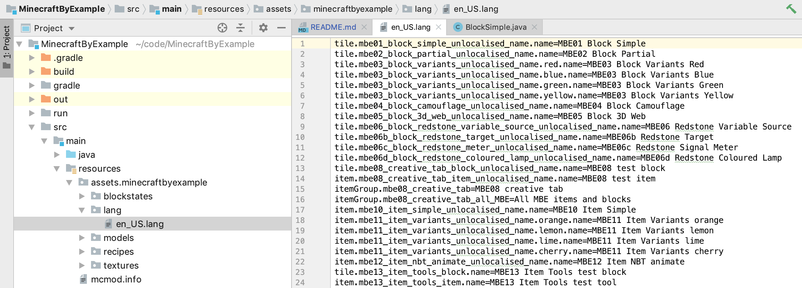
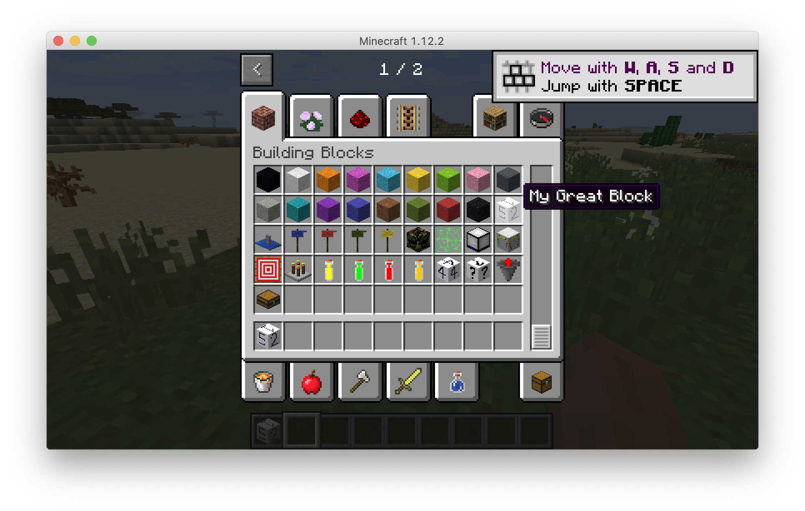
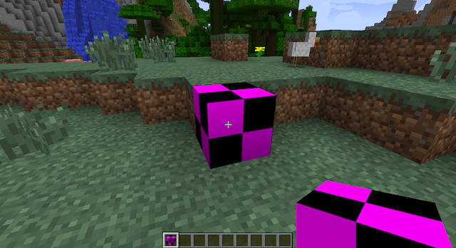
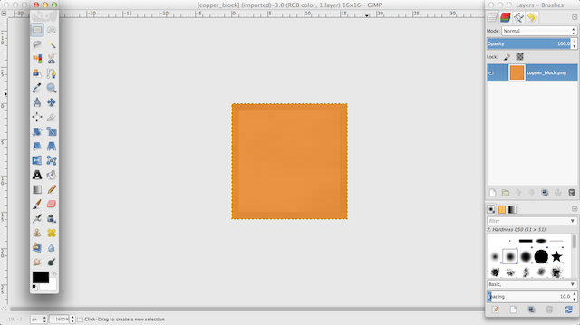
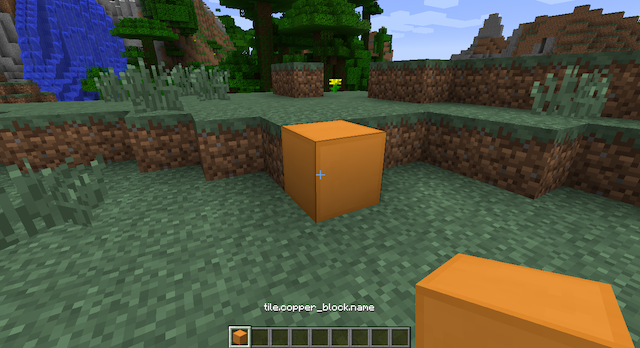
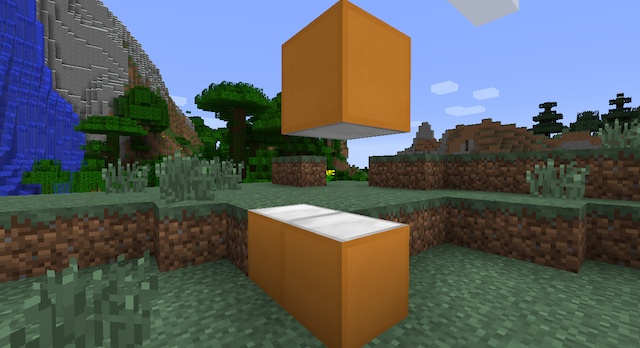

# Making basic blocks

**Anytime you copy Java code in this section, be sure to match ALL capitalization, punctuation, and spacing.**

First we're going to explore some of the examples in the MinecraftByExample repository. Go back to that IntelliJ project. Open the file tree of  `MinecraftByExample`-->`src`-->`main`-->`java`-->`minecraftbyexample`-->`mbe01_block_simple` and double click on the BlockSimple file.



## Core concepts

### Code comments

There are a couple of core concepts visible right at the top of this file. The first one we want you to pay attention to is the comment block at the top. Comments are where the developer of the code can write plain-English instructions or explanations about the code. It's always important to read code comments. The developer put them there for a reason!

```java
/**
 * Code comments can look like this
 */

// code comments can also look like this
```

You can see the developer of the BlockSimple class has written a lot of comments within the file, including their name, the date, a description. They even include helpful links you an follow for more explanation!

### "Extends"

The other core concept is just below the opening comments: the `extends` keyword. Keywords are special words in a programming language that mean specific things. 

In the Minecraft source code, just about everything is represented as a class. There's a class for a diamond pickaxe, for an iron ore, and all other blocks and items. These classes tell what a block (or item) should look like, how it should behave, as well as where it spawns or how it can be crafted. By creating our own classes, we can add our own blocks and items to the game. Let's say that we wanted to make a new type of block. Minecraft already has a `Block` class that defines what a block is in the game (all blocks can be broken and have a texture, for example). We can _extend_ the existing `Block` class and make our own new block. It will have all the normal properties of a block but we can set our own texture, hardness, and sound.

You can see that `BlockSimple` **`extends`** `Block`.

```java
public class BlockSimple extends Block
{
  public BlockSimple()
  {
    super(Material.ROCK);
    this.setCreativeTab(CreativeTabs.BUILDING_BLOCKS);   // the block will appear on the Blocks tab in creative
  }
```

### "Super"

`super` is another keyword. The `super` keyword in Java is a reference variable which is used to refer immediate parent class object.

Whenever you create the instance of subclass, an instance of parent class is created implicitly which is referred by `super` reference variable.

Therefore, the line `super(Material.ROCK)` is calling the `Block` parent class (in this case, its _constructor_). What can you infer from this line of code?

Answer: this new block is going to inherit some properties of Minecraft [Rock](https://minecraft.gamepedia.com/Rock). 

Let's observe this block in the wild. Run the MinecraftByExample project in IntelliJ just as before. Find the block "MBE01 Block Simple" and observe its characteristics. Make sure to observe that when you break the block, it has blue particles, identical to the Lapis particles. It is _inheriting_ those settings from the Lapis block.



### "README"

Another way developers communicate about their code in plain English is via README files. These can be in various different formats but a common one is called Markdown. Markdown allows some basic formatting using simple text. This curriculum is written in Markdown.

IntelliJ offers some Markdown plugins. Go to Preferences-->Plugins, search for "Markdown support" and install it. You may be prompted to restart IntelliJ. Afterwards your "Installed" tab under Plugins will look something like:



This will allow you to more easily view Markdown files, like the `README.md` files in MinecraftByExample. Open `src`...`mbe01_block_simple`-->`README.md`:



These README files in each MinecraftByExample folder will help guide you through each example. Let's experiment with this simple block.

First let's change the name of the block. In the README it indicates that the name of the block is in: `resources\assets\minecraftbyexample\lang\en_US.lang`. Find that file:



Change the name on the first line from `MBE01 Block Simple` to anything else. Example:

```text
tile.mbe01_block_simple_unlocalised_name.name=My Great Block
```

Save your file and re-run the project.



Let's change something else. Let's change the particles when the block is broken. It's currently set to inherit that value from Lapis. Let's change that to Emerald. 

Open `resources\assets\minecraftbyexample\models\block\mbe01_block_simple_model.json`:

```json
{
    "parent": "block/cube",
    "textures": {
        "down": "minecraftbyexample:blocks/mbe01_block_simple_face0",
        "up": "minecraftbyexample:blocks/mbe01_block_simple_face1",
        "north": "minecraftbyexample:blocks/mbe01_block_simple_face2",
        "east": "minecraftbyexample:blocks/mbe01_block_simple_face5",
        "south": "minecraftbyexample:blocks/mbe01_block_simple_face3",
        "west": "minecraftbyexample:blocks/mbe01_block_simple_face4",
        "particle": "blocks/lapis_block"
    }
}
```

Now just change the particle definition:

```json
"particle": "blocks/emerald_block"
```

Re-run your project. You'll see the broken block particles for this block are now green, the same as an Emerald block.

### JSON


---


For this lesson, we're going to create a new resource in Minecraft: copper. We'll have to make copper ore, copper ingots, copper tools, and all the other items associated with it (think of the tools and other items made from iron or diamond). First, open up the IntelliJ project that was created when you ran the gradle builds. Then, you should create a new class called `CopperBlock` by right-clicking on the package and choosing _Create new class_. Name it `CopperBlock` and press OK. The file that opens up will have code almost matching what I've written below. You should add the lines with comments (use `//` to make a comment in Java) after them so that it matches exactly. Note: if you add `extends Block` first, you can press `Alt-Enter` on top of the error and IntelliJ will offer to add the import for you. Be sure that any imports are of the form `net.minecraft.something`.

```java
package com.example.coppermod;

import net.minecraft.block.Block; //Add this line

public class CopperBlock extends Block //Add the second half of this line
{

}
```

The keyword `class` means that we are creating a new class. By extending the `Block` class, our `CopperBlock` class will inherit all of the attributes of the existing `Block` class. We call `Block` the _parent class_ of `CopperBlock`, while `CopperBlock` is the _child class_ of `Block`.

An error will come up regarding a missing _constructor_. A constructor is a function that runs whenever a new block is created in the game. The following constructor should go inside the braces of the `CopperBlock` class. If your cursor is over `CopperBlock`, you should be able to press Alt-Enter and select `Add missing constructor`. Then change the name of the `Material` parameter to `mat` and fill in the rest of the constructor.

```java
package com.example.coppermod;

import net.minecraft.block.Block;
import net.minecraft.block.material.Material;
import net.minecraft.creativetab.CreativeTabs;

public class CopperBlock extends Block
{
    protected CopperBlock(Material mat) {
        super(mat);
        this.setBlockName("copper_block");
        this.setHardness(5.0F);
        this.setStepSound(Block.soundTypeMetal);
        this.setCreativeTab(CreativeTabs.tabBlock);
        this.setBlockTextureName("coppermod:copper_block");
        this.setHarvestLevel("pickaxe", 2);
    }
}
```

`super` calls the constructor of `CopperBlock`'s parent class, `Block`. It's very important, but we mainly want to focus on the rest of the functions since they allow more customization! Each of them defines an attribute of our `CopperBlock` block, most of which should be obvious from the name. For example, `setStepSound` determines which sound the block will make when placed. `setHarvestLevel` determines what type and level of tool is required to successfully mine it (the number `2` means iron tools are required). The keyword `this` means that the function is part of the class whose constructor you're currently in, `CopperBlock` in this case (don't worry about this too much, either).

However, simply making a new class in our project is not enough. To actually add our block into the game, we need to register it with Minecraft Forge. Open the `CopperMod` class from the left side of the screen (it might still be called `ExampleMod` initially; just rename it to `CopperMod` if so). Add the variable declaration line and the `registerBlock` line shown below. The second argument of `registerBlock` sets up the name of the block as "_modid_\__blockname_" and lets us use the same code to create a standardized naming system for all of our blocks. In addition, by using our _MODID_ in the names of our blocks, we can make sure there won't be any overlaps with any other mods we may want to add.

```java
public static CopperBlock copperBlock;  //static variable declaration

@EventHandler
public void init(FMLInitializationEvent event)
{
    copperBlock = new CopperBlock(Material.iron);
    GameRegistry.registerBlock(copperBlock, MODID + "_" + copperBlock.getUnlocalizedName());
}
```

This block of code registers our newly-created block with the game. Again, `MODID + "_" + copperBlock.getUnlocalizedName()` creates a unique name based on our `MODID`, so that our blocks (or items) will not conflict with other mods.

So to recap, our `CopperMod` and `CopperBlock` classes should look as follows.

```java
package com.example.coppermod;

import cpw.mods.fml.common.Mod;
import cpw.mods.fml.common.Mod.EventHandler;
import cpw.mods.fml.common.event.FMLInitializationEvent;
import cpw.mods.fml.common.registry.GameRegistry;
import net.minecraft.block.material.Material;

@Mod(modid = CopperMod.MODID, version = CopperMod.VERSION)
public class CopperMod
{
    public static final String MODID = "coppermod";
    public static final String VERSION = "1.0";

    public static CopperBlock copperBlock;

    @EventHandler
    public void init(FMLInitializationEvent event)
    {
        copperBlock = new CopperBlock(Material.iron);
        GameRegistry.registerBlock(copperBlock, MODID + "_" + copperBlock.getUnlocalizedName());
    }
}
```

```java
package com.example.coppermod;

import net.minecraft.block.Block;
import net.minecraft.block.material.Material;
import net.minecraft.creativetab.CreativeTabs;

public class CopperBlock extends Block
{
    protected CopperBlock(Material mat) {
        super(mat);
        this.setBlockName("copper_block");
        this.setHardness(5.0F);
        this.setStepSound(Block.soundTypeMetal);
        this.setCreativeTab(CreativeTabs.tabBlock);
        this.setBlockTextureName("coppermod:copper_block");
        this.setHarvestLevel("pickaxe", 2);
    }
}
```

To actually launch our modded Minecraft, run the project by clicking on the green arrow at the top of the IDE. Make a new creative world and try placing your block on the ground. It should be under the normal `Blocks` tab at the very bottom and will be called `tile.copper_block.name`. The coloring should be a purple and black checkerboard, the default color scheme when a texture is not specified. Even though we said the texture file's name should be `copper_block` in the code, Minecraft can't find the texture file because we haven't made one!



## Adding a texture to a block

To add our texture to our block, we first need to create the folder that will hold our textures. The full path is `src/main/resources/assets/coppermod/textures/blocks`. Start at the `resources` folder (it should already exist) and create one folder after another until you get down to the final one, `blocks`. Open up Paint (or another image-editing program) and create a new empty canvas with a square resolution. Most Minecraft textures are 16x16 but you could also try 32x32 or 64x64. Take a few minutes and make your own texture!



For right now, the block will have the same texture on all six sides like cobblestone or obsidian. Name the texture `copper_block` and save it as a `.png` in the `blocks` folder. After your texture has been saved, run Minecraft. Now check out the texture of your block!



## Multi-sided textures

What about blocks like grass that have different textures on different sides? The following code in the `CopperBlock` class registers three different textures and tells the program which textures belong on the top, sides, and bottom. If we want, we could even make the side textures different (like a furnace or dispenser). You will have to create three texture files matching the names that are being registered. I've made it so that my block has a silver-colored top and bottom. You can add additional `if` statements if you would like the other sides to have different colors as well. The `meta` parameters can be used to alter which textures that are returned (such as how logs face differently based on their angle of placement). Add the following code to your `CopperBlock` class:

```java
//Creating our icon variables
private IIcon topIcon;
private IIcon sideIcon;
private IIcon botIcon;

//This function registers our textures to their specific icons
@Override
public void registerBlockIcons(IIconRegister ir)
{
    this.topIcon = ir.registerIcon("coppermod:copper_block_top");
    this.sideIcon = ir.registerIcon("coppermod:copper_block_side");
    this.botIcon = ir.registerIcon("coppermod:copper_block_bottom");
}

//This function tells which icons to use for which sides of the block
@Override
public IIcon getIcon(int side, int meta) //side = the side of the block
{
    if (side == 0) //Bottom
        return botIcon;

    else if (side == 1) //Top
        return topIcon;

    else //all other sides, numbers 2,3,4,5
        return sideIcon;
}
```


