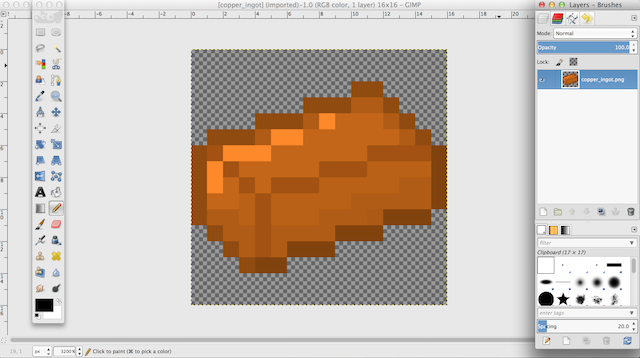

# Half blocks

Next we're going to look at a half block. This code is in the MinecraftByExample `mbe02_block_partial` folder. The README is located [here](https://github.com/MinecraftU/MinecraftByExample/tree/master/src/main/java/minecraftbyexample/mbe02_block_partial). Here's what the block looks like in-game:


Let's update this block with new textures, just as before, except to make a partial block requires a significant additional layer of complexity. You'll notice the JSON in `resources/assets/minecraftbyexample/models/block/mbe02_block_partial_model.json` is much more complex than the JSON from the 1x1x1 block in MBE01. To specify only certain portions of the block face be textured, we have to use **UV** values. 

>The UV field used by each face has the format [U1, V1, U2, V2]. These are always oriented to the texture such that [0,0] is the top left corner.


_From [Minecraft By Example: Block Models - texturing quads (faces)](http://greyminecraftcoder.blogspot.com/2014/12/block-models-texturing-quads-faces.html)_

Because it is so complex to understand, we're going to use a tool to help us. We're going to use [Blockbench](https://www.blockbench.net/web/), a free, web-based tool. (For more information about Blockbench, visit their [homepage](https://blockbench.net/).) Open Blockbench and you'll be presented with a new project. Add a cube by going Edit-->Add Cube.


The left pane is the important area for our purposes. Save our example cake textures from [here](images/sections_3/new_textures). Click the Import Texture icon under Textures, navigate to your saved cake textures and select both textures. They'll then show up in the Textures pane.


You'll notice the top portion of the left panel is the all-imporant UV pane. For North, South, East and West, drag `cake_side.png` into the UV pane. Then resize the selection box around the image:


Notice how the numbers below the image change to represent the UV values.

For Up and Down, do the same thing but with the `cake_top.png` image.

Finally, resize the block to be the correct size by clicking the resize icon at the top of the screen. Then drag the resizing squares (the blue, red and green elements postioned in 3D over the block) to resize the block appropriately. The numbers on the right of the top toolbar indicate the size of the block. 


This block not using up the whole space. We've accomplished this by adjusting the UV values. 

Now go File-->Save. This will prompt you to download a JSON file. You can open the JSON file in IntelliJ. It should look something like this:

```json
{
  "credit": "Made with Blockbench",
  "textures": {
    "0": "cake_side",
    "1": "cake_top",
    "particle": "cake_side"
  },
  "elements": [
    {
      "from": [0, 0, 0],
      "to": [16, 10, 16],
      "faces": {
        "north": {"uv": [1, 8, 15, 16], "texture": "#0"},
        "east": {"uv": [1, 8, 15, 16], "texture": "#0"},
        "south": {"uv": [1, 8, 15, 16], "texture": "#0"},
        "west": {"uv": [1, 8, 15, 16], "texture": "#0"},
        "up": {"uv": [1, 1, 15, 15], "texture": "#1"},
        "down": {"uv": [1, 1, 15, 15], "texture": "#1"}
      }
    }
  ]
}
```

Copy this JSON into `mbe02_block_partial_model.json`.

Now we need to save those same textures to `resources/assets/minecraftbyexample/textures/blocks/` so we can correctly reference them in the `textures` portion of the JSON. Once those textures are in that directory, we can reference them as before, and change up the particle if you like:

```json
  "textures": {
      "0": "minecraftbyexample:blocks/cake_side",
      "1": "minecraftbyexample:blocks/cake_top",
      "particle": "blocks/gold_block"
  },
```

Now run your project and you'll notice the block MBE02 Block Partial is now our cake block:


---

# Making basic items

Making an item is very similar to making a new block, except that we will be extending the `Item` class rather than the `Block` class.

```java
package com.example.coppermod;

import net.minecraft.item.Item;

public class CopperIngot extends Item {

}
```

Just as we did with our `CopperBlock` class, we can also add a constructor and give some properties to our `CopperIngot`.

```java
public CopperIngot()
{
    this.setUnlocalizedName("copper_ingot");
    this.setCreativeTab(CreativeTabs.tabMaterials);
    this.setTextureName("coppermod:copper_ingot");
}
```

One important note regarding textures is that item textures should have transparent backgrounds, or there will be a white square around the item in the game. Transparency backgrounds are indicated by a grey and white checkerboard on the background of the image file.



We'll also need to register our item with the game using the `registerItem` function. You should create a static `copperIngot` variable in `CopperMod` class just as we did with our static `copperBlock` variable.

```java
copperIngot = new CopperIngot();    //initializing the variable you should declare in the class
GameRegistry.registerItem(copperIngot, MODID + "_" + copperIngot.getUnlocalizedName());
```

## On-click effects

There are two methods that are called when the player right-clicks while holding an item. `onItemUse` is called when the player is targeting a block in range (ie. the block has the black wireframe around it), while `onItemRightClick` is called regardless of what the player is targeting (ie. even if they are looking at the sky).

`onItemUse` gives us several parameters that we can use to make _something_ happen when an item is used.

```java
@Override
public boolean onItemUse(ItemStack itemstack, EntityPlayer player, World world, int p_77648_4_, int p_77648_5_, 
int p_77648_6_, int p_77648_7_, float p_77648_8_, float p_77648_9_, float p_77648_10_)
{
    return false;
}
```

`onItemRightClick` is a bit more general and primitive. There are fewer arguments given to us:

```java
@Override
public ItemStack onItemRightClick(ItemStack itemstack, World world, EntityPlayer player)
{
    return itemstack;
}
```
