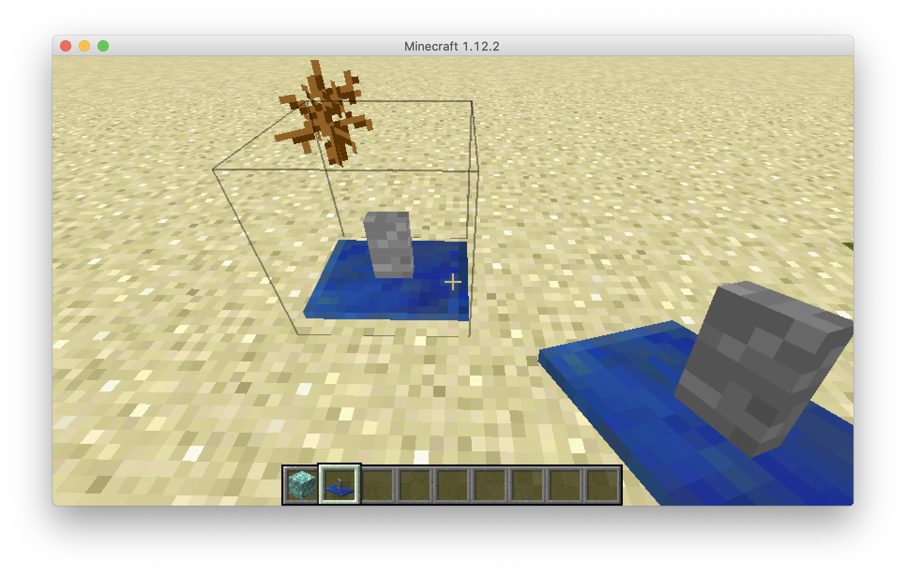
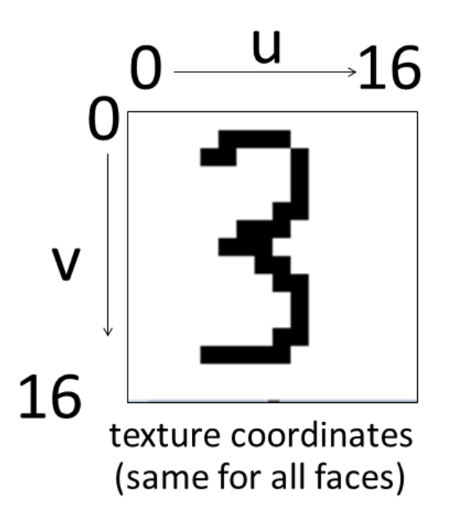
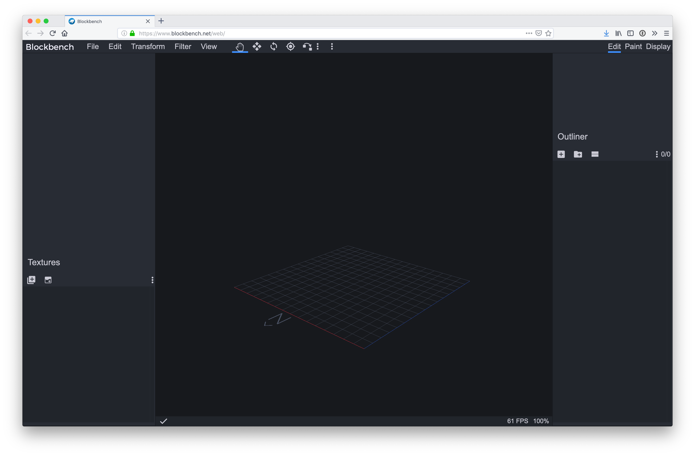
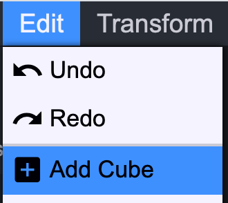
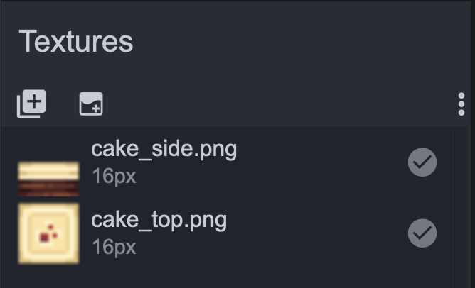
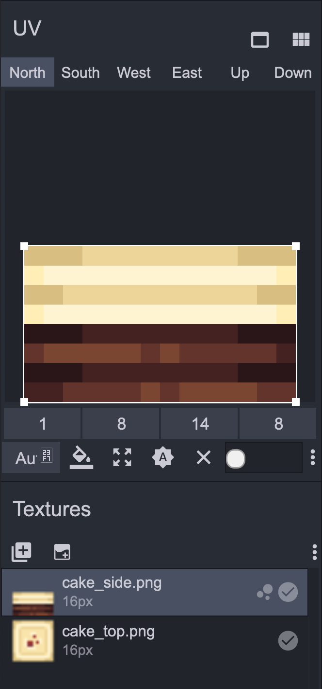
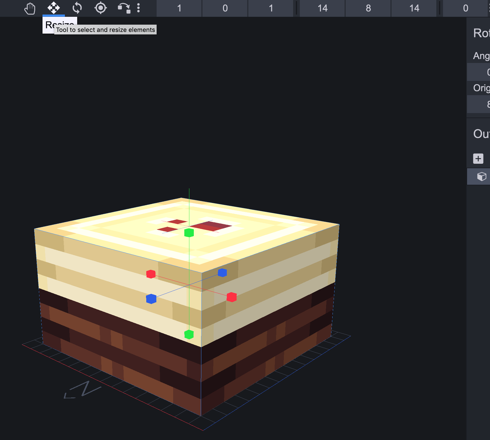
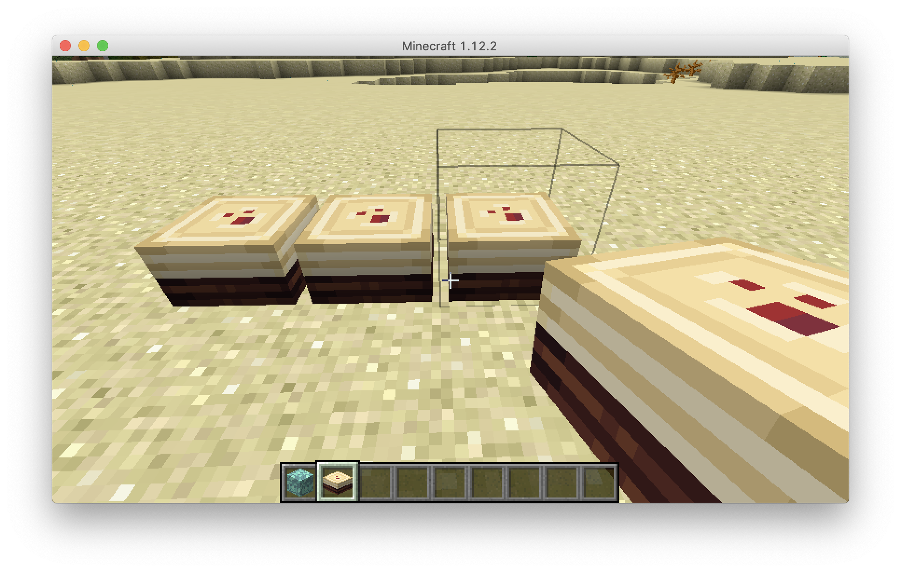

# Half blocks

Next we're going to look at a half block. This code is in the MinecraftByExample `mbe02_block_partial` folder. The README is located [here](https://github.com/MinecraftU/MinecraftByExample/tree/master/src/main/java/minecraftbyexample/mbe02_block_partial). Here's what the block looks like in-game:



Let's update this block with new textures, just as before, except to make a partial block requires a significant additional layer of complexity. You'll notice the JSON in `resources/assets/minecraftbyexample/models/block/mbe02_block_partial_model.json` is much more complex than the JSON from the 1x1x1 block in MBE01. To specify only certain portions of the block face be textured, we have to use **UV** values. 

>The UV field used by each face has the format [U1, V1, U2, V2]. These are always oriented to the texture such that [0,0] is the top left corner.



_From [Minecraft By Example: Block Models - texturing quads (faces)](http://greyminecraftcoder.blogspot.com/2014/12/block-models-texturing-quads-faces.html)_

Because it is so complex to understand, we're going to use a tool to help us. We're going to use [Blockbench](https://www.blockbench.net/web/), a free, web-based tool. (For more information about Blockbench, visit their [homepage](https://blockbench.net/).) Open Blockbench and you'll be presented with a new project. Add a cube by going Edit-->Add Cube.





The left pane is the important area for our purposes. Save our example cake textures from [here](images/sections_3/new_textures). Click the Import Texture icon under Textures, navigate to your saved cake textures and select both textures. They'll then show up in the Textures pane.



You'll notice the top portion of the left panel is the all-imporant UV pane. For North, South, East and West, drag `cake_side.png` into the UV pane. Then resize the selection box around the image:



Notice how the numbers below the image change to represent the UV values.

For Up and Down, do the same thing but with the `cake_top.png` image.

Finally, resize the block to be the correct size by clicking the resize icon at the top of the screen. Then drag the resizing squares (the blue, red and green elements postioned in 3D over the block) to resize the block appropriately. The numbers on the right of the top toolbar indicate the size of the block. 



This block not using up the whole space. We've accomplished this by adjusting the UV values. 

Now go File-->Save. This will prompt you to download a JSON file. You can open the JSON file in IntelliJ. It should look something like this:

```json
{
  "credit": "Made with Blockbench",
  "textures": {
    "0": "cake_side",
    "1": "cake_top",
    "particle": "cake_side"
  },
  "elements": [
    {
      "from": [0, 0, 0],
      "to": [16, 10, 16],
      "faces": {
        "north": {"uv": [1, 8, 15, 16], "texture": "#0"},
        "east": {"uv": [1, 8, 15, 16], "texture": "#0"},
        "south": {"uv": [1, 8, 15, 16], "texture": "#0"},
        "west": {"uv": [1, 8, 15, 16], "texture": "#0"},
        "up": {"uv": [1, 1, 15, 15], "texture": "#1"},
        "down": {"uv": [1, 1, 15, 15], "texture": "#1"}
      }
    }
  ]
}
```

Copy this JSON into `mbe02_block_partial_model.json`.

Now we need to save those same textures to `resources/assets/minecraftbyexample/textures/blocks/` so we can correctly reference them in the `textures` portion of the JSON. Once those textures are in that directory, we can reference them as before, and change up the particle if you like:

```json
  "textures": {
      "0": "minecraftbyexample:blocks/cake_side",
      "1": "minecraftbyexample:blocks/cake_top",
      "particle": "blocks/gold_block"
  },
```

Now run your project and you'll notice the block MBE02 Block Partial is now our cake block:



# Block behavior

## Drops

The next section of MinecraftByExample we'll be looking at is `mbe07_block_behavior`. This section adds a drop when the block is broken. Look at the differences between this block and `mbe01_block_simple`. If you need help spotting the differences, you can see them clearly in [this diff](https://gist.github.com/dealingwith/5b2f5f8e38d9e210753be85713cfe6e4/revisions?diff=unified).

>In computing, the [diff](https://en.wikipedia.org/wiki/Diff) utility is a data comparison tool that calculates and displays the differences between two files.

Here are the important parts. We'll go over each:

```java
  public Item getItemDropped(IBlockState state, Random rand, int fortune)
  {
    return Items.COOKIE;
  }
```

```java
  public int quantityDropped(Random random) {
      return random.nextInt(4) + 1;
  }
```

`getItemDropped` is a _method_. A method is code that performs some operation. They are normally named in a way that you can understand what they do just by their name. `Item` defines what the method _returns_. In this case the line `return Items.COOKIE` defines what this block will drop when it's broken.

Now let's look at the `quantityDropped` method. What does it do? What kind of data does it return? (`int` stands for _integer_.) What do you think `random.nextInt(4)` does? Why is `1` added to the result?

>The nextInt(int n) method is used to get a [random] value between 0 and the specified value

In other words, `random.nextInt(4)` will result in a number between 0 and 4. The `+ 1` makes it so it will drop at least one cookie (it will drop between 1 and 5 cookies).

Run your project and find this block. Place a bunch, grab a tool, switch to survival and break the blocks. 

Let's change how hard it is to break this block. Note the line: `this.setHardness(0.5f);` ...let's try something between `3f`-`13f`. Test it out!

What do you think the hardness value of Obsidian is?
