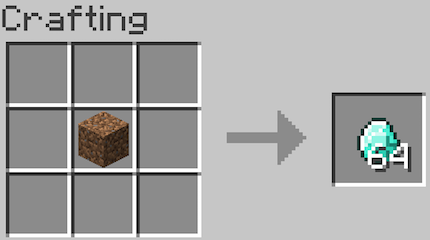
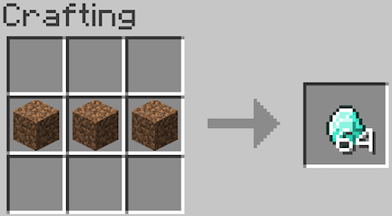
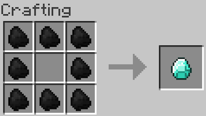
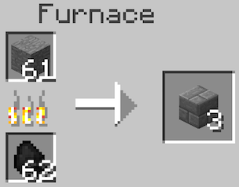
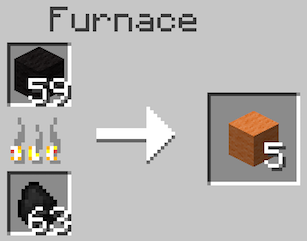

# Making basic items


## On-click effects


---

# Recipes


>The function calls that create new recipes will go in your main mod class (eg. CopperMod), not the block or item classes.

Now we need to make our new blocks and items useful by creating some recipes! There are two types of recipes we can create: shapeless and shaped. Shapeless recipes (such as making wooden planks from wood) don't require the items to be in any specific orientation to work. Shaped recipes (such as making a pickaxe or shovel) require blocks to be in specific locations for the recipe to function.

We simply use the `addShapelessRecipe` and `addShapedRecipe` function calls to register our recipes with the game. The calls will go in your main mod class, and you will need to import the `ItemStack` and `Items` classes to use them (IntelliJ will prompt you for them when you use them).

### Shapeless recipes

First, let's make a shapeless recipe.

```java
GameRegistry.addShapelessRecipe(new ItemStack(Items.diamond, 64), new ItemStack(Blocks.dirt));
```

This recipe simply trades in a stack of 64 dirt blocks for 64 diamonds. The resulting item is the first argument in the function call, and any input items are the following arguments.



To add more items, simply add more ItemStacks within the parentheses.

```java
GameRegistry.addShapelessRecipe(new ItemStack(Items.diamond, 64), new ItemStack(Blocks.dirt),
    new ItemStack(Blocks.dirt), new ItemStack(Blocks.dirt));
```
Note that we must call `new ItemStack(item, number)` when passing arguments. `addShapelessRecipe` expects `ItemStack` objects to be passed; this is a shortcut which allows us to skip defining an `ItemStack` variable and just directly pass a newly-instantiated object.



### Shaped recipes

Next, let's make a shaped recipe. Shaped recipes group the rows of items using letters to represent the type of block. For example, the recipe for TNT would be: `("xyx", "yxy", "xyx", 'x', new ItemStack(Materials.sulphur), 'y', new ItemStack(Blocks.sand))` where `x` corresponds to sulphur (the name for gunpowder in the game code) and `y` corresponds to sand. Pay attention to the double-quotes for the letters representing the recipe shape and the single-quotes for the letters representing the items in the recipe.

> Note: when we leave out the size of the ItemStack, the game will assume a size of 1.

An example of a shaped recipe. You use three strings to represent the three rows of the crafting table and define which letters relate to which type of item. Blank spaces are used in the strings to represent empty crafting slots.

```java
GameRegistry.addShapedRecipe(new ItemStack(Items.diamond), "xxx", "x x", "xxx", 'x',
    new ItemStack(Items.coal));
```



## Smelting recipes

Smelting recipes are very similar and only require a slightly different function call.

```java
GameRegistry.addSmelting(Blocks.stone, new ItemStack(Blocks.stonebrick), 0.1f);
```

This time, the input item is the first argument while the output is the second argument. Be sure to remember this is the reverse of crafting recipes! The `float` at the end specifies how much experience the player receives from the smelting.



On a side note, the _damage values_ of items often hold extra information (also called data) about the block and can be set using the `setItemDamage` method. For example, all the colors of wool are actually the same type of block. They're rendered differently based on the value of their damage value. We can use this data value in our recipes to alter what kinds of wool, clay, or wood are required.

```java
// What do you think this smelting recipe does?
ItemStack woolStackBlack = new ItemStack(Blocks.wool);
ItemStack woolStackOrange = new ItemStack(Blocks.wool);
woolStackBlack.setItemDamage(15);
woolStackOrange.setItemDamage(1);
GameRegistry.addSmelting(woolStackBlack, woolStackOrange, 0.1f);
```


