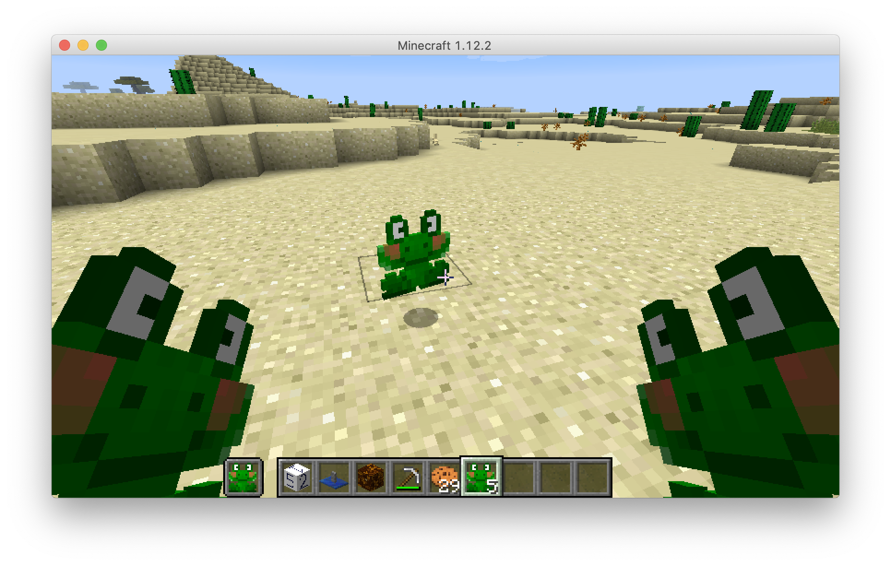
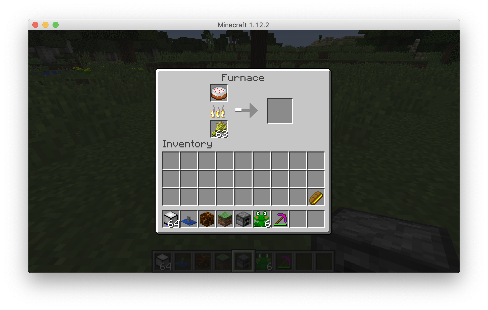
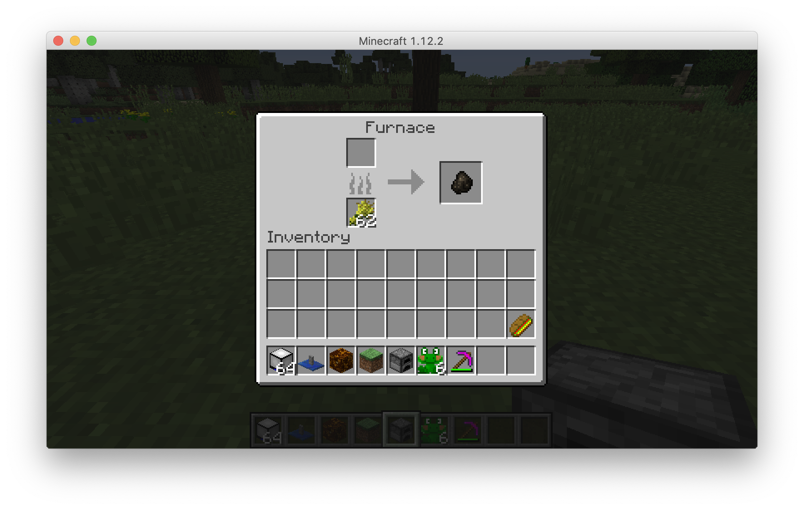

# Making basic items

In this section, we will be referencing `mbe10_item_simple`. Our simple item is a frog. As always, read the README.md file in that directory, and then run the MinecraftByExample project and find the frog item and observe its use and behaviors.

Next, look at `ItemSimple.java`.

```java
public class ItemSimple extends Item
{
  public ItemSimple()
  {
    final int MAXIMUM_NUMBER_OF_FROGS = 6;
    this.setMaxStackSize(MAXIMUM_NUMBER_OF_FROGS);
    this.setCreativeTab(CreativeTabs.MISC);
  }
}
```

You'll notice here that again we're extending a class, this time the `Item` class. 

>Basic items that need no special functionality (think sticks or sugar) don’t need custom classes. You can simply instantiate Item and call its various setters to set some simple properties.

[Forge docs](https://mcforge.readthedocs.io/en/latest/items/items/#advanced-items)

There are just a couple of lines of code in this class, one to set the maximum stack size. `MAXIMUM_NUMBER_OF_FROGS` is a _constant_, and the value passed into the `setMaxStackSize` must be represented this way. <!-- why? --> Constants are almost always represented with all caps.

The second method, `setCreativeTab`, sets the tab in which the item will appear in Creative mode.

To define the model for the item, go to `resources/assets/minecraftbyexample/modes/item/mbe10_item_simple.json`. You'll notice this is a large JSON file, but relatively readable. There are different _objects_ representing each state of the texture. An object in JSON is a group of key-value pairs, such as this:

```json
"firstperson_righthand": {
  "rotation": [ -25, -90, 0 ],
  "translation": [ 1.13, 3.20, 1.13 ],
  "scale": [ 0.68, 0.68, 0.68 ]
}
```

The keys in this JSON file are relatively easy to reason about. The above JSON object represents the item being held in the right hand while in first person. Let's look at a couple others:

```json
"firstperson_lefthand": {
  "rotation": [ 335, 90, 0 ],
  "translation": [ 1.13, 3.20, 1.13 ],
  "scale": [ 0.68, 0.68, 0.68 ]
},
"gui": {
  "rotation": [ 0, 0, 0 ],
  "translation": [ 0.00, 0.00, 0.00 ],
  "scale": [ 1.00, 1.00, 1.00 ]
},
```

You can see the rotation numbers change when in the left hand, and in the GUI the rotation numbers are 0. The same for if you were to throw the frog item on the ground:

```json
"ground": {
  "rotation": [ 0, 0, 0 ],
  "translation": [ 0.00, 4.00, 0.00 ],
  "scale": [ 0.60, 0.60, 0.60 ]
}
```



For more information on item models, see [https://minecraft.gamepedia.com/Model#Item_models](https://minecraft.gamepedia.com/Model#Item_models)

# Extending an existing item

In this section, we will be referencing `mbe10_tool_simple`. It extends `ItemPickaxe`. With `mbe10_item_simple`, we simply created an item that does nothing. Now we want to create a new pickaxe, so we'll _inherit_ all the characteristics from the `ItemPickaxe` object.

Look at `mbe10_tool_simple/ToolSimple.java`:

```java
public class ToolSimple extends ItemPickaxe 
{
  public ToolSimple(ToolMaterial material) {
    super(material);
    this.setCreativeTab(CreativeTabs.MISC);
  }
  
}
```

To understand the parameters passed into the `ToolSimple` method, look in `StartupCommon.java`:

```java
final Item.ToolMaterial TOOL_MATERIAL = Item.ToolMaterial.STONE;
toolSimple = (ToolSimple)(new ToolSimple(TOOL_MATERIAL));
```

You can see that the _material_ is set to stone. Finally, in `StartupClientOnly.java` you can see where the model and item texture are defined:

```java
ModelResourceLocation itemBlockModelResourceLocation = new ModelResourceLocation("minecraftbyexample:mbe10_tool_simple", "inventory");
```

So this is going to be a stone pickaxe but with a new name and texture. Run your project and observe the characteristics of this pickaxe.

Finally, let's change the material so that it's not just using all of stone's characteristics. We will need to create our own `ToolMaterial`. The ToolMaterial object consists of:

 A ToolMaterial has:

* A name (String) -- This should be the same as the variable name.
* A harvestLevel (int) -- Which blocks are mineable. Vanilla blocks range between 0 and 3. Examples:
    * Wood: 0
    * Stone: 1
    * Iron: 2
    * Diamond: 3
    * Gold: 0
* The max durability (int) -- How many times the tool can be used. Examples:
    * Wood: 59
    * Stond: 131
    * Iron: 250
    * Diamond: 1561
    * Gold: 32
* The mining speed (float) -- How fast the tool is. Examples:
    * No tool: 1.0f
    * Wood: 2.0f
    * Stone: 4.0f
    * Iron: 6.0f
    * Diamond: 8.0f
    * Gold: 12.0f
* The damage (float) -- How much damage it does against entities. Examples:
    * Wood: 0.0f
    * Stone: 1.0f
    * Iron: 2.0f
    * Diamond: 3.0f
    * Gold: 0.0f
* The enchantability (int) -- How good the enchants are. Examples:
    * Wood: 15
    * Stone: 5
    * Iron: 14
    * Diamond: 10
    * Gold: 22

Let's make our new tool the best of all worlds, the harvest level, durability and damage of diamond with the speed of gold. We'll define the ToolMaterial `StartupCommon` exactly where it is defined now. Modify the definition of `TOOL_MATERIAL`:

```java
final Item.ToolMaterial TOOL_MATERIAL = EnumHelper.addToolMaterial("TOOL_MATERIAL", 3, 1561, 12.0f, 3.0f, 22);
toolSimple = (ToolSimple)(new ToolSimple(TOOL_MATERIAL));
```

Notice this uses a new method called `EnumHelper`. This is a part of Forge that we need to import at the top of our file. In the imports section add:

```java
import net.minecraftforge.common.util.EnumHelper;
```

Now our pickaxe has the durability of a diamond pickaxe and the speed of a gold pickaxe. Try it out! To overpower your pickaxe, crank up the values passed into `addToolMaterial`, e.g:

```java
final ToolMaterial TUTORIALMATERIAL = EnumHelper.addToolMaterial("TUTORIALMATERIAL", 3, 2048, 13f, 4.0f, 30);
```

# Recipes

Recipes are used for crafting and smelting in furnaces. There are two types of recipes we can create: shapeless and shaped. Shapeless recipes (such as making wooden planks from wood) don't require the items to be in any specific orientation to work. Shaped recipes (such as making a pickaxe or shovel) require blocks to be in specific locations for the recipe to function. In this section we will be referencing `mbe35_recipies`.

## JSON-only recipe

Look in `resources/assets/minecraftbyexample/recipes/mbe35_recipe_painting.json`. Notice the author has added some comments to the JSON by using the key `_comment`. Now let's look at each piece of the JSON in turn:

```json
  "pattern": [
    "PPP",
    "DDD",
    " F "
  ],
```

The key _pattern_ is an array, with each element of the array representing a row on the crafting bench. The way the author has formatted this JSON makes it easy to decipher the pattern. The _key_ key defines what each of those items in the pattern are:

```json
"key": {
  "D": {
    "item": "minecraft:dye",
    "data": 1,
  },
  "P": {
    "item": "minecraft:paper",
  },
  "F": {
    "item": "minecraft:feather"
  }
},
```

Hint: Use [https://minecraft.gamepedia.com/Java_Edition_data_values](https://minecraft.gamepedia.com/Java_Edition_data_values) to know what different data values to use, if any are required.

Finally, the _result_ key defines what is crafted by this recipe:

```json
"result": {
  "item": "minecraft:painting"
}
```

## Shaped recipes

Now that we know how to make a shaped recipe with just JSON, doing the same in Java is more self-explanatory. Look in `java/minecraftbyexample/mbe35_recipes/StartupCommon.java`. You'll notice a lot of familiar things about this code. `ResourceLocation`, just as previous blocks and items. `optionalGroup` is not familiar and you can ignore it for now or read the explanation in the code comments of the file. Finally, something that, when formatted correctly, looks a lot like our JSON recipe. 

```java
GameRegistry.addShapedRecipe(
    new ResourceLocation("minecraftbyexample:mbe35_recipe_ender_eye"), 
    optionalGroup, 
    new ItemStack(Items.ENDER_EYE), new Object[]{
        " D ",
        "DED",
        " D ",
        'D', Items.DIAMOND, // note: single quotes - 'D' not "D"!
        'E', Items.EMERALD // note: single quotes!
    }
);
```

Formatting your code is very important! The above is just one line of code and could be written that way. Imagine trying to read this code without the above formatting:

```java
GameRegistry.addShapedRecipe(new ResourceLocation("minecraftbyexample:mbe35_recipe_ender_eye"), optionalGroup, new ItemStack(Items.ENDER_EYE), new Object[]{" D ", "DED", " D ", 'D', Items.DIAMOND, 'E', Items.EMERALD});
```

Make a new recipe, copying and pasting the above code (you can paste it just below the original) and modifying the values.

## Shapeless recipes

Next, let's make a shapeless recipe. They simply take Ingredients, rather than a recipe `object` as above. This recipe makes 2 green dye out of a blue and yellow dye.

```java
final int BLUE_DYE_DAMAGE_VALUE = EnumDyeColor.BLUE.getDyeDamage();
final int YELLOW_DYE_DAMAGE_VALUE = EnumDyeColor.YELLOW.getDyeDamage();
final int GREEN_DYE_DAMAGE_VALUE = EnumDyeColor.GREEN.getDyeDamage();
final int NUMBER_OF_GREEN_DYE_PRODUCED = 2;

GameRegistry.addShapelessRecipe(
    new ResourceLocation("minecraftbyexample:mbe35_recipe_greendye"), optionalGroup,
    new ItemStack(Items.DYE, NUMBER_OF_GREEN_DYE_PRODUCED, GREEN_DYE_DAMAGE_VALUE),
    new Ingredient[] {
        Ingredient.fromStacks(new ItemStack(Items.DYE, 1, YELLOW_DYE_DAMAGE_VALUE)), 
        Ingredient.fromStacks(new ItemStack(Items.DYE, 1, BLUE_DYE_DAMAGE_VALUE))
    }
);
```

Again, the line invoking `addShapelessRecipe` is one line of code, but we've put it across 8 lines in the file for readability. Also notice the large amount of constants used, and the re-use of the `optionalGroup` variable.

Make a new shapeless recipe, copying and pasting the example code just as you did for your shaped recipe.

## Smelting recipes

Scroll down in `StartupCommon.java` and find the furnace recipes section. The use of properly named constants helps make this code very readable:

```java
final float CAKE_SMELT_XP = 0.0F;
final int NUMBER_OF_ITEMS = 1;
final int CHARCOAL_METADATA_VALUE = 1;
GameRegistry.addSmelting(
    Items.CAKE, 
    new ItemStack(
        Items.COAL, 
        NUMBER_OF_ITEMS, 
        CHARCOAL_METADATA_VALUE
    ), CAKE_SMELT_XP
);
```

You can also add items that can be used as fuel in a furnace:

Look at `FurnaceFuelBurnTimeEventHandler.java` in the same folder:

```java
@SubscribeEvent
public void onFurnaceFuelBurnTimeEvent(FurnaceFuelBurnTimeEvent event)
{
  ItemStack fuel = event.getItemStack();
  final int BURN_TIME_SECONDS = 5;
  final int TICKS_PER_SECOND = 20;
  if (fuel.getItem() == Items.WHEAT) {
    event.setBurnTime(BURN_TIME_SECONDS * TICKS_PER_SECOND);
  }
}
```

...and back in `StartupCommon.java`:

```java
MinecraftForge.EVENT_BUS.register(FurnaceFuelBurnTimeEventHandler.instance);
```




