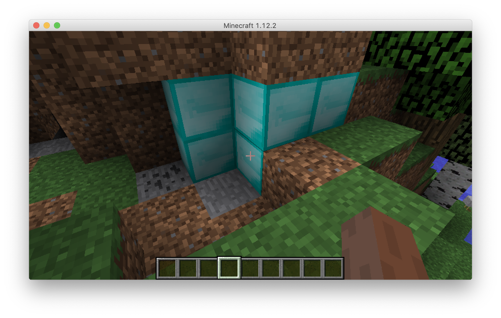
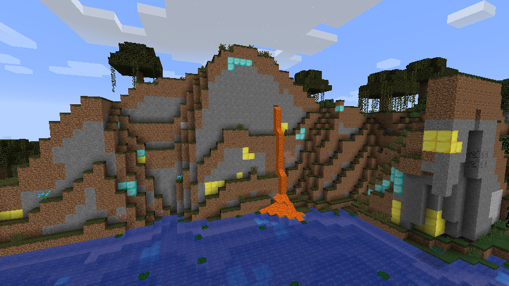

# Generating ore

In this section, we will be referencing `mbe09_ore_spawning`. We're going to make diamond blocks randomly generate in dirt!



Almost all of the required code is in `mbe09_ore_spawning/OreSpawner.java`.

Let's start in the middle of the file, with the `generate` function.

Now take a look at the `addOreSpawn` method. As the comment above the method definition explains, this is a utility method that allows us to create multiple ore spawns easily. Here we add some formatting for readability:

```java
private void addOreSpawn(
  WorldGenerator generator, 
  World world, 
  Random random, 
  int blockXPos, 
  int blockZPos,
  int chancesToSpawn, 
  int minY, 
  int maxY) {
```

(Typically, a method definition such as this should be kept to as few lines as possible.)

We can see this utility (or _helper_) method takes a number of parameters: a `WorldGenerator` (which we sill look at in a minute), a `World` (!), `Random` (from `java.until.Random`), and five integers all named intuitively.

The next piece of code we want to look at is:

```java
private WorldGenerator diamondSpawner = new WorldGenMinable(
    Blocks.DIAMOND_BLOCK.getDefaultState(), // the block to spawn
    16, // the size of the vein
    BlockMatcher.forBlock(Blocks.DIRT)); // the block to replace
```

Again, the author has formatted this code for readability and added comments so we know what each argument does. The first two are self-explanatory; this `diamondSpawner` is going to create veins of 16 diamond blocks when triggered. The last argument is a bit trickier. It's a Forge-specific way to define which blocks to replace. `BlockMatcher` is a helper class that matches blocks!

Finally, we need to register the ore spawner as a `WorldGenerator` in a `preInit`.
```java
GameRegistry.registerWorldGenerator(new OreSpawner(), 0);
```

When the mod loads, Forge will look for all the registered world generators and run them after the default world generators. We use `0` so it runs first, but we could also add other generators that run later. Forge will call the `generate` method, which is going to call our `addOreSpawn` helper method, adding our chosen blocks to chunks as they are generated.

To discover this working in the wild, fly around to generate new chunks and look for dirt. You should quickly discover some exposed diamond blocks.

Now add another ore spawner (right below the other one) to replace some stone blocks with gold blocks.

```java
private WorldGenerator goldSpawner = new WorldGenMinable(
    Blocks.GOLD_BLOCK.getDefaultState(),
    16,
    BlockMatcher.forBlock(Blocks.STONE));
```

Then, add another `addOreSpawn` call to the `generate` method.

```java
addOreSpawn(goldSpawner, world, random, chunkX * CHUNK_SIZE, chunkZ * CHUNK_SIZE, 64, 15, 160);
```


