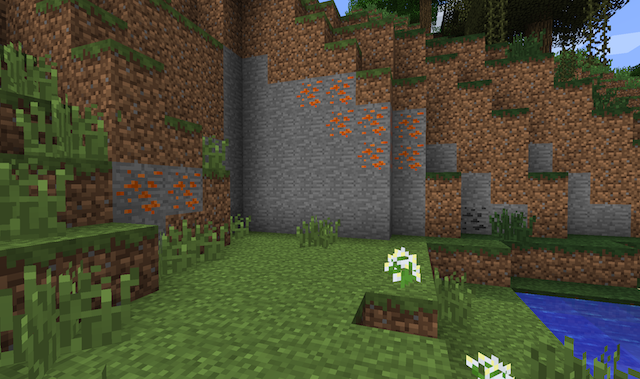

# Generate your ore

We have created our copper block and ingot, but where do we find it in the Minecraft world? Our copper blocks will not be generated until we create the ore generator. This tells Minecraft which dimension (Overworld, Nether, or End) to generate copper ore, and how to do it.

Before we get started, create you copper ore block if you have not done so already. You can refer back to section 2 or your `CopperBlock` class if needed. When you are finished creating your copper ore block, create a class named `OreManager` and type in the code shown below.

```java
package com.example.coppermod;

import cpw.mods.fml.common.IWorldGenerator;
import net.minecraft.init.Blocks;
import net.minecraft.world.gen.feature.WorldGenMinable;
import net.minecraft.world.gen.feature.WorldGenerator;

public class OreManager implements IWorldGenerator {
    private final int CHUNK_SIZE = 16;
    private WorldGenerator copperOreGen = new WorldGenMinable(CopperMod.copperOre, 16, Blocks.dirt);

}
```

The `implements` keyword tells Minecraft which method to call for generating the copper ore. You will still have an error after importing IWorldGenerator, and thats fine for now. We also create a constant variable `CHUNK_SIZE` by using the `final` keyword. This prevents us from acidentially changing it later on when we use it.

The class `WorldGenerator` describes the pattern how the blocks should be found in the world. Since we are creating copper ore, we will use the `WorldGenMinable` generator which creates the copper ore veins in a similar pattern to other ores like iron or gold. Here are the types of arguments this generator requires:
* block: Deterimes which ore block to generate.
* number: The maximum vein size that will be generated.
* target: The block type that is replaced by the ore (currently set to generate in dirt patches). By default, this is `Blocks.stone`.

Now add the methods below in `OreManager`. Be sure to import any necessary classes.

```java
@Override
public void generate(Random random, int chunkX, int chunkZ, World world,
                     IChunkProvider chunkGenerator, IChunkProvider chunkProvider)
{
    addOreSpawn(copperOreGen, world, random, chunkX * CHUNK_SIZE, chunkZ * CHUNK_SIZE, 64, 15, 160);
}

public void addOreSpawn(WorldGenerator generator, World world, Random random, int blockXPos, int blockZPos,
                        int chancesToSpawn, int minY, int maxY)
{
    assert maxY > minY : "The maximum Y must be greater than the Minimum Y";
    assert minY > 0 : "addOreSpawn: The Minimum Y must be greater than 0";
    assert maxY < 256 && maxY > 0 :
            "addOreSpawn: The Maximum Y must be less than 256 but greater than 0";

    int diffBtwnMinMaxY = maxY - minY;
    for (int i = 0; i < chancesToSpawn; i++)
    {
        int posX = blockXPos + random.nextInt(CHUNK_SIZE);
        int posY = minY + random.nextInt(diffBtwnMinMaxY);
        int posZ = blockZPos + random.nextInt(CHUNK_SIZE);

        generator.generate(world, random, posX, posY, posZ);
    }
}
```

The `generate` method is called when Minecraft creates new chunks when you are exploring the world. From here, we call the `addOreSpawn` method which tells Minecraft to use our copper ore generator. If you want to change the amount of ore found in the world, modify the `changesToSpawn` argument to a different value other than 64. You can also adjust the block level where you find your ore by changing the `minY` and `maxY` arguments to your liking.

Finally, we just have to register our ore generator with Minecraft.

```java
OreManager om = new OreManager();
GameRegistry.registerWorldGenerator(om, 0); //Integer determines when generation code
// runs (0 = normal). Use higher numbers to run later
```
  
