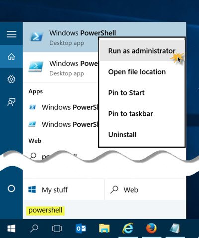

# Windows Setup Instructions

### Install Chocolatey

[Chocolatey](https://chocolatey.org) is a pakcage manager for Windows. It will make installing all the software we need easier. Follow the instructions at [chocolatey.org/install](https://chocolatey.org/install). Try the PowerShell instructions first. You'll need to [run PowerShell as an adminstrator](https://www.thewindowsclub.com/how-to-open-an-elevated-powershell-prompt-in-windows-10).

### Use Chocolatey to install JDK8

Modding with Forge requires the Java Development Kit 8

In PowerShell, run:

`choco install jdk8 -y`

If this fails for any reason, you can [try to install JDK8 manually](https://www.oracle.com/technetwork/java/javase/downloads/jdk8-downloads-2133151.html).

Note: the JDK8 is _not_ the most recent version of the JDK, but you should be able to have multiple versions of it installed on your computer at the same time, in the case you already have a newer version installed.

### Use Chocolately to install IntelliJ IDEA CE

In PowerShell, run:

`choco install intellijidea-community -y`
