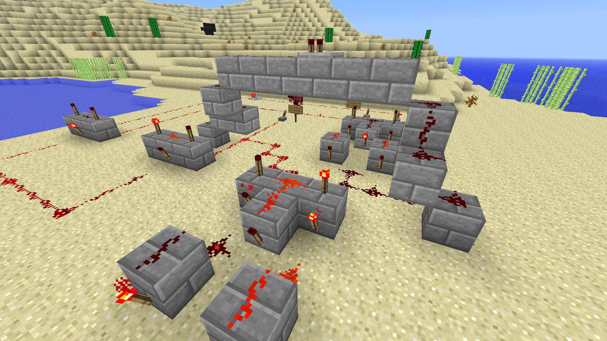
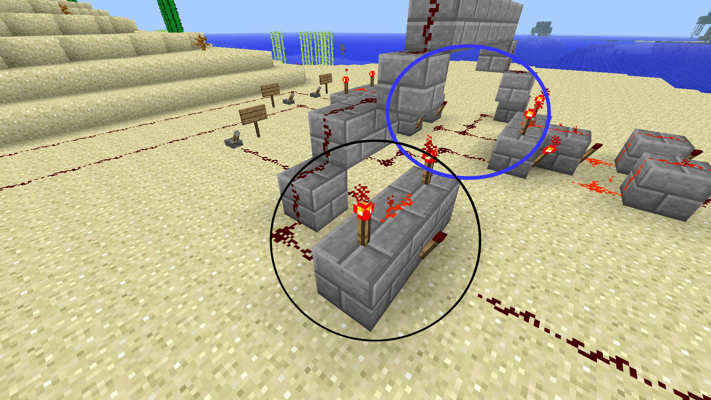

## Redstone Adder Circuit

An _adder_ uses logic gates to perform addition. There are three inputs to the whole circuit: A, B, and carry. The carry is the result from the previous addition (think of how you carry a 1 when you add large numbers). The two outputs are the result and the carry for the next addition.

This diagram shows the overall structure of an adder.  
Note: A dot means the two lines of redstone should connect.  Other overlaps should not connect.

Look at the logic gates key so you can begin to understand how the adder works.

Now, we're going to build an adder using redstone! Follow along with the steps as best you can. This is a complex circuit so be sure to ask questions. The doors at the end represent the output. The door to the left represents the normal output, and the door to the right represents the carry. An open door is a 1 and a closed door is a 0.

There are three inputs, so be sure to put signs to label each one. Levers are best since we can switch them between ON and OFF easily.

Next, build two XOR gates. The first one (on the left; we'll call it XOR gate 1) takes input from A and B. The second one (XOR gate 2) takes input from the output of the first gate and the carry.

A second perspective of the XOR gates.

This AND gate takes input from the carry and the output of XOR gate 1. The blue circle shows where the gate 1 output goes up and over to this AND.

The second AND gate. This one takes input from the original A and B inputs. Notice how it and the output of the other AND gate combine and go to the door representing the carry.

Two overviews of the entire adder from different perspectives.

  

