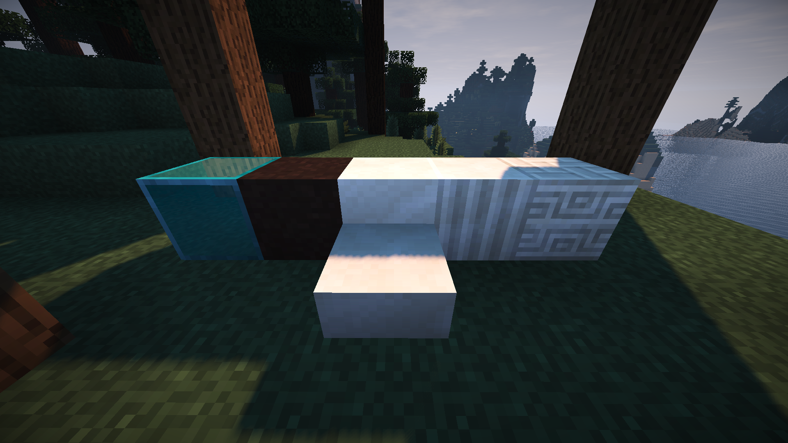
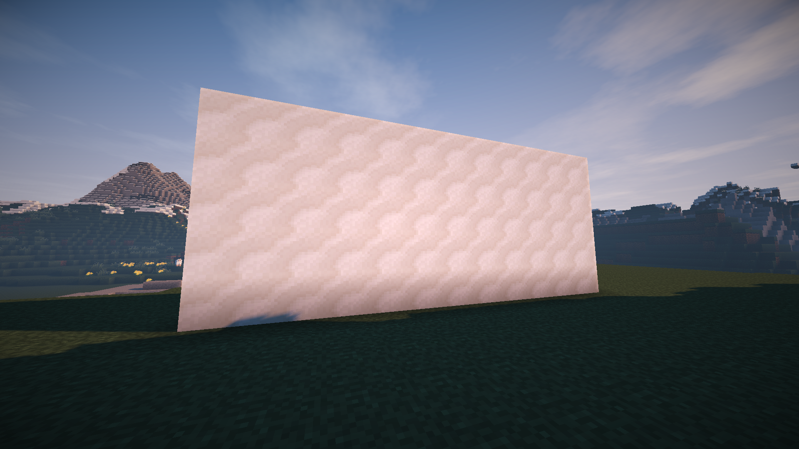
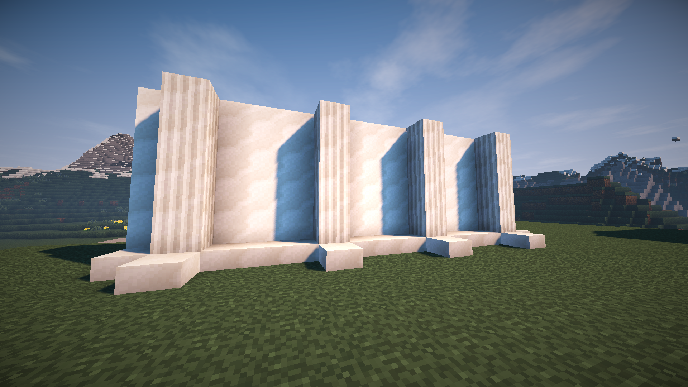
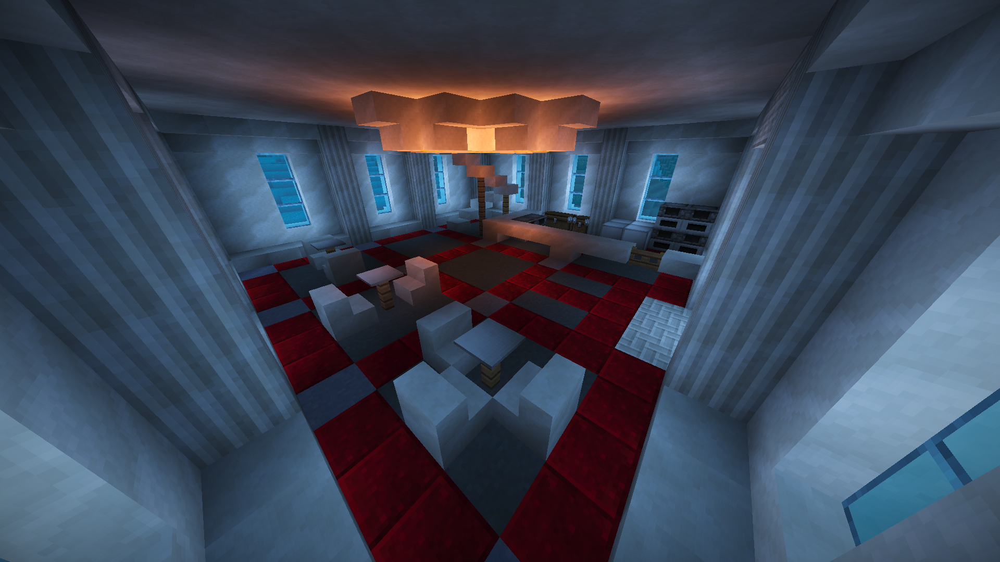
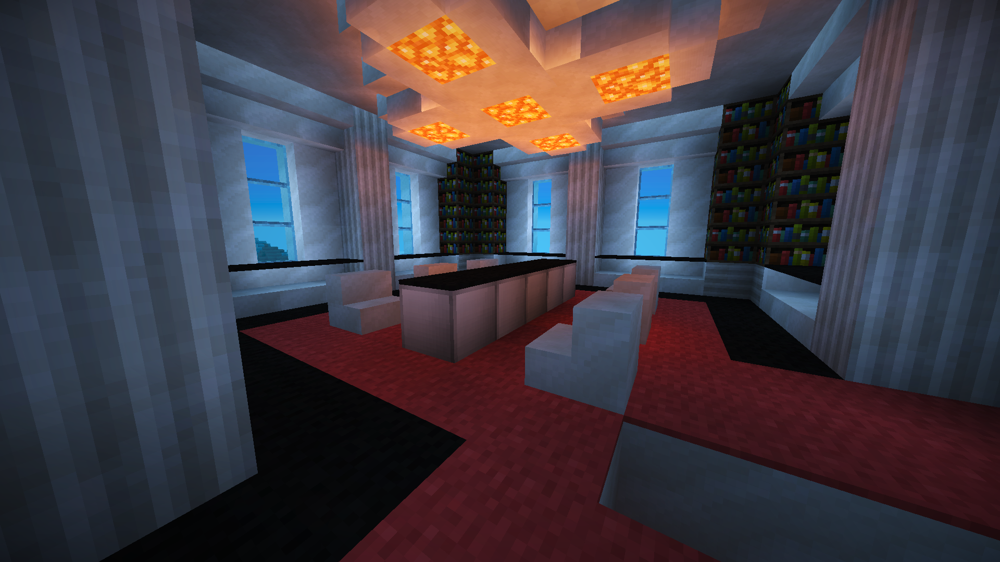

# Colors and Depth

When starting out in a new world, it's wise to keep your first home simple. You don't have enough resources yet to make it complex and beautiful. But after you have established a base of operations, and freed yourself from the shackles of iron tools, it's time to upgrade your dwelling into something more fit for the ruler you've become.

## Color Palettes using Blocks

One of the basics of making a good looking structure is picking blocks that work well together.

For most of this, we'll be using [Adobe Color CC](https://color.adobe.com), a free tool from the people that make Photoshop. It lets you choose the kind of color scheme you want to use, and it generates a decent looking palette by itself.

For instance, this:

Is a simple color palette generated by Color CC. It could probably be made in Minecraft with jungle wood planks, sandstone, ice, snow, and maybe some colored wool. Let's try it out:

Looks pretty good! You can play around with Color CC to get your own color schemes to follow. One of the easiest ways to start a good looking building is to get a good color palette and then find blocks that fit those colors in Minecraft. Here are some more of my favorite color palettes, built inside Minecraft.

Ultra Modern:

Medieval:

Hearth and Home:

## Adding Depth

Depth in building is something that a lot of players don't do, which is why you end up with lots of houses that are just cubes with some furnaces in them. It's surprisingly easy to add depth to your buildings.

This wall is a simple slab of quartz, sticking out of the earth. It works just fine as a wall, but it certainly doesn't look very good.

We can make it look much better by simply adding some columns to the outside. These columns also serve to divide the wall into three block wide sections.

The wall still looks like it would fall over if a light breeze hit it, so let's add some support at the bottom using quartz slabs.

Now we need to pull the top edge of the wall out, and push the inside of the sections in. We can do this by adding pretty chiseled quartz to the top and replacing the central blocks of each section with glass panes. Glass panes add depth without building inwards, since they, unlike glass blocks, sit halfway into a block. Notice we're using a colored glass pane, the same one I used in the Ultra Modern palette in the previous section.

The top of our wall is still pretty flat, so we'll add a little height and depth with some quartz slabs on top.

The wall looks a bit heavy at the top compared to our support on the bottom, so we'll replace those slabs with quartz stairs, which also add some nice half-block depth.

Just for fun, here's the finished building, constructed out of nothing else but the wall we just built. It takes a little extra work to blend the walls together on the edges, but you can follow the same principles of depth for that as well.

## Detailing

Now that we've built the exterior of this building, we can focus on the interior. For this build, we'll go with a fine dining theme.

As you can see, the interior is, for the time being, fairly sparse.

We split the structure into two floors. The bottom floor is going to act as the main dining room. For that, we've added tables on the left edge, and a cooking area on the right edge. The center has been left empty to allow access to the stairs.

For the stairs, we had room to do a spiral staircase out of quartz slabs, holding it up with some fences.

On the upper floor, we built the private dining room, and carpet the floor. If you've been watching, all the interior walls have the same depth concepts applied to them as the outside walls.

Add as much detail as you can to your builds. It helps to make them interesting to look at, and makes you think about what you want the final build to feel like. The more thought you put into a build, the better it will turn out. Remember to keep adding depth if everything starts to look too flat, and always pick a color palette you think will work for the structure you want to build.
