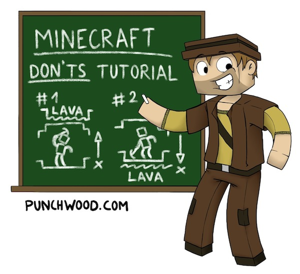

# The Minecraft Ecosystem

## Minecraft YouTubers

Your child probably watches as much Minecraft on YouTube as he or she plays Minecraft. Unfortunately many YouTube Let's Play (LP) (so much for that acronym meaning a Long Play record) creators are not exactly family-friendly and many mix in other LP series better known for violence than for educational value. Here are a few YouTubers to point your child to:

**[Mr Stampy Cat](https://www.youtube.com/channel/UCj5i58mCkAREDqFWlhaQbOw)**
You probably already know about Stampy, he's one of the most famous YouTubers and fortunately child-friendly. Somewhat annoying for adults, though.

**[Paul Soares Jr](https://www.youtube.com/user/paulsoaresjr)**
Another famous family-friendly YouTuber, he gained fame through his incredibly helpful _[Survive and Thrive](https://www.youtube.com/playlist?list=PL7326EF82122776A9)_ series. He runs an IT support business. His online community _[Punchwood](http://www.punchwood.com/)_ is a particularly well-mannered online community centered around Minecraft and Paul's videos, specifically.  

**[Adam Clarke](https://www.youtube.com/channel/UCaBUn1E86ey7XjyvA4l7a_Q)**
Adam Clarke is an artist who uses digital and traditional techniques to inspire and engage participation in creative thinking and practice. His [101 Ideas for Minecraft Learners](https://www.youtube.com/playlist?list=PL41iJfA2iBPHyuNHpxsa80hJaXKvZDdWH) is particularly nice.

**[SethBling](https://www.youtube.com/channel/UC8aG3LDTDwNR1UQhSn9uVrw)**
The most well known and likely the most talented redstone and command block builder. A former Microsoft developer he now does Minecraft full-time.

**[HFoG](https://www.youtube.com/channel/UCa7KzW-J5S1hghTS69Rqkvw)**
A father of six, a senior developer with 25 years of programming experience and really talented minecraft player who incorporates nice bits of historic context into his builds.

**[Adrian Brightmoore](https://www.youtube.com/channel/UCqr93r8sTI9fizPF-oqxXeA)**
An Australian map builder and redstone/command block expert. Also a software engineer.

**[Dragnoz](https://www.youtube.com/channel/UCNRt2CNtdt4PZx8KnetjCQA)**
Redstone contraptions and new feature spotlights.

**[Phedran](https://www.youtube.com/user/phedran)**
A woman! Creator of the _[Life in the Woods](http://phedran.com/LifeInTheWoods)_ mod pack, which emphasizes nature and pastoral elements in the gameplay. She almost always plays in groups but for the most part with other nice, trustworthy players.

## Forums

Much of the information needed to enjoy Minecraft, particularly the more educational aspects of the game, is buried in forum posts on web pages covered in ads. Often the information quickly becomes obsolete. File downloads are hidden within file hosting sites designed to trick you into installing malware. That is why maintain our own website and forums that house the information specific to our curriculum. In general, however, Minecraft forums are relatively safe online spaces. Be cautious, not paranoid.

## The Rest

One of the best tools available for Minecraft programmers is the same one professional software developers utilize: Google. Unfortunately Google can lead to some strange corners of the web. It is always a good idea to log your children's internet activity and enable whatever parental controls are available for your operating system and browser. Skype is another frequently used tool in the Minecraft ecosystem. It is always a good idea to vet each and every Skype contact.

It has been said before but it bears repeating that the easiest way to know what your child is doing online is to participate with them. Fortunately Minecraft is fun and easy to learn. You should play it. :)
