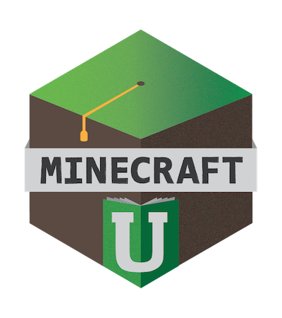

# Minecraft U Curriculum

This is the repository for the [Minecraft U](http://minecraftu.org/) curriculum. This curriculum is published under a [Creative Commons Attribution-ShareAlike 4.0 International license](http://creativecommons.org/licenses/by-sa/4.0/).

## About Minecraft U

### Practical Programming and Design Instruction for Your Child

Minecraft game mechanics are incredibly analogous to engineering. We focus on teaching problem solving and programming techniques in a safe, encouraging ecosystem centered around Minecraft.

Our curriculum is designed to guide a child from the basics of Minecraft gameplay all the way through to programming using modern programming languages. Our materials are engaging and skip the cruft of most books or templated materials. Maintaining it ourselves means we are able to keep it updated to the changing landscape of both Minecraft and technology education.

The curriculum itself is organized into a core curriculum organized by levels. There are also additional units outside of the core levels.

### Level 1: Basic Computer Skill with Minecraft

Learn how to use a computer...no previous experience required! You might be able to make an iPad sing, but it's time to learn how to use a keyboard and mouse. You also might be brand-new to Minecraft, or need to level up your Minecraft skills from the Pocket Edition to the "proper" PC version.

### Level 2: Basic Problem Solving with Minecraft

Learn the basics of survival in the Minecraft world, from fending off starvation to defending against skeletons. Solve these problems and more in a fun environment, with help from our instructors. Overcome the challenges that Minecraft has to offer, and have fun doing it. Improve building skills with creative tips and tricks.
 _For ages 6-12._

### Level 3: Engineering with Redstone

Learn the basics of electricity, with in game and real world applications. We’ll go over digital circuits, like those found in smartphones and tablets, and how to use them in the Minecraft world to build yourself awesome contraptions. At the advanced level, we’ll go over what binary really is, and how to design binary logic machines with Redstone! _For ages 8-14 or younger when having completed Level 2 or with equivalent experience._

### Level 4: ComputerCraft

Use the Minecraft mod ComputerCraft to learn the basics of programming and then apply those skills via your own in-game robots. These robots can do anything, from build you a house to find and mine diamonds for you. The only limit is your ability to direct them. At the advanced level, we’ll discuss the limitations of computers and how to work around them. _For ages 8-14 or younger when having completed Level 3 or with equivalent experience._

### Level 5: Java and Modding Minecraft

Learn the basics of Java, the most common programming language in the world, and use them to create your own modification of Minecraft. Add any item of your design to the game, expanding Minecraft in whatever direction you desire. At the end, you’ll understand the syntax and applications of Java, and how they apply to Minecraft. _For ages 10-16 or younger when having completed Level 4 or with equivalent experience._

### Level 6: Advanced Mod Development

TBD

### Level 7: Product Design

This camp is an advanced course that gives campers hands-on software development experience, within the context of Minecraft, and teaches them to push the boundaries of both their creative and technical ability.

The curriculum introduces students to the project planning and implementation process as they work collaboratively on the design of a virtual world and user experience.

---

### Contributing

Contributions, corrections and improvements to this curriculum are welcome! If you are not familiar with how to contribute to a project on GitHub, check out [this guide](https://guides.github.com/activities/forking/).
