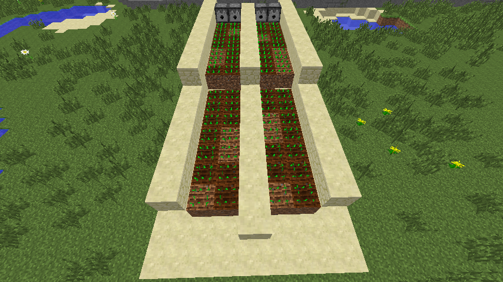
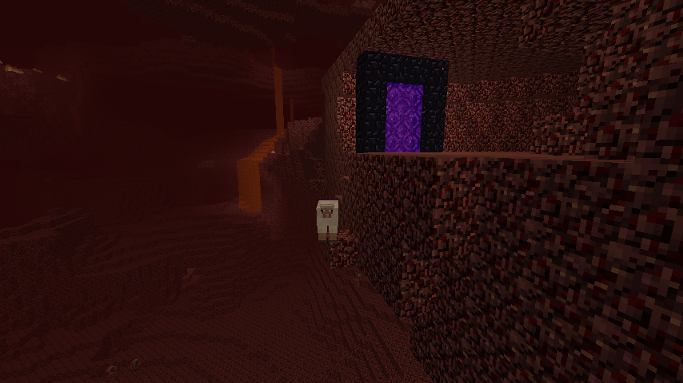
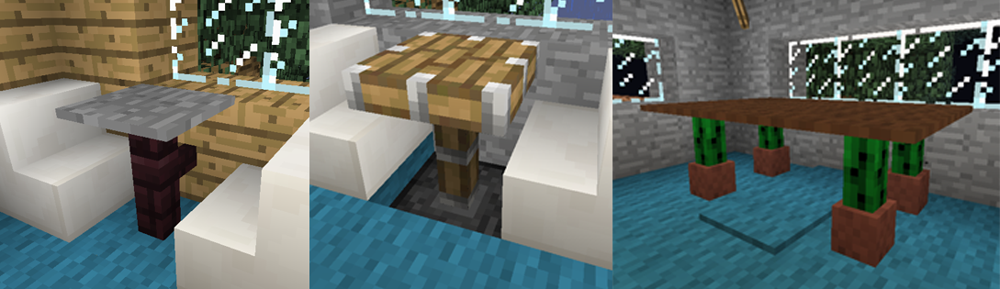
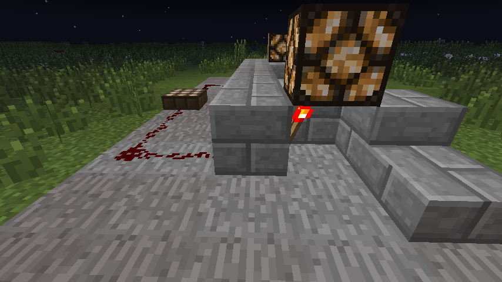
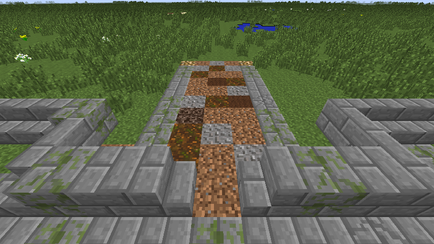
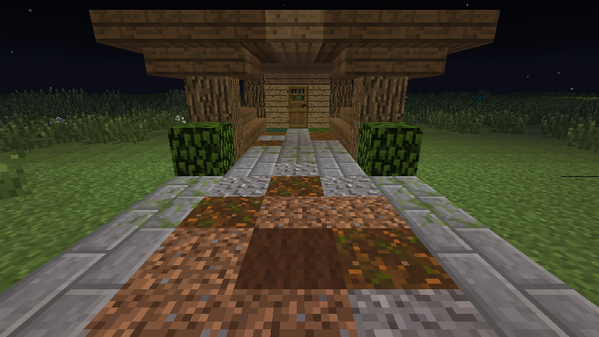
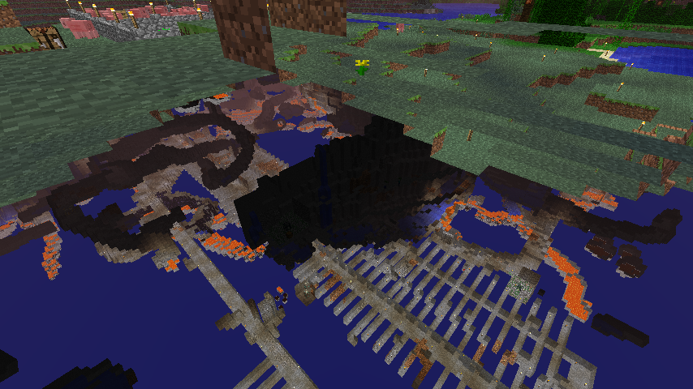

# Section 1: Basic Building and Survival

### Village House

One thing any Minecraft survivor needs is a nice place to rest. Housing is the most common type of build in Minecraft. Villages offer a number of building templates and this build is based off of one of the larger village structures.

We'll build this in a creative world but if you consider yourself an advanced builder you could ch  allenge yourself by changing your gamemode to survival after stocking up on supplies.

> To change gamemode create the world with cheats enabled and issue the command ```/gamemode s```.

Here is the blueprint for this building--we will build the last and largest of these structures. Each number represents a block level. There are different ways to approach the build. You can build an entire level at a time, or you could build one block at a time. Use whatever technique works best for you. You also might decide to change the design.


### Efficiency of Building Structures

Now we'll do a competition.

You must construct a house that takes up the smallest area possible.

Your house must contain all of the following:

* At least one Door
* At least one Workbench
* At least one Furnace
* At least one Torch
* At least one Window (must be completely surrounded by blocks)
* At least one Bed (must be able to fall asleep and wake up inside house)
* At least two Chests (can be in the form of one double or two single chests. Must be accessible)
* At least one Jukebox (must be able to play and remove music disks)

Your house's design must not use any of the required contents as exterior building material (excluding the window) (basically you should have real complete walls. No beds sticking out or furnaces in the wall, etc.) However, items can be used as flooring.

### Survival

One of the first thing one must master in the world of Minecraft is survival. You are dropped into the middle of a world with nothing but your bare hands. In order to survive you need to use all of your most well defined problem solving skills.

#### Tool making and surviving your first night

One of the most important things a Minecraft survivor needs to do is develop tools.

There's not much else to do when developing your first set of tools than to punch a tree for wood, craft a wooden pickaxe, then (hopefully) find some stone with which to create a bevy of stone tools to use until you can source some iron.

There are some tricks to help you craft these tools just a tiny bit faster, however.

* Wood is priority #1. If you spawn in a desert or empty island, run/swim in the direction of vegitation!

* If there is any stone in sight, only use enough wood to craft a workbench, a pickaxe, handles for a sword, axe and shovel and some extra sticks for torches.

* When crafting a set of tools, place enough in each part of the crafting table for multiple tools. A pickaxe, axe and shovel will all need a two stick configuration in crafting grid for their hilts. You can place three sticks in each slot when crafting all three tools at the same time (typically the first time you craft them with any given material, like your first stone tools during  your first day).


> The above configuration will produce a pickaxe and shovel before requiring more stone placement for an axe.

* Don't forget to get enough cobble to make a furnace.

* If there is no coal in sight or under the first layers of stone you mine, immediately go back to chopping down trees. You'll need wood to smelt charcoal for torches.

#### Surviving your first night exercise

Start a new world! When you spawn, it will be morning in the world of Minecraft. You'll be alone in the wilderness without any food or supplies. Tools are your top priority, as food will be difficult to obtain without them. Monsters will spawn at nighttime, so you will also need somewhere safe to stay overnight. Your challenge is simply to survive your first night in Minecraft. Explore your surroundings and decide where you're going to make your base, and then move on from there.

#### Survival challenge


For this challenge we'll be playing the _Artic_ map by _[ICrafting](http://www.planetminecraft.com/member/indianacrafting/)_. In this map, you are the sole survivor of a shipwreck, washed up near an artic research station. We're going to see who can survive the longest.

Additional challenges on this map are:

* Tame a dog
* Find the underwater caverns
* Find the greenhouse
* Find a grass block
* Build a house
* Make a fireplace
* Trade with Mr. Maillet
* Rescue József
# Section 2: Advanced Survival Strategies

### Farming

A Minecraft survivor needs to quickly develop a renewable food source.

> This section is going to keep you happy and healthy throughout your Minecrafting days

The easiest source of food is getting meat from animals such as cows, pigs, and chickens. Their meat can be eaten raw or cooked; raw food has a chance of making you sick, while cooked food fills you up more. Animals, however, aren't a renewable source (at least until you can get a breeding program started). On the other hand, wheat is an easily obtainable and fast-renewing source of food. It only requires seeds, a source of water, and a hoe.

First, you need to acquire some seeds. They are dropped when long grass is destroyed. Try to start out with at least 10 seeds to get a good-sized farm going.

Use the hoe to turn some ordinary dirt blocks into farmland. Farmland needs to be hydrated by nearby water in order to remain farmland; farmland that dries out will convert back to dirt. Take a look at the screenshot below to see how farm away water will hydrate farmland.


One block of water can hydrate up to 4 blocks away in all directions. Even though I plowed more than that in the picture below, the water can only hydrate the farm land up to 4 blocks away, so some of the plowed land becomes dirt, and grass.


Plant your seeds by using them on the farmland. As long as they have a lightsource (the sun, torches, or other blocks) these seeds will slowly grow into wheat (the picture below has wheat in several stages of growth). The wheat will turn a yellow color when it is finished growing.


Harvest the fully-grown wheat which will also drop seeds for future crops. On average, each wheat block will drop 1.5 seeds so your crop size will grow faster and faster over time.


Make bread using the recipe below. Bread fills you up almost as much as cooked meat but is much more sustainable and faster to harvest.


### Automatic Farming

Farming isn't exactly difficult, and can be quite relaxing, but if you wanted to speed things up a bit there is a simple redstone contraption you can construct to automatically harvest your crops.

Water will flow 8 blocks, which is an important fact to know for many purposes. This farm will use water flowing downhill over the crops to automatically harvest them and drop them into hoppers, and then a central chest where you can pick up the foodstuffs.

Create a new creative world for this exercise.

First we'll set up the irrigation system for our farm by creating a canal down the center of our farming area. Both levels are eight blocks long, but the water starts at the second block so that it will flow off the end of the first level and down the second level.


Next cover the irrigation canal (using whatever block you want) and create the farm plots next to the canal:


Now create walls along the side of your plots. These will keep the water from flowing over the sides.


Now we'll place dispensers along the top of our farm. These will dispense the water that will harvest our crops and carry them down to the bottom of the farm.


To power the dispensers, you'll need redstone repeaters, redstone and a button, like so:


Place a bucket of water in each dispenser. The nice thing about this setup is the water buckets will remain full even after the dispenser dispenses the water.


Plant crops of your choice. Here we've planted some carrots on the left and potatoes on the right:



Now we need to get the collection system in place. Place a chest at the bottom-center of your farm, directly in front of where the irrigation canal stops. Then place hoppers on either side of the chest. To do so take a hopper and then shift-click on the side of the chest to place the hopper. Do the same on the side of the hopper with another hopper. Now everything falling into these four hoppers will go into the chest in the center:


Now we have to wait for our crops to grow. Go ahead and take some bonemeal in your hand and right-click on your crops until they're fully grown.


To harvest, go press the button connected to the hoppers. The water will flow down over your crops, harvesting them and carrying them down to the hoppers.


When all the items have flowed down into the hoppers, press the button to stop the water flow, and replant!

### Mining strategies

In Minecraft, ores tend to group together at certain heights and some ores will only occur very far underground. Diamond ore, for example, only spawns at a Y-coordinate of 15 or below. To search for diamonds and other ores most efficiently, we need to mine below that level.

Dig an initial shaft straight down until you hit level 13 (you can check this by pressing F3 to open up the console). We will be mining out levels 13, 14, and 15 so we can find diamond as easily as possible.


Create an open work area where you can have chests, furnaces, and lighting. This will serve as your underground base for storing supplies and mined ore. Our mine shafts will branch off of this central area.


Whenever we mine a straight shaft, we are either digging out or looking at 3 columns of blocks. The column we are digging and then the ones to the left and right. To mine most efficiently, we should locate our shafts every 3 blocks. We can reach the highest number of blocks with the fewest number of shafts. Torches should be placed every 7 blocks alongside our shaft. Any further apart, and mobs may spawn in the middle. Any closer, and we would be using more torches than needed. Try to keep all of your torches on one side. If you get lost, you'll know which direction you're traveling.


If you keep mining long enough, you're sure to find some good veins of ore! Here, I found a vein of diamond ore after just a few minutes of mining from start to finish.


### Nether Portal

The Nether is an awful place without much to see and a lot to be afraid of; but it also a place one must visit if one is ever to create potions and it is fairly handy when travelling long distances.

This section is going to focus on placing nether portals for maximum transportation value with maximum safety features.

Going through a nether portal will create a linked portal in the nether. If there is already an active portal within range (about 128 blocks) in the other world, the portal will link to it.

For this exercise we will create two portals to travel between two mountain ranges.

Some friendly reminders regarding traveling through the nether:

* Take flint and steel. Your portal might be damaged by ghasts. In this exercise you'll need it to light a new portal at the 2nd location.

* Take cobble and gravel. The former for building walls to protect from ghasts, the latter for gravel elevators.

* Take a bow and plenty of arrows for fighting ghasts.

* Do not hit zombie pigmen! Be careful when mining around them!

* Use shift/sneak liberally while near precipices and lava, so as not to fall

The advantage of using the nether for long-distance travel is that for every block traveled in the nether, you travel eight blocks in the overworld. Since naturally occuring resources are often far apart in the overworld, you will very likely need to travel long distances with some frequency as you collect and transport those resources.

Placing portals so that they connect is tricky. From the wiki:

> Horizontal coordinates and distances in the Nether are proportional to the Overworld in a 1:8 ratio (1:3 in Xbox 360 & PlayStation 3 version)...This does not apply on the Y-axis...Thus, for a given location X, Y, Z in the Overworld, the corresponding coordinates in the Nether are X ÷ 8, Y, Z ÷ 8. Conversely, for a location X, Y, Z in the Nether, the matching Overworld coordinates are X × 8, Y, Z × 8.

The goal of this exercise is to travel through the nether to another portal to the overworld position 1000 blocks away.


Mobs of all kinds can make their way through portals, so be a little cautious when traveling through no matter which direction. Here an unfortunate sheep has found their way into the nether and a very precarious position. He doesn't look too happy:



### Mob Farm/Grinder

Occasionally you will find a monster spawner in a Minecraft dungeon. These cage-like blocks spawn monsters in a cube around them every few seconds. While they can be dangerous, they can also be a valuable source of items and experience. To do so safely and quickly, you can build a structure that serves two purposes. First, it should weaken the monsters using water, lava, or a steep fall so that you can defeat them faster. Second, it should also allow you to attack the spawned monsters from a safe place.

You must locate a monster spawner! They're locating in dungeons and are surrounded by stone brick rather than smooth stone. When you find it, dig out a large space around the spawner (about 8x8) and put torches around it so monsters won't spawn.


The goal for this mob grinder is to drop zombies exactly 22 steps (check out the Minecraft wiki to calculate how high you should drop each type of monster). After the drop, they will have low enough health that one hit from a sword will kill them. At the same time, the player must be able to stand near enough the spawner that new zombies will spawn. First, we need to force the monsters into one location so we can control where they go. Dig out some of the stone on one side (see the picture for reference) and then put water at the middle and corners of the other side (underneath the glowstone in the second picture).


Next, we will dig a shaft upward 22 blocks (we built ours out of glass so you can easily see how it is built). Inside, we will use a water-and-sign checkerboard to get the zombies to swim up to the top. The air pockets will keep the zombies alive while they swim upward.


Third, we need to build a horizontal tunnel with water at one end to push the zombies to the top of our drop shaft. Place one more water source next to the top sign so that it pushes the zombies over the spawner to the opposite side. Another sign at the end will stop the water where we want it for the drop shaft.


And finally we create a 22-block high shaft for the zombies to drop down. We can dig stairs down to the bottom and easily farm these zombies for items and experience. By standing one further down than the zombies, we can attack their legs while being completely safe.


We've given you a world that has a zombie dungeon located directly below the spawn point. Your task is to find the spawner (dig down carefully to find it) and build a mob grinder like the one described above.
# Section 3: Advanced Building

### Furniture and Decor

#### Tables and Chairs

Tables can be made in many different ways, like a pressure plate on a fence post or glass pame, carpet on a cactus in a pot, or a piston powered by redstone.



Chairs are usually made with stairs and can be given arm rests with items such as signs, paintings, trap doors, and item frames.


#### Wall art

Paintings are a great way to decorate your home. They come in lots of different sizes and can even be used to hide doors! Item frames are not only a nice decoration, but double as storage to display your tools and fovorite items!


#### Cabinets

Bookshelves can be spruced up with the same types of materials you use for chairs. Stairs are a great way to add depth and texture to a home, as well.


### Lighting strategies

#### Hiding light sources

##### Carpet

You can hide a light source under carpet. The only disadvantage is you can't place another block on top of the carpet.


##### Jack-o-lanterns with hidden faces

You can place jack-o-lanterns in walls and floors so that their face isn't facing outwards. Unless you like the jack-o-lantern faces, in which case leave them face-out (only an option in walls).


##### The around-the-corner trick

It lets less light through, and might not work in buildings as well as in caves or moutain-dwellings, but lights can be hidden "up and away" inside small openings in walls.


##### Behind bushes

Like carpet, bushes let light through but obscure the light source. This works great outside when placed strategically.

#### Redstone lamps

Redstone lamps are commonly considered the most tasteful of light sources, but they are also the most expensive. The recipe for a redstone lamp is as follows: a glowstone block surrounded by four redstone dust. The advantage to redstone lamps is they can be controlled by switches and daylight sensors, allowing them to turn off and on by either user action or the lack of natural light.

##### Creating an automatic lighting source using redstone lamps and a daylight sensor

For this exercise create a creative superflat world. Once in your world, you will need the following:

* Redstone lamps
* Redstone dust
* Redstone torches
* Daylight sensors
* Some building material, like stone bricks.

We will be creating an inverter or "not gate". Because the daylight sensor emits a redstone signal during the day, but we want our redstone lamp to be powered at night, we need to reverse the signal with just such a configuration. Fortunately they are simple to configure. A block acts as an inverter, reversing any redstone signal on its opposite side.

The layout is: daylight sensor -> redstone dust -> block -> redstone torch -> redstone lamp. Use the screenshots below to guide you.

> If you already know how to create an automatic redstone lamp, improve on the examples to better hide the sensors and improve the aesthetics.




Here one daylight sensor powers two redstone lamps:


The final product from the "front": automatic lights along a decorative wall.


### Adding texture and interest

One of the keys to a really great looking build is the ability to add texture and interest to your structures.

#### Roads and paths

Try and mix up the materials used in building roads and paths as much as possible. Here we see a stone path made up of stone bricks, mossy stone bricks, cracked stone bricks, cobblestone and gravel. Stick with one main material, adding as randomly as possible the other materials you have at your disposal.


(There is also a very typical Minecraft street light added for good measure. It just takes some fence posts, a glowstone block and some trap doors.)

Adding borders to roads and paths also helps them look better. Here we have single block border made up of the same materials, although half slabs work great for this purpose as well. Using stairs to break things up a little bit is a great technique as well; here they're used to go around the street lights, keeping the border from just being a straight line for as far as one can see.


Dirt paths can also be rather nice. Here we have one made of dirt, podzol, gravel and wool, with a stone border flush vertically with the path. The glowstone blocks at the end of the path will soon be covered by bushes, giving us a secret lighting source.



### Structures

Now, onto structures. One of the often neglected areas of a building is the entrance. Here we make the entrance more interesting with some pillars anchoring a covered path to the front doors of this house. The stairs on either side create separation and define the space while taking up less visual space than a fully square block. With enough imagination they could also be benches lining the path.



Here are some examples of how to create more interesting interiors. In this first example, we see the use of stairs as a way to create more interesting corners and the use of item frames behind torches to make them look a little bit more intentional than just a stick in a wall.


This next example uses the space between the ceiling and the roof to create recessed lighting (again, hiding light sources is a very big deal in the Minecraft builder world).


#### Roofs and Material Choice

Roof lines are very important in Minecraft. Here we see two different styles of flat roof and the beginnings of multi-lined staired roof.


You'll also notice the variety of materials used in this build: oak wood and planks, spruce, birch, stone bricks and stone slabs. Here is another example of using different block types, this building (one of the schematics we used before) uses wool, spruce and stone bricks:


Don't forget to add interesting bits and pieces to the outside of your structure as well. This example uses leaves and vines, stairs and crafting tables, podzol and red mushrooms and redstone torches with item frames to break up what would normally just be a relatively plain outside area:


### Your Turn

We want to finish this section off with a relatively big build. We will provide some examples, but use your own creativity and practice building your dream Minecraft house, or at least something better than your last Minecraft house. (Remember we're going for detail and visual interest here, not simply building size.)

Here are a couple of screen shots of the final product all the previous examples were leading up to. Again, don't try to copy this build exactly, just use the techniques it demonstrates.


# Section 4: More Advanced Survival Techniques

### Enchanting

Enchanting is a very important technique in Minecraft. Enchanted tools, armor and weapons make success in your Minecraft adventures much more likely, and are more fun to use besides.

Tips:

* When first starting out, use only one experience level to enchant as many tools and armor pieces as possible. After that, use an anvil to combine enchantments. Later, do the opposite to try and get as many enchantments as possible on one tool/weapon, then  use an anvil again to combine when possible.

* When trying to get a specific enchantment on a tool/weapon that is already enchanted, use books.

* As you progress above level 16, each level requires more XP than the last. Try to enchant using a level as close to yours as possible to make the high XP cost worthwhile.

* Do not enchant anything weaker than iron as the lack of durability makes the cost not worthwhile.

* In 1.7 and later, an enchanted fishing rod can pay off. "Luck of the Sea" lowers chance of "junk" catches by 2.5% per level and increases chance of "treasure" catches by 1% per level. "Treasure" can include enchanted tools. "Lure" decreases wait time until a catch by 5 seconds per level but decreases chances of both "junk" and "treasure" catches by 1% per level, so be careful with that one if your goal is to catch treasure. ("Treasure" and "junk" catches are only available in version 1.7 and up.)

* Place 15 bookshelves around an enchantment table to get the highest level enchantments. If after establishing the 15 bookshelves you _do not_ want maximized enchantments, you can block their effect with torches.

#### Anvils

An anvil can be used to combine the enchantments of two items. The items must be of the same type and material. There are two slots in the anvil, and the item in the second slot is sacrificed to improve the first.

The cost in levels depends on the enchantments. You can also repair and name items with the anvil. In survival mode, there is a limit of 39 levels for any work performed on the anvil.

#### Enchanting Challenge

In the map provided, enchant a sword to either:

* Two enchantments, one at level 2 or better.

_or_

* One enchantment, level 3 or better.

Extra credit for enchanting a chest plate as well.

The bottle of enchantment provided is only going to get you so far. You'll have to go get some bad guys for the rest of the XP required (there are plenty of slimes around during the day for this purpose). There are three strategies you can use to achieve the challenge:

* Enchant two swords and combine.

* Enchant books and use the anvil.

* Just go for it with the maximum possible enchant (you'll need to go get some additional XP first).

There is a fair amount of luck involved, and no one strategy is necessarily better than another. After everyone has completed the challenge, compare notes.

### X-ray machines

X-ray machines are rather useful things, allowing you to see through the ground to whatever open space it might contain, allowing you to locate abandoned mineshafts, dungeons, ravines, etc. To create a primitive x-ray machine in the latest version of Minecraft:

* Acquire two pieces of fence and a redstone block

* Dig a 1x2 hole and jump in

* Place the two fence posts one on top of the other in one half of the hole

* While jumping, place the redstone block against the side of the fence facing you

Timing is tricky here, you must time it just right, and it might take a few tries




There is also a more sophisticated x-ray machine design that involves minecarts. If you would like to try those, you can checkout [this SethBling video (at 16:30 minutes)](http://youtu.be/WBu2gPRYPyQ?t=16m33s).

Unfortunately the x-ray glitch is becoming more difficult to exploit in upcoming versions. To see a 1.8 x-ray machine, checkout [this video](https://www.youtube.com/watch?v=hQMhwqlaArI).

Fortunately, one of our camp servers is 1.6.4, which allows for a more elegant x-ray machine using a sticky piston and a block of glowstone:

### Minecarts and railway construction

As you expand your living area, you may find that traveling between areas taking up a lot of your time. Running and walking aren't particularly fast, but minecarts can make traveling significantly faster and safer.

After placing down some track, you can place a minecart on top and right-click to enter. Once you're in the cart, pressing W will start moving you forward. Pressing the left SHIFT key will make you dismount the minecart though it will keep going. The wooden block at the end of this track stops the minecart before it goes too far.


You can use powered rails to keep the minecart going on long tracks, similar to redstone repeaters. They must be powered with redstone to provide any power to the minecart.


By using blocks to create tilted rails, we can make handy locations for starting minecarts without having to move manually.


Redstone can also be used to make junctions where you can select which direction the cart will take you. Three-way intersections will flip back and forth as power is supplied or cut off.


We can also make a two-way minecart station where our minecart will stop until we tell it to continue.

Dig out a 3x1 trench. Put a detector rail in the middle, and two powered rails on either side (powered rails act as brakes when unpowered).


Extend the rails outward to connect to your normal railways.


Place two blocks with buttons on them on top of the blocks adjacent to the powered rail segments. When you press the button, the powered rail below it should light up.


When you are on the railway, you will stop right next to one of the buttons. Press the button to power the rail underneath you, pushing you forward. The detector rail will then power the rail on the other side, pushing you along on your journey.


Your assignment is to make a minecart rail that connects three different locations: a house, a farm, and a cave entrance. Make a start-stop point at each of the destinations. Create a stop that allows you to choose your destination (see screenshot below). The map for this exercise is called "Railroad".


### Auto-Smelters

The concept behind an auto-smelter is pretty simple, actually: smelt a chest full of materials automatically. The build in its most basic is this: Chest (with materials) feeds into a hopper, which in turn feeds into the furnace, then into another hopper, then into the chest with the final product.


Think of ways to improve upon this design by making it more efficient, easier to load with raw materials or have more capacity.
# Section 5: Minecraft Tools

### Adventure Maps

> Adventure mode is a game mode intended for player-created maps by limiting some of the gameplay in Minecraft, in which the player cannot directly destroy most blocks to avoid spoiling adventure maps or griefing servers. Most blocks cannot be destroyed without the proper tools. However, players can still interact with mobs and craft items. [link](http://minecraft.gamepedia.com/Adventure)

Notch, in 2010:

> "But why", some people ask, "are you making Minecraft programmable?". The reason is, adventure mode!

> I foresee a future where people can design “challenge maps” in creative or survival mode, then share them with people so that they can try to beat them in Adventure mode. Being able to create interesting puzzles or trigger events requires some more advanced programming than the sand and water based stuff we’ve seen so far, yet still I don’t want to introduce real programming into the world. [link](http://notch.tumblr.com/post/779956568/the-rationale-for-redstone)

This section's activities involve mostly just playing adventure maps. But as you play, solving the puzzles of the maps, consider how you might have built them differently, what's fun and challenging about them or what's simply tedious and boring.

The first map is relatively easy and can be played through in one sitting. It's called "D&D's Adventure Map" and was built for twin daughters, Delaney and Delilah. As a single player playing the map, you can snag both of their starting items, although you probably won't need them all (or maybe you should leave some should you perish and respawn).

> The concept of the map is to find the diamonds hidden in the world in various locations and to obtain extra diamonds by defeating "boss dungeons" and solving the riddles in every dungeon. You "level up" as you play by obtaining better gear which allows you to do the harder dungeons. [link](http://www.minecraftforum.net/topic/1775721-childrens-adventure-map/)

* Play "D&D's Adventure Map"

After you're done with "D&D's" map, try one of the other maps provided. If you don't like the first one you pick, choose a different one. They vary in plot, types of challenges, difficulty, etc.

Maps provided:

* "Teramia 0.9.1 Beta" is an open-ended map with no clear path or plot. By changing the dynamics of vanilla Minecraft only slightly, the map can still change what skills and problem-solving strategies are of most value.
* "The Evil Doctor's Castle" is a classic escape-style map. Quickly determining the way through each "level" is of the most importance with this map, but it does have a very clear path to success!
* "Jungle Stream" is a classic story/puzzle/parkour map in the style of the Indiana Jones series.*

### Importing Schematics Using MCEdit

Schematics and tools that support them, like MCEdit, can be very helpful in getting started creating more interesting worlds for any game type.

Let's create a very small village using a few schematics.

> A good resource for Minecraft schematics is [http://www.minecraft-schematics.com/](minecraft-schematics.com). These schematics came from there.


Open MCEdit and create a new world by creating "Create New World". Keep it creative for now. We'll likely need to make adjustments from within Minecraft itself. Check the box to simulate the world. Save the world with a name you'll remember.


You'll end up back at the same opening screen. This time click "Load World" and choose the world you just created. You'll be dropped at the spawn point for the world. The inital view inside MCEdit can be very confusing and disorienting. There are a few extra controls you'll need to get used to in comparison to normal Minecraft. And there are inherit difficulties in manipulating a 3D world on a 2D screen. But it's all part of the fun. The good news is MCEdit puts instructions right in the interface.

Of course your world will look different depending on what biome you spawned in. Regardless, we need to create some flat space in which to build our village. Tap ```Q``` a few times to move up, then ```S``` a few times to move back. This way you'll be looking down towards the spawn point. Use the mouse to select some space to clear. Don't worry about selecting exactly the right area. We'll adjust it. In fact it is really difficult to select just the area you want to at first. You must select some portion of it, then release the mouse button and make adjustments by clicking and dragging the sides of the 3D selection that you first drew.


Now use ```Q W E A S D Z``` to orient yourself around your selection and the mouse pointer to see how you can select edges of the 3D selection. When you have the hang of it, click and drag an edge to refine your selection.


When you think you have a decent area select, click "Delete Blocks" to clear the area. This might take some trial-and-error. You might also want to save the world and go into Minecraft to do some detail repair work.

To save the world click the MCEdit button in the top left of the window and then choose "Save".

Click "Deselect".

Click "Import" from the bottom menu (the one that looks like a hotbar). Navigate to the directory containing the schematics and select one of them to import.

Place the structure where you want it.

Uncheck "Copy Biomes".

Click "Import".

Click "Deselect" to release the building.


Repeat for the other two structures provided.


Save your village with ```control + S```

Quit MCEdit, open Minecraft and test out your new creations!

> It is very important to have only MCEdit *or* Minecraft open at any given time. You will lose work if you try to have a world open in both applications.

### Creating Schematics

While you are in your creative Minecraft world, whip up a quick farm.


Open back up MCEdit and load your world.

Select your farm and click Export.


Name your schematic and save it. Then click Deselect.

Now import your schematic and create multiple farms (or one big farm) by placing your new schematic throughout your world.


Everything might not be perfect in MCEdit (as you can see in the image above). That's ok, you can go make cosmetic touch ups from inside Minecraft itself.

Now you can try to create schematics from other worlds and import them into your world.

### Building Your Own Map

Continue using the techniques you just learned to flesh out your map. Leave goodies for players to find, particular challenges for them to complete, etc. Once you've completed your map, trade with a friend or neighbor (ask your instructor for help with this step).

### Skin Design

This section is pretty straightforward thanks to the great tools at [Miners Need Cool Shoes](http://www.needcoolshoes.com/). Go to needcoolshoes.com and import your skin or go to the gallery and pick a new one to tweak. Then edit that skin using their editing tools! You can download the png file or change your skin right from the site. You can even combine skins by loading multiple skins as layers in the editing tool.

### Server time!

We will now spend some time getting familiar with the Sequences server, our whitelisted camp server for Minecraft U campers. Your instructors will go over the rules, which are also in the next section, and help you get on the server and get established there.
# Appendix 1: MCU Servers

We have a lot of cool stuff on the servers and have more things planned, like build projects, adventures and online lessons. Right now there is a Minecraft U building with all the redstone logic gates we built in our redstone camps; there are two large mazes built with ComputerCraft turtles and maze making algorithms; an obstacle race course; a distant and mysterious pagoda that whispers to you as you approach; a special ComputerCraft island and an undersea village.

And the main point of maintaining the server—you know who is on it. Only campers and staff, plus a very few vetted outside players, are on the MCU servers.

This is all included as a part of your week at Minecraft U, and you may continue to play on the server indefinitely.

Access to the camp server is contingent on behavior guidelines just like those in real life. Anything you wouldn't do to someone else in real life, you should not do on the server. PVP is turned off. Do not ask for it to be turned on.

Violation of any of these rules will result in bans on a graduated scale described below.

1. No griefers. [A griefer is a player in a multiplayer video game who deliberately irritates and harasses other players within the game](http://en.wikipedia.org/wiki/Griefer).

2. No stealing. You wouldn't just walk into someone else's house and take things out of their closet. Similarly, you may not remove things from other player's chests without consequences. The only exceptions to this are chests marked with a sign as community chests, and food in the case of emergency.

3. No bad language.

4. No raging or rage quitting. Even if not intended as raging, all caps chatting may be interpreted as such.

5. Fill creeper holes and repair any other damage done by creeper blasts.

6. Replant community crops, and leave as much behind in community chests as you take out.

Punishment for breaking any of the server rules are as follows:

1. Verbal warning through chat.

2. If immediately reachable, warning to a parent.

3. Kick.

4. Ban for 24 hours.

5. Ban for a week.

6. Ban for three weeks.

7. Permanent ban. Reversible only through appeal.
