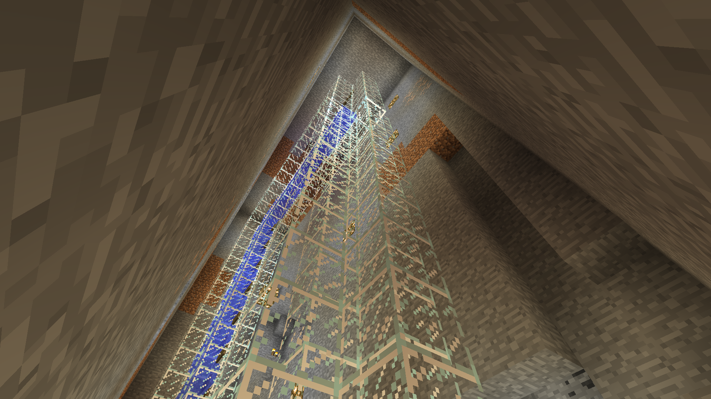

## Mob Farm/Grinder

Occasionally you will find a monster spawner in a Minecraft dungeon. These cage-like blocks spawn monsters in a cube around them every few seconds. While they can be dangerous, they can also be a valuable source of items and experience. To do so safely and quickly, you can build a structure that serves two purposes. First, it should weaken the monsters using water, lava, or a steep fall so that you can defeat them faster. Second, it should also allow you to attack the spawned monsters from a safe place.

You must locate a monster spawner! They're locating in dungeons and are surrounded by stone brick rather than smooth stone. When you find it, dig out a large space around the spawner (about 8x8) and put torches around it so monsters won't spawn.

The goal for this mob grinder is to drop zombies exactly 22 steps (check out the Minecraft wiki to calculate how high you should drop each type of monster). After the drop, they will have low enough health that one hit from a sword will kill them. At the same time, the player must be able to stand near enough the spawner that new zombies will spawn. First, we need to force the monsters into one location so we can control where they go. Dig out some of the stone on one side (see the picture for reference) and then put water at the middle and corners of the other side (underneath the glowstone in the second picture).

Next, we will dig a shaft upward 22 blocks (we built ours out of glass so you can easily see how it is built). Inside, we will use a water-and-sign checkerboard to get the zombies to swim up to the top. The air pockets will keep the zombies alive while they swim upward.

Third, we need to build a horizontal tunnel with water at one end to push the zombies to the top of our drop shaft. Place one more water source next to the top sign so that it pushes the zombies over the spawner to the opposite side. Another sign at the end will stop the water where we want it for the drop shaft.

And finally we create a 22-block high shaft for the zombies to drop down. We can dig stairs down to the bottom and easily farm these zombies for items and experience. By standing one block further down than the zombies, we can attack their legs while being completely safe.

We've given you a world that has a zombie dungeon located directly below the spawn point. Your task is to find the spawner (dig down carefully to find it) and build a mob grinder like the one described above.

## Skin Design

This section is pretty straightforward thanks to the great tools at [Miners Need Cool Shoes](http://www.needcoolshoes.com/). Go to needcoolshoes.com and import your skin or go to the gallery and pick a new one to tweak. Then edit that skin using their editing tools! You can download the png file or change your skin right from the site. You can even combine skins by loading multiple skins as layers in the editing tool.

## Auto-Smelters

The concept behind an auto-smelter is pretty simple, actually: smelt a chest full of materials automatically. The build in its most basic is this: Chest (with materials) feeds into a hopper, which in turn feeds into the furnace, then into another hopper, then into the chest with the final product.

Think of ways to improve upon this design by making it more efficient, easier to load with raw materials or have more capacity.
