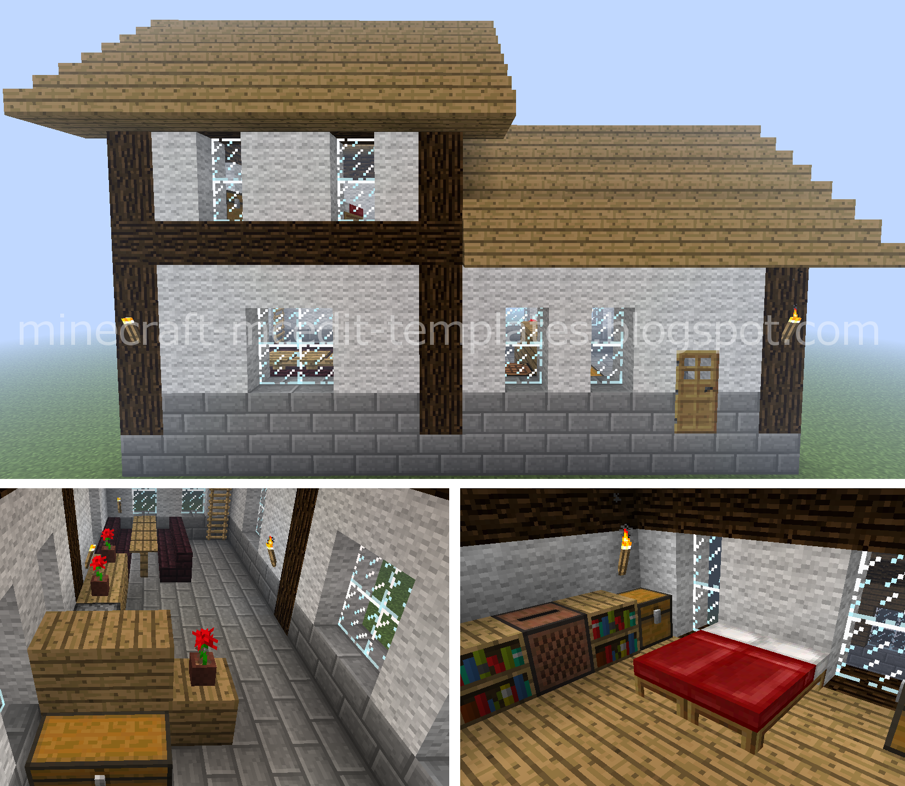
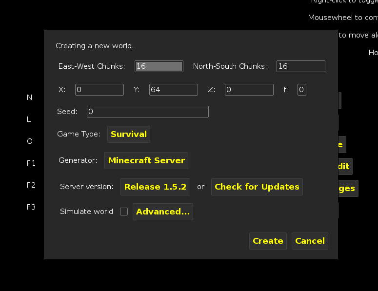
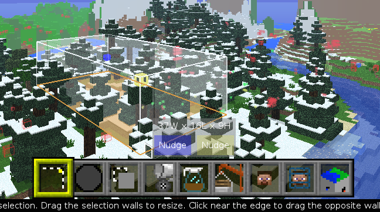
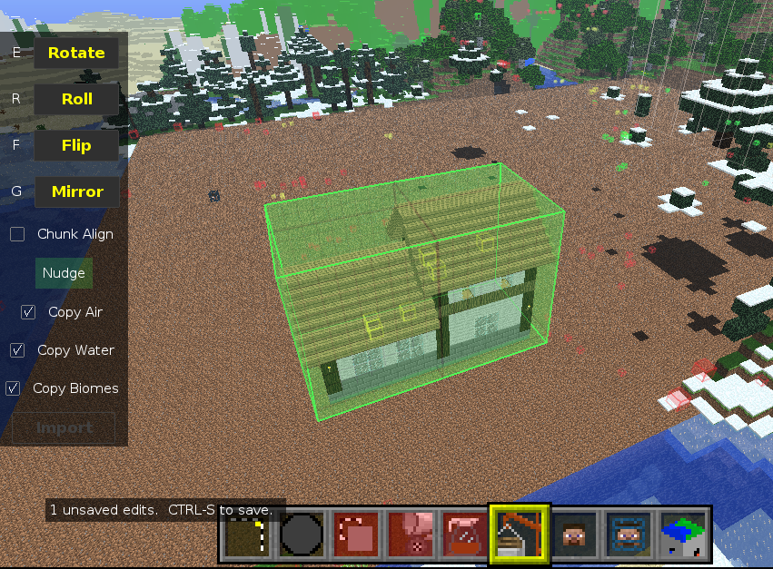
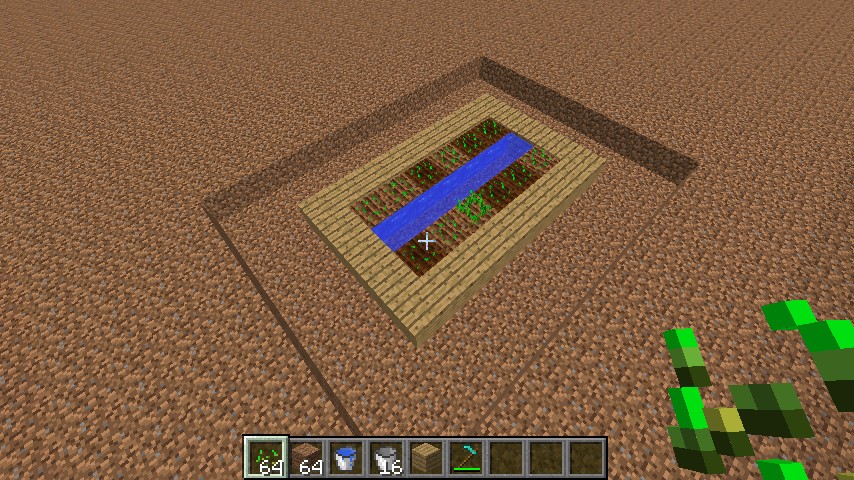
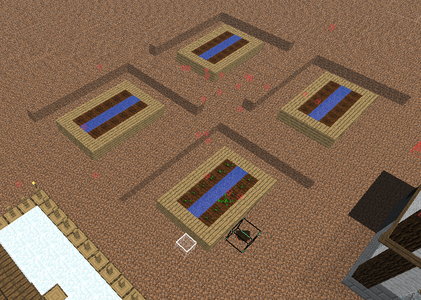

# Section 5: Minecraft Tools

## Adventure Maps

> Adventure mode is a game mode intended for player-created maps by limiting some of the gameplay in Minecraft, in which the player cannot directly destroy most blocks to avoid spoiling adventure maps or griefing servers. Most blocks cannot be destroyed without the proper tools. However, players can still interact with mobs and craft items. [link](http://minecraft.gamepedia.com/Adventure)

Notch, in 2010:

> "But why", some people ask, "are you making Minecraft programmable?". The reason is, adventure mode!

> I foresee a future where people can design “challenge maps” in creative or survival mode, then share them with people so that they can try to beat them in Adventure mode. Being able to create interesting puzzles or trigger events requires some more advanced programming than the sand and water based stuff we’ve seen so far, yet still I don’t want to introduce real programming into the world. [link](http://notch.tumblr.com/post/779956568/the-rationale-for-redstone)

This section's activities involve mostly just playing adventure maps. But as you play, solving the puzzles of the maps, consider how you might have built them differently, what's fun and challenging about them or what's simply tedious and boring.

The first map is relatively easy and can be played through in one sitting. It's called "D&D's Adventure Map" and was built for twin daughters, Delaney and Delilah. As a single player playing the map, you can snag both of their starting items, although you probably won't need them all (or maybe you should leave some should you perish and respawn).

> The concept of the map is to find the diamonds hidden in the world in various locations and to obtain extra diamonds by defeating "boss dungeons" and solving the riddles in every dungeon. You "level up" as you play by obtaining better gear which allows you to do the harder dungeons. [link](http://www.minecraftforum.net/topic/1775721-childrens-adventure-map/)

* Play "D&D's Adventure Map"

After you're done with "D&D's" map, try one of the other maps provided. If you don't like the first one you pick, choose a different one. They vary in plot, types of challenges, difficulty, etc.

Maps provided:

* "Teramia 0.9.1 Beta" is an open-ended map with no clear path or plot. By changing the dynamics of vanilla Minecraft only slightly, the map can still change what skills and problem-solving strategies are of most value.
* "The Evil Doctor's Castle" is a classic escape-style map. Quickly determining the way through each "level" is of the most importance with this map, but it does have a very clear path to success!
* "Jungle Stream" is a classic story/puzzle/parkour map in the style of the Indiana Jones series.*

## Importing Schematics Using MCEdit

Schematics and tools that support them, like MCEdit, can be very helpful in getting started creating more interesting worlds for any game type.

Let's create a very small village using a few schematics.

> A good resource for Minecraft schematics is [http://www.minecraft-schematics.com/](minecraft-schematics.com). These schematics came from there.




Open MCEdit and create a new world by creating "Create New World". Keep it creative for now. We'll likely need to make adjustments from within Minecraft itself. Check the box to simulate the world. Save the world with a name you'll remember.



You'll end up back at the same opening screen. This time click "Load World" and choose the world you just created. You'll be dropped at the spawn point for the world. The inital view inside MCEdit can be very confusing and disorienting. There are a few extra controls you'll need to get used to in comparison to normal Minecraft. And there are inherit difficulties in manipulating a 3D world on a 2D screen. But it's all part of the fun. The good news is MCEdit puts instructions right in the interface.

Of course your world will look different depending on what biome you spawned in. Regardless, we need to create some flat space in which to build our village. Tap ```Q``` a few times to move up, then ```S``` a few times to move back. This way you'll be looking down towards the spawn point. Use the mouse to select some space to clear. Don't worry about selecting exactly the right area. We'll adjust it. In fact it is really difficult to select just the area you want to at first. You must select some portion of it, then release the mouse button and make adjustments by clicking and dragging the sides of the 3D selection that you first drew.


Now use ```Q W E A S D Z``` to orient yourself around your selection and the mouse pointer to see how you can select edges of the 3D selection. When you have the hang of it, click and drag an edge to refine your selection.



When you think you have a decent area select, click "Delete Blocks" to clear the area. This might take some trial-and-error. You might also want to save the world and go into Minecraft to do some detail repair work.

To save the world click the MCEdit button in the top left of the window and then choose "Save".

Click "Deselect".

Click "Import" from the bottom menu (the one that looks like a hotbar). Navigate to the directory containing the schematics and select one of them to import.

Place the structure where you want it.

Uncheck "Copy Biomes".

Click "Import".

Click "Deselect" to release the building.



Repeat for the other two structures provided.


Save your village with ```control + S```

Quit MCEdit, open Minecraft and test out your new creations!

> It is very important to have only MCEdit *or* Minecraft open at any given time. You will lose work if you try to have a world open in both applications.

## Creating Schematics

While you are in your creative Minecraft world, whip up a quick farm.



Open back up MCEdit and load your world.

Select your farm and click Export.


Name your schematic and save it. Then click Deselect.

Now import your schematic and create multiple farms (or one big farm) by placing your new schematic throughout your world.



Everything might not be perfect in MCEdit (as you can see in the image above). That's ok, you can go make cosmetic touch ups from inside Minecraft itself.

Now you can try to create schematics from other worlds and import them into your world.

## Building Your Own Map

Continue using the techniques you just learned to flesh out your map. Leave goodies for players to find, particular challenges for them to complete, etc. Once you've completed your map, trade with a friend or neighbor (ask your instructor for help with this step).

## Skin Design

This section is pretty straightforward thanks to the great tools at [Miners Need Cool Shoes](http://www.needcoolshoes.com/). Go to needcoolshoes.com and import your skin or go to the gallery and pick a new one to tweak. Then edit that skin using their editing tools! You can download the png file or change your skin right from the site. You can even combine skins by loading multiple skins as layers in the editing tool.

## Server time!

We will now spend some time getting familiar with the Sequences server, our whitelisted camp server for Minecraft U campers. Your instructors will go over the rules, which are also in the next section, and help you get on the server and get established there.
