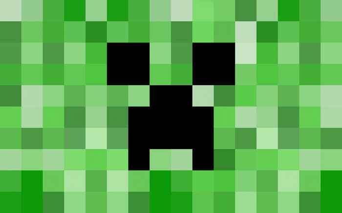

## Minecraft U Sequence 1b: Basic Problem Solving in Gaming

Learn the basics of survival in the Minecraft world, from fending off starvation to defending against skeletons. Solve these problems and more in a fun environment, with help from our instructors. Overcome the challenges that Minecraft has to offer, and have fun doing it. Improve building skills with creative tips and tricks.

###Table of Contents

Section 1: First House and Tools  
Section 2: Farming and Ranching  
Section 3: Mining  
Section 4: Enchanting and Minecarts  
Section 5: Adventure Maps and Nether Portals  

###Maps required

These all work with the latest vanilla Minecraft version (as of June 7, 2015)

* "New to Minecraft" -- Play this map before starting the curriculum if you need familiarization with the basic Minecraft game mechanics, such as moving with the WASD keys, jumping, breaking blocks and crafting items.
* "Arctic" map by ICrafting
* "Enchanting Map"
* "D&D's Adventure Map"

Optional maps:

* "Teramia 0.9.1 Beta"
* "Jungle Stream"
