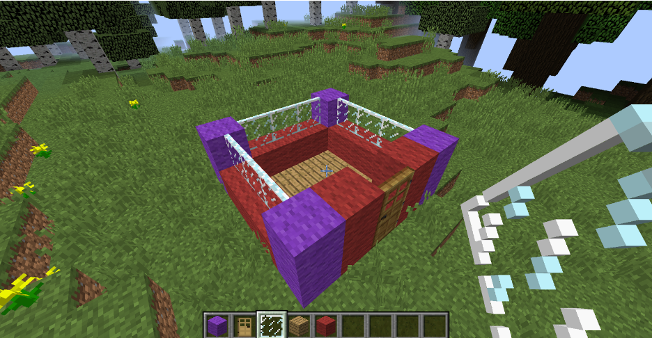
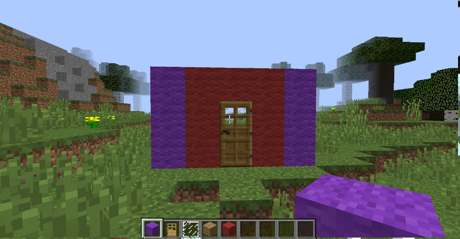
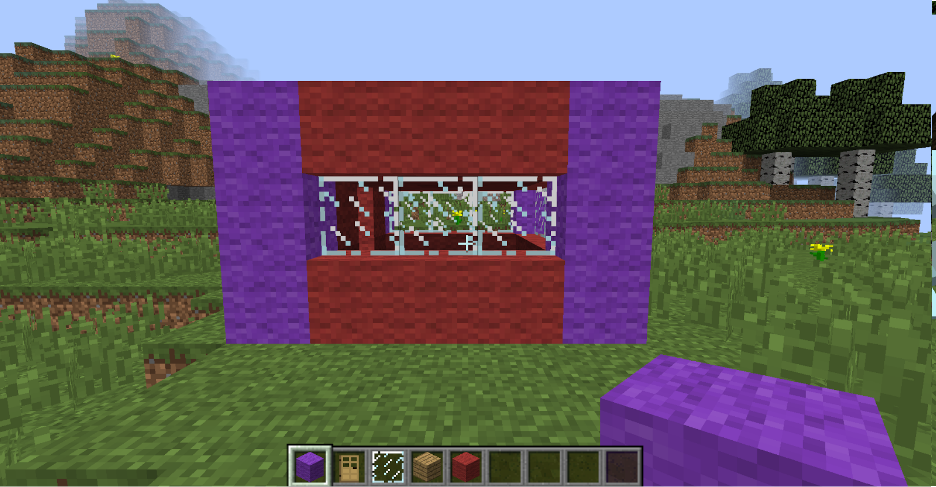

# Section 1: House Building

Welcome to the housebuilding section of sequence 1B! When you first enter the game, you are stranded in a mysterious land. To make sure you survive, you need to first make a house. Your house will be shaped like a cube, with a door for an entrance, a roof, glass panes, and different kinds of blocks. Be sure to place torches somewhere in the house, to keep monsters from spawning in your house!
	In order to get the materials to build your house, press ‘e’ on your keyboard, and this will open the creative menu. You can go through the tabs at the top and look for what blocks and items you want, or you can click on the compass in the corner of the menu and type in what you want. From there you will want to get:
Two different blocks:
One block will be the corners of your house (for example, Stone Bricks)  
The Second block will be what the rest of your house will be made of (for example, Wood Planks)
Doors
Glass Panes
Torches
	Now that you have all your materials, it’s time to begin construction.
First let’s place the cornerstones of your new place, make four columns of your first block.
Next, connect the four columns with your second block, building up the walls from there.
Finally, add a door and glass panes in the middle of the house so you can see outside.

Example house before roof is added:

Completed house screenshots:

When you have finished your house, you don't have to stop there! Expand your house by making the walls go out further, adding more floors, and adding more things like bedding and a furnace.

If you are happy with how your house turned out, try challenging your neighbor with a TNT cannon competition! Ask your Instructor for help.
