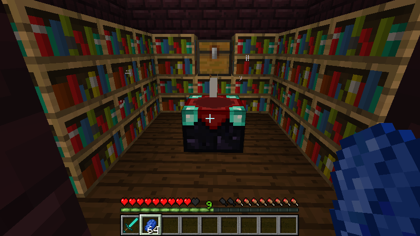
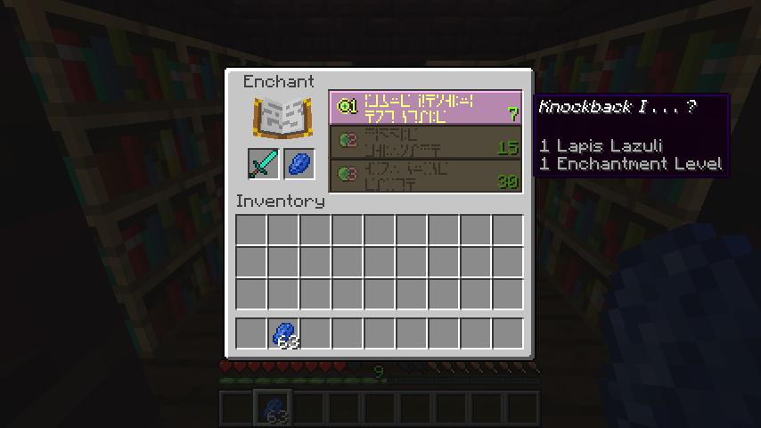

<!--BREAK-->

# Section 4: More Advanced Survival Techniques

## Enchanting

> Enchanting is a mechanic that augments armor, tools, weapons and books with one or more of a variety of enchantments that improve an item's existing abilities or imbue them with additional abilities and uses.

Enchanting is a very important technique in Minecraft. Enchanted tools, armor and weapons make success in your Minecraft adventures much more likely, and are more fun to use as well.

To enchant an item, right-click on an enchanting table and place the item and 1–3 lapis lazuli in the input slots. Options will display on the right hand side of the enchanting display.

To get the maximum enchants, surround the enchanting table with bookshelves. To get to the highest level of enchanting (level 30), you will need 15 bookshelves placed within a 5×5 square centered at the table or the block above. No other blocks can be placed in between the table and the bookshelves.

Tips:

* When first starting out, use only one experience level to enchant as many tools and armor pieces as possible. After that, use an anvil to combine enchantments. Later, do the opposite to try and get as many enchantments as possible on one tool/weapon, then  use an anvil again to combine when possible.
* When trying to get a specific enchantment on a tool/weapon that is already enchanted, use books.
* As you progress above level 16, each level requires more XP than the last. Try to enchant using a level as close to yours as possible to make the high XP cost worthwhile.
* Do not enchant anything weaker than iron as the lack of durability makes the cost not worthwhile.
* In 1.7 and later, an enchanted fishing rod can pay off. "Luck of the Sea" lowers chance of "junk" catches by 2.5% per level and increases chance of "treasure" catches by 1% per level. "Treasure" can include enchanted tools. "Lure" decreases wait time until a catch by 5 seconds per level but decreases chances of both "junk" and "treasure" catches by 1% per level, so be careful with that one if your goal is to catch treasure. ("Treasure" and "junk" catches are only available in version 1.7 and up.)
* Place 15 bookshelves around an enchantment table to get the highest level enchantments. If after establishing the 15 bookshelves you _do not_ want maximized enchantments, you can block their effect with torches.

### Anvils

An anvil can be used to combine the enchantments of two items. The items must be of the same type and material. There are two slots in the anvil, and the item in the second slot is sacrificed to improve the first.

The cost in levels depends on the enchantments. You can also repair and name items with the anvil. In survival mode, there is a limit of 39 levels for any work performed on the anvil.

### Enchanting Challenge

In the map provided, enchant a sword to either:

* Two enchantments, one at level 2 or better.

**or**

* One enchantment, level 3 or better.

Extra credit for enchanting a chest plate as well.

The bottle of enchantment provided is only going to get you so far. You'll have to go get some bad guys for the rest of the XP required (there are plenty of slimes around during the day for this purpose). There are three strategies you can use to achieve the challenge:

* Enchant two swords and combine.
* Enchant books and use the anvil.
* Just go for it with the maximum possible enchant (you'll need to go get some additional XP first).

There is a fair amount of luck involved, and no one strategy is necessarily better than another. After everyone has completed the challenge, compare notes.

## Minecarts and railway construction

As you expand your living area, you may find that traveling between areas taking up a lot of your time. Running and walking aren't particularly fast, but minecarts can make traveling significantly faster and safer.

After placing down some track, you can place a minecart on top and right-click to enter. Once you're in the cart, pressing W will start moving you forward. Pressing the left SHIFT key will make you dismount the minecart though it will keep going. The wooden block at the end of this track stops the minecart before it goes too far.

You can use powered rails to keep the minecart going on long tracks, similar to redstone repeaters. They must be powered with redstone to provide any power to the minecart.

By using blocks to create tilted rails, we can make handy locations for starting minecarts without having to move manually.

Redstone can also be used to make junctions where you can select which direction the cart will take you. Three-way intersections will flip back and forth as power is supplied or cut off.

We can also make a two-way minecart station where our minecart will stop until we tell it to continue.

Dig out a 3x1 trench. Put a detector rail in the middle, and two powered rails on either side (powered rails act as brakes when unpowered).

Extend the rails outward to connect to your normal railways. Place two blocks with buttons on them on top of the blocks adjacent to the powered rail segments. When you press the button, the powered rail below it should light up.

When you are on the railway, you will stop right next to one of the buttons. Press the button to power the rail underneath you, pushing you forward. The detector rail will then power the rail on the other side, pushing you along on your journey.

Your assignment is to make a minecart rail that connects three different locations: a house, a farm, and a cave entrance. Make a start-stop point at each of the destinations. Create a stop that allows you to choose your destination (see screenshot below). The map for this exercise is called "Railroad".

