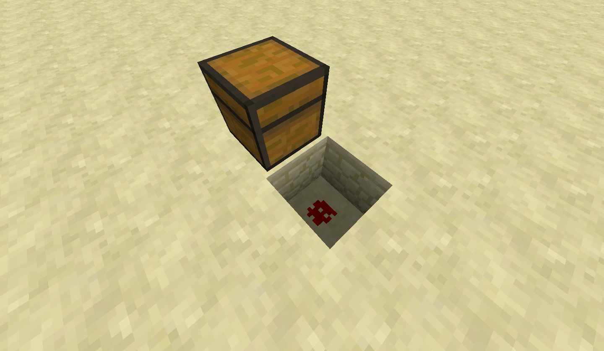
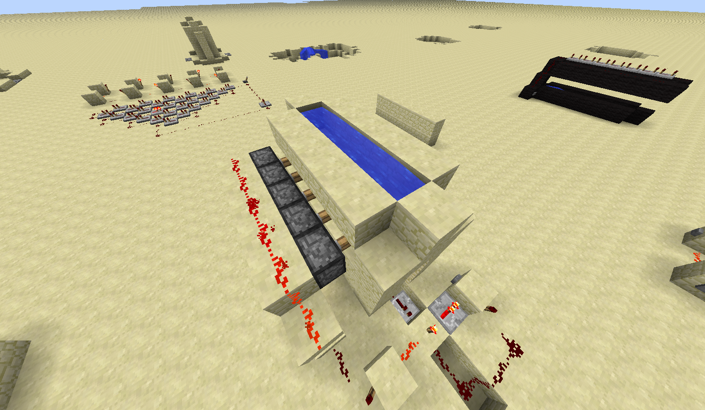

## Traps: Design and Execution

There are a few key features that every good trap must have. They must avoid suspicion and lure in victims with chests or rare items. They should have an entertaining or unique mechanism, since in the end all Minecraft traps are purely for entertainment. A trap has three main parts: the trap mechanism, the trigger, and the bait.

1. The first thing to consider when making a trap is the trap mechanism itself. How will you ensnare the player who has been snooping around your house? Obsidian can make for very strong traps as it requires diamond (and lots of time) to break; if the trapped player doesn't have a way to break obsidian, they're basically stuck! Water and lava traps can slow and even kill a player, but are significantly harder to conceal. For our trap we will be using stone and water. Stone is easier to obtain than obsidian but is still somewhat difficult to break, especially when the player is under the water we will be dropping on their head!

1. Triggers can take many forms. Tripwires and pressure plates are the most obvious, and you can place them in various ways to avoid detection (for example, only putting wood pressure plates on wood of matching color). However, buttons and levers can also be used. You can make it appear as if a button opens a specific door, when in reality it activates the trap. Levers can be used for dual purposes. For example, you may have 3 levers that act as a combination lock for a door. One combination will open the door, while incorrect combinations will trigger a trap for the trespasser. Our trap will use a trap chest as the trigger.

1. A trap chest filled with valuables is serving as the bait for this trap. However, interesting rooms, rare blocks, and even mine entrances can be used as the bait. As long as the object has something that a player would desire, it can serve as bait for a trap. Protective traps don't really have true "bait" as the trap is not supposed to be luring players in; rather, the item they are protecting is the bait in some sense. Our bait is the valuable items we will be placing inside of our trap chest.

Now that you've learned about the basics of traps, we're going to build an example trap using a trap chest, water, and pistons.

## Trap Chests

Trap chests emit a redstone signal whose power is based on the number of people who are opening the chest. We can use this redstone signal to spring a trap designed for people opening the chest. It will open a flow of water when they open the chest, and it will not stop until a reset button has been pressed.

1. Place a trap chest somewhere. They're made out of a regular chest and a tripwire. Dig a whole behind the chest and place one patch of redstone dust.

1. Dig a second hole and place a redstone repeater. Since the redstone power is proportional to the number of people opening the chest, this trap will trigger if just one person opens the chest.

1. The wiring that will make the water gate open when the chest is opened. It's a bit tricky but further down there are additional pictures for you to follow.

1. This is the "one-way gate" that prevents the water from turning off even when the trap is closed. When the button on the left is pressed, the first torch is turned off and the second one turns on (since the first one is no longer disabling it). Now the second torch is disabling the first torch as its redstone leads into the block of the first one. Toggling the button (or chest in our case) will not alter the state of the switch.

Try to think of some other ideas for traps that could be fun or useful. If we have time left over, feel free to experiment and share ideas with each other.

## Automatic Farming

Farming isn't exactly difficult, and can be quite relaxing, but if you wanted to speed things up a bit there is a simple redstone contraption you can construct to automatically harvest your crops.

Water will flow 8 blocks, which is an important fact to know for many purposes. This farm will use water flowing downhill over the crops to automatically harvest them and drop them into hoppers, and then a central chest where you can pick up the foodstuffs.

Create a new creative world for this exercise.

First we'll set up the irrigation system for our farm by creating a canal down the center of our farming area. Both levels are eight blocks long, but the water starts at the second block so that it will flow off the end of the first level and down the second level.

Next cover the irrigation canal (using whatever block you want) and create the farm plots next to the canal:

Now create walls along the side of your plots. These will keep the water from flowing over the sides.

Now we'll place dispensers along the top of our farm. These will dispense the water that will harvest our crops and carry them down to the bottom of the farm.

To power the dispensers, you'll need redstone repeaters, redstone and a button, like so:

Place a bucket of water in each dispenser. The nice thing about this setup is the water buckets will remain full even after the dispenser dispenses the water. Plant crops of your choice. Here we've planted some carrots on the left and potatoes on the right:

Now we need to get the collection system in place. Place a chest at the bottom-center of your farm, directly in front of where the irrigation canal stops. Then place hoppers on either side of the chest. To do so take a hopper and then shift-click on the side of the chest to place the hopper. Do the same on the side of the hopper with another hopper. Now everything falling into these four hoppers will go into the chest in the center:

Now we have to wait for our crops to grow, but in creative we have a shortcut. Go ahead and take some bonemeal in your hand and right-click on your crops until they're fully grown.

To harvest, go press the button connected to the hoppers. The water will flow down over your crops, harvesting them and carrying them down to the hoppers.

When all the items have flowed down into the hoppers, press the button to stop the water flow, and replant!
