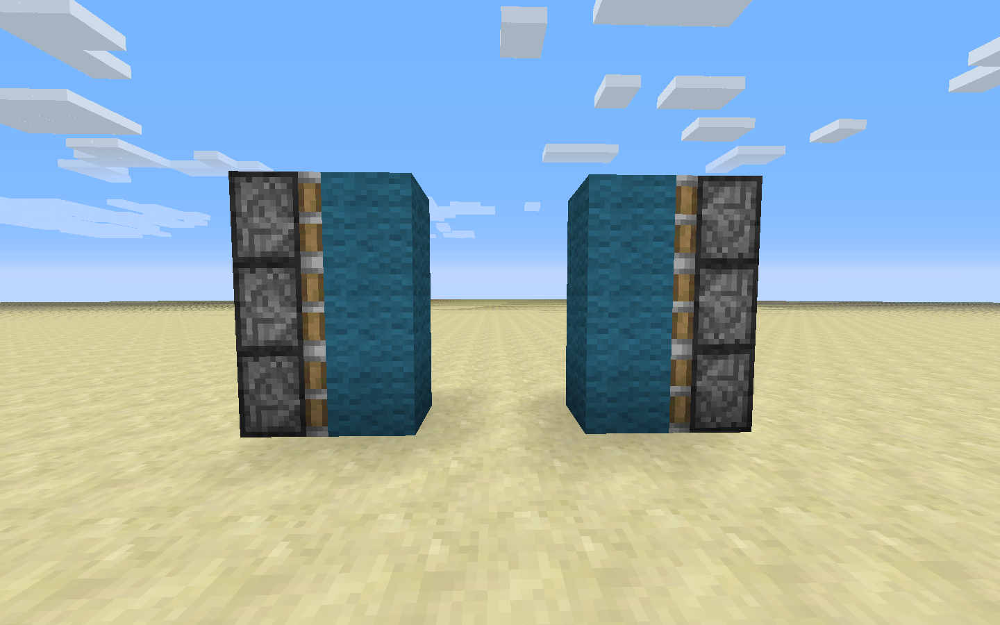
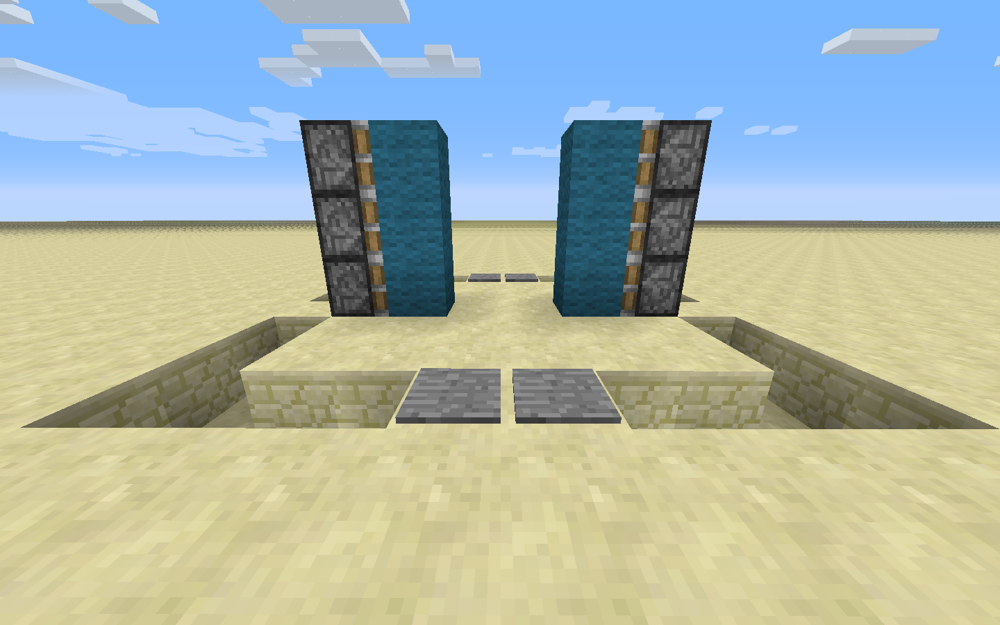
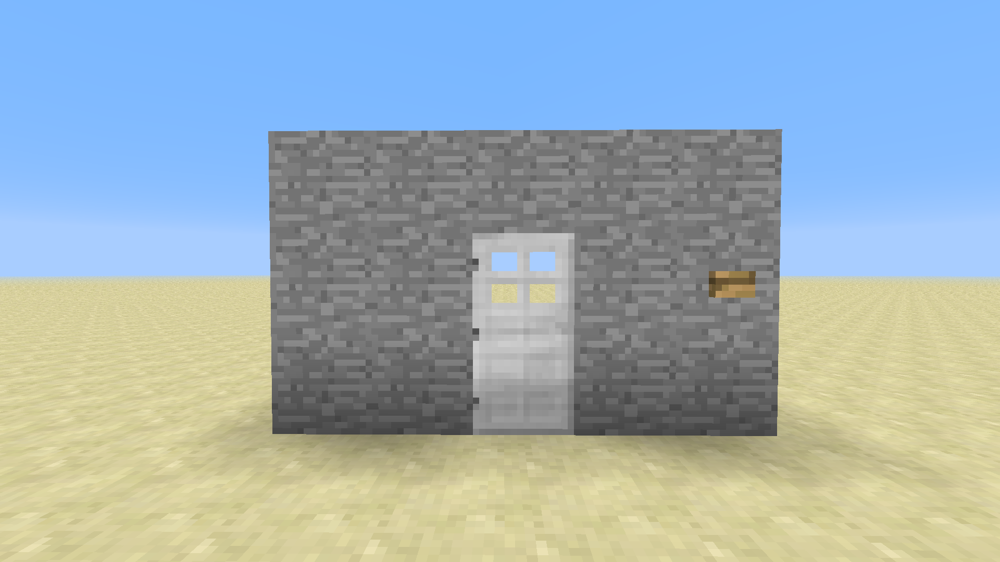
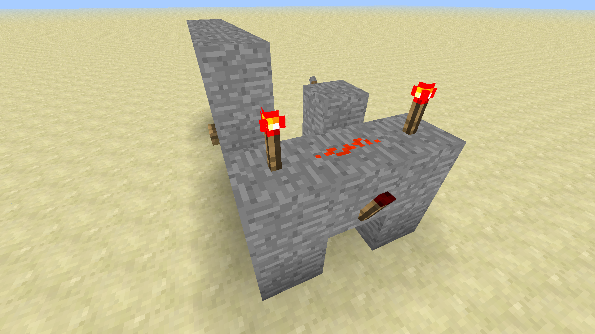

# Advanced Redstone

## Piston Doors

This section concerns making doors powered by pistons and redstone. Rather than using wood or iron doors, we'll be using pistons to make large doors using blocks. For this you will need redstone, redstone torches, and sticky pistons. Since sticky pistons can both push and pull blocks, they're ideal for making something like a door. The redstone circuit used is simple but still requires some space, which can be hidden inside a wall (especially since doors normally appear in walls!).

1. The door will be two blocks wide and three blocks tall. Place two columns of three sticky pistons facing each other with four empty air blocks between them. Then place your door blocks (lapiz, gold, etc) onto each of the sticky piston faces. When unpowered, there will be a two-block gap between the pieces of the door.

1. Dig a one block deep channel around the doors as shown in this picture. We will hide the redstone we're using to power the doors within this channel. Dig out two more blocks from the front of the door (consult the screenshot if you are confused).

Then put two ground blocks back in the middle (keeping the just-mined block underneath empty) and put two pressure plates on top of them.

1. Now run redstone from the very bottom space all the way around the bottom of the channel, with the ends pointing into the remaining sandstone block on either side.

1. Place a redstone torch on top of that remaining sandstone (the torch should be next to the bottom-most sticky piston).

Place a sandstone block on top of that torch and redstone dust on top of that sandstone block. Repeat this for the other side of the door.

1. Cover up the redstone using slabs, which give the best aesthetics. You can also cover up the side towers (pistons and all) with sandstone, wood, or other attractive patterns.

Ultimately, only the two-block space in the middle of the door is what shouldn't be covered. Our suggestion is to build this door as part of a wall where it looks best.

## Locked Doors

Sometimes you may want to prevent people from entering a door using a lock. By having a lever on the inside, you can prevent the door from being opened unless the lever is in a specific state.

1. Place a door and build a wall around the door. A button should be placed one block away from the door; its block cannot be touching the door or it will open the door every time.

1. The location of the lock lever inside the door.

1. Repeaters that carry the redstone signal from both the button and the lever. Be sure to place the layer of stone underneath them so they are powered by the button and lever.

1. An AND gate. The two inputs are the lever and the button, and the output goes to the door. The output will only be ON when both the button and lever are ON as well.

1. The redstone that carries the output of the AND gate to the block directly underneath the door. Now, the door will only open when the lever is set and the button is pressed.

## Traps: Design and Execution

There are a few key features that every good trap must have. They must avoid suspicion and lure in victims with chests or rare items. They should have an entertaining or unique mechanism, since in the end all Mincraft traps are purely for entertainment. A trap has three main parts: the trap mechanism, the trigger, and the bait.

1. The first thing to consider when making a trap is the trap mechanism itself. How will you ensnare the player who has been snooping around your house? Obsidian can make for very strong traps as it requires diamond (and lots of time) to break; if the trapped player doesn't have a way to break obsidian, they're basically stuck! Water and lava traps can slow and even kill a player, but are significantly harder to conceal. For our trap we will be using stone and water. Stone is easier to obtain than obsidian but is still somewhat difficult to break, especially when the player is under the water we will be dropping on their head!

1. Triggers can take many forms. Tripwires and pressure plates are the most obvious, and you can place them in various ways to avoid detection (for example, only putting wood pressure plates on wood of matching color). However, buttons and levers can also be used. You can make it appear as if a button opens a specific door, when in reality it activates the trap. Levers can be used for dual purposes. For example, you may have 3 levers that act as a combination lock for a door. One combination will open the door, while incorrect combinations will trigger a trap for the trespasser. Our trap will use a trap chest as the trigger.

1. A trap chest filled with valuables is serving as the bait for this trap. However, interesting rooms, rare blocks, and even mine entrances can be used as the bait. As long as the object has something that a player would desire, it can serve as bait for a trap. Protective traps don't really have true "bait" as the trap is not supposed to be luring players in; rather, the item they are protecting is the bait in some sense. Our bait is the valuable items we will be placing inside of our trap chest.

Now that you've learned about the basics of traps, we're going to build an example trap using a trap chest, water, and pistons.

## Trap Chests

Trap chests emit a redstone signal whose power is based on the number of people who are opening the chest. We can use this redstone signal to spring a trap designed for people opening the chest. It will open a flow of water when they open the chest, and it will not stop until a reset button has been pressed.

1. Place a trap chest somewhere. They're made out of a regular chest and a tripwire. Dig a whole behind the chest and place one patch of redstone dust.

1. Dig a second hole and place a redstone repeater. Since the redstone power is proportional to the number of people opening the chest, this trap will trigger if just one person opens the chest.

1. The wiring that will make the water gate open when the chest is opened. It's a bit tricky but further down there are additional pictures for you to follow.

1. This is the "one-way gate" that prevents the water from turning off even when the trap is closed. When the button on the left is pressed, the first torch is turned off and the second one turns on (since the first one is no longer disabling it). Now the second torch is disabling the first torch as its redstone leads into the block of the first one. Toggling the button (or chest in our case) will not alter the state of the switch.

Try to think of some other ideas for traps that could be fun or useful. If we have time left over, feel free to experiment and share ideas with each other.
