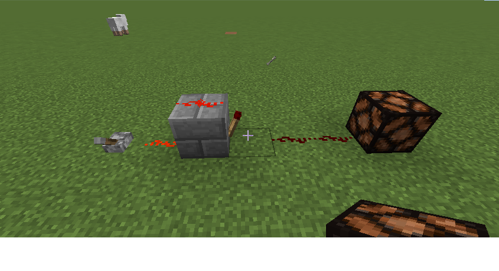
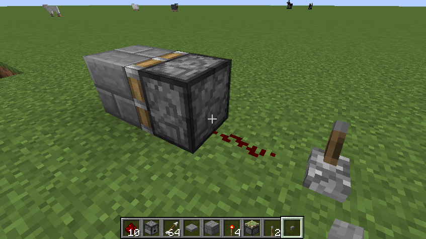
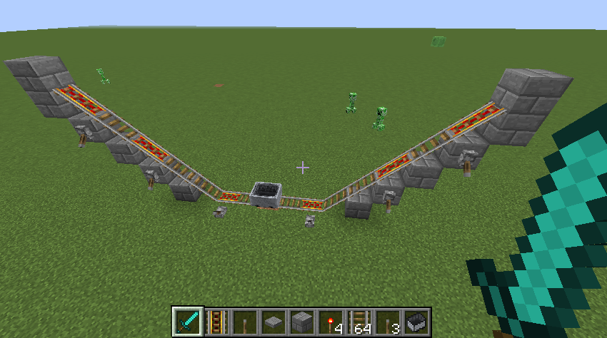

# Section 1: Redstone Basics

Redstone in Minecraft is a bit like electricity in real life. A redstone source transmits power through redstone dust (or repeaters) and can be used to power other blocks. For example, a lever in the ON position can be used to power a redstone lamp if at least two redstone dusts are placed between the two. THe two
  

Redstone dust (also called redstone wire) can also bridge over individual blocks and still transmit power (also called redstone current).
  

A lever placed directly onto a block powers the block itself, and redstone wire can carry current from the block to a lamp.
  

Redstone torches are a permanent source of redstone power; they are always ON and will always power adjacent redstone wire.
  

A redstone torch can be placed on the side of a block, too. Any adjacent redstone dust will also be powered.
  

Redstone current dies out after 15 blocks of redstone dust. Placing a repeater (which _repeats_ the signal) will let a power source reach blocks even further away.
  

To move current upward, you must make stairs and connect the redstone dust going upward.
  

Now that you've seen some of the basics of redstone, experiment more with interactions between redstone and blocks. For example, you could try placing repeaters next to blocks and see how the current behaves.

Redstone torches are “turned off” when the block attached to it is turned on. In the setup below, when the lever is switched on, the redstone power travels to the stone block that the redstone torch is attached to. Because the block the redstone torch is attached to is now powered, the torch is turned off.

  

###Redstone can also be used to power devices such as the ones shown below:  
* Dispenser powered by button. Dispenser may be filled with any material (e.g. Arrows, diamond, etc).

  

* Sticky piston powered by lever.

  

* Door powered by pressure plate.

* Powered rails powered by levers.

  

You can also combine these elements to make more complex contraptions.

