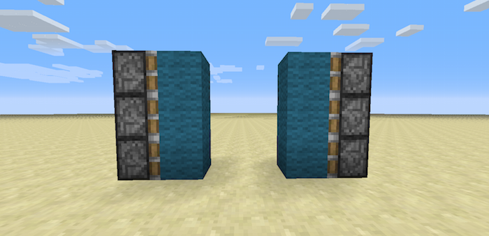
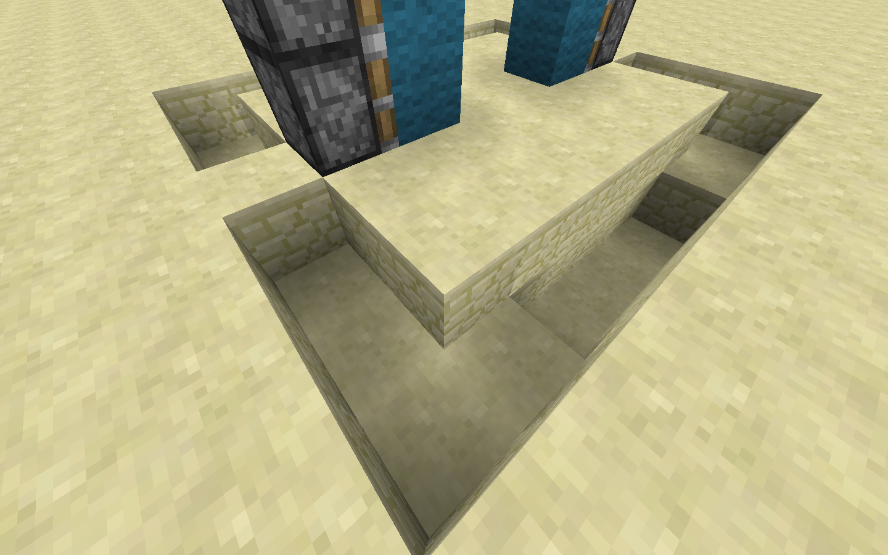
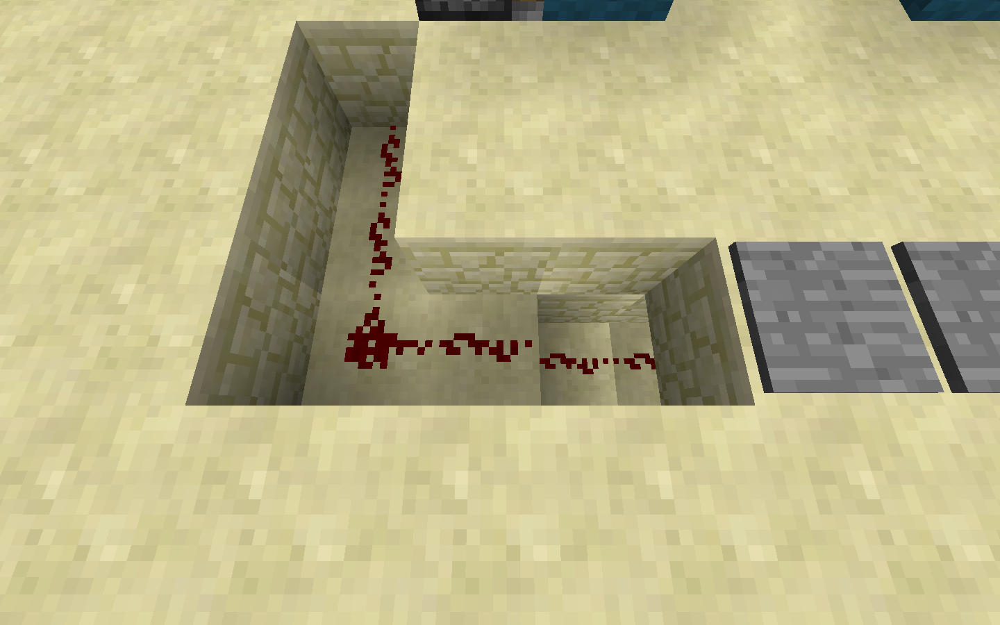
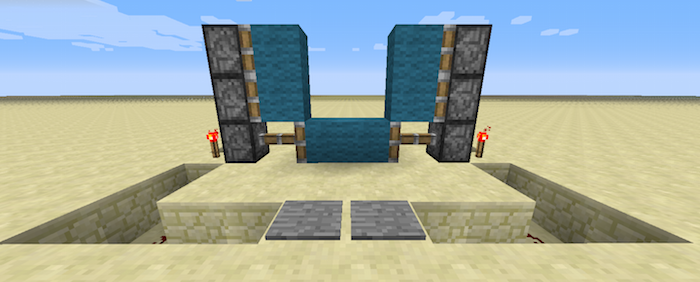
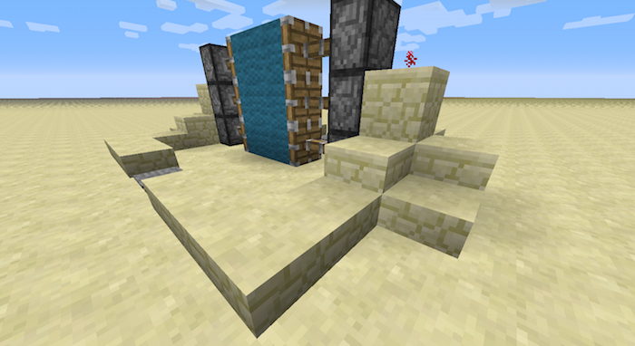
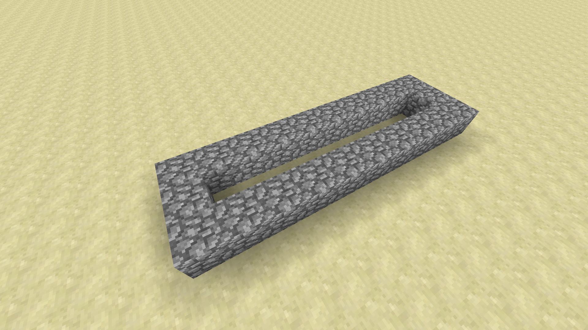
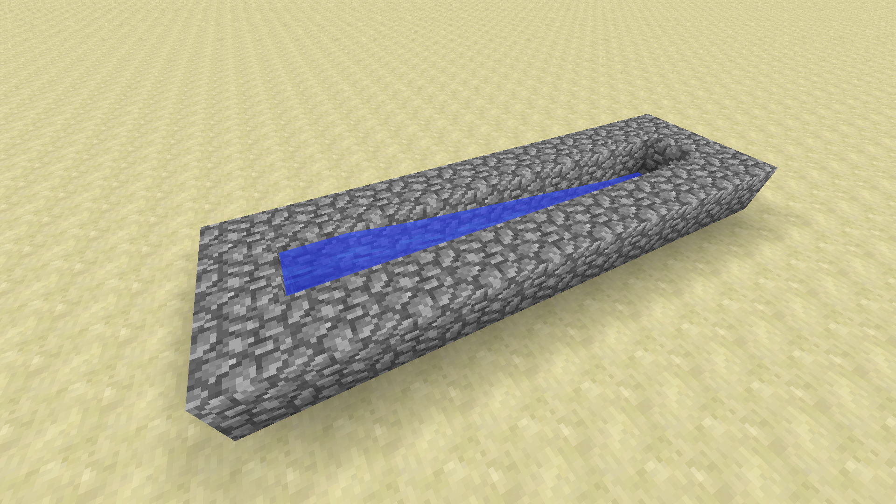
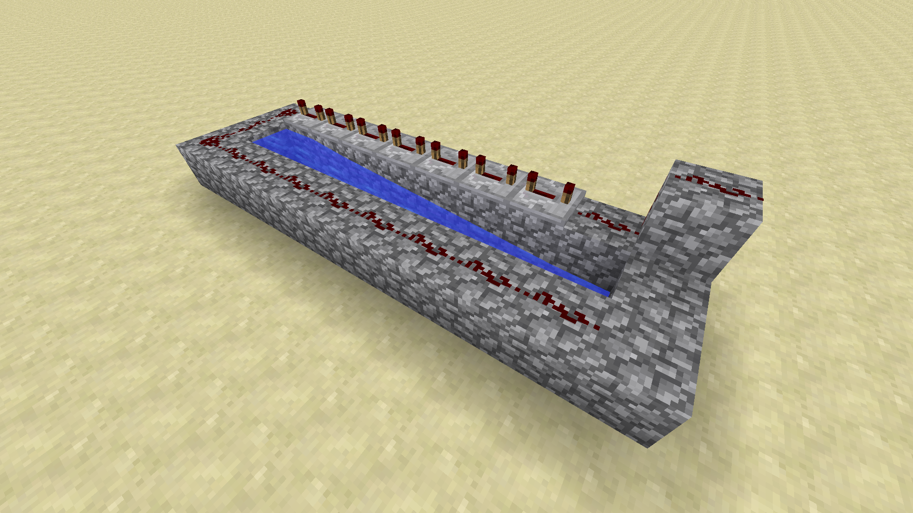
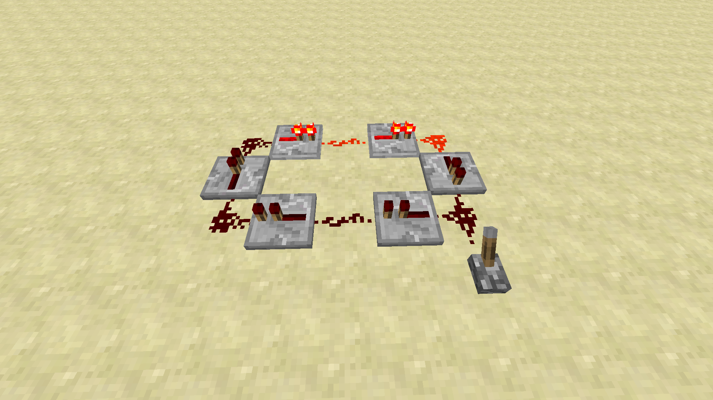
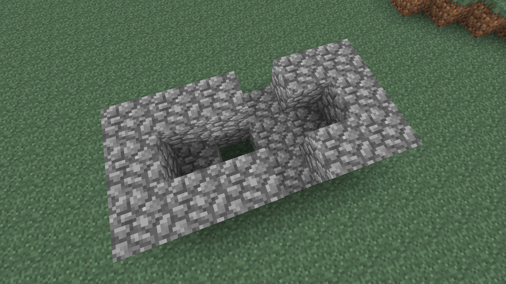

# Section 2: Applications of Redstone Basics

## Piston Doors

This section concerns making doors powered by pistons and redstone. Rather than using wood or iron doors, we'll be using pistons to make large doors using blocks. For this you will need redstone, redstone torches, and sticky pistons. Since sticky pistons can both push and pull blocks, they're ideal for making something like a door. The redstone circuit used is simple but still requires some space, which can be hidden inside a wall (especially since doors normally appear in walls!).

1. The door will be two blocks wide and three blocks tall. Place two columns of three sticky pistons facing each other with four empty air blocks between them. Then place your door blocks (lapiz, gold, etc) onto each of the sticky piston faces. When unpowered, there will be a two-block gap between the pieces of the door. 

1. Dig a one block deep channel around the doors as shown in this picture. We will hide the redstone we're using to power the doors within this channel. Dig out two more blocks from the front of the door (consult the screenshot if you are confused).  
  

1. Then put two ground blocks back in the middle (keeping the just-mined block underneath empty) and put two pressure plates on top of them.  

1. Now run redstone from the very bottom space all the way around the bottom of the channel, with the ends pointing into the remaining sandstone block on either side.

1. Place a redstone torch on top of that remaining sandstone (the torch should be next to the bottom-most sticky piston).

Place a sandstone block on top of that torch and redstone dust on top of that sandstone block. Repeat this for the other side of the door.

1. Cover up the redstone using slabs, which give the best aesthetics. You can also cover up the side towers (pistons and all) with sandstone, wood, or other attractive patterns.

Ultimately, only the two-block space in the middle of the door is what shouldn't be covered. Our suggestion is to build this door as part of a wall where it looks best.

# Cannons

By exploiting some of the physics of Minecraft, we can make cannons that fire TNT! As you've probably seen, explosions normally destroy blocks and throw items. Explosions in water, however, will not destroy blocks but will still affect items. Lit TNT is one item that can be thrown, and so we can use TNT and water to shoot a lit TNT block out of our cannon. We will be using redstone to ignite our TNT.

1. Set up the body of the cannon. Cobblestone is what we will be using, though most normal building blocks will work.

1. Fill the body with water, which will protect the body of the cannon from the blast.

1. Place our redstone and repeaters as well as a button to trigger them. The trail of redstone will ignite our propellant TNT. The repeaters will ensure that the projectile TNT is lit right before it fires.

1. To fire the cannon, we will fill the body with TNT. Be sure not to accidentally place TNT over the source block of water. Then, place the projectile on the very end.

1. Press the button to fire!

We know that we're limited to using TNT seven blocks away from whatever we want to fire. How could we increase our firing power with this limitation? Come up with some ideas and designs and test them out. Also, experiment with the height of the projectile TNT. How does placing it onto a slab change the distance shot?

# Redstone Clocks

Interestingly enough, you can use redstone to make simple clocks in Minecraft. Redstone signals do not travel instantaneously. Instead, they update based on the timing of "ticks". A "tick" is one update in the world of Minecraft; for redstone, ten ticks occur per second. Generally torches, repeaters, and other blocks take one tick to update. Repeaters are unique in that they can be set to a specific number of ticks; the "setting" on a repeater (moving the torch back and forth along it) changes it to 1, 2, 3, or 4 ticks. So repeaters can be used to make clocks that pulse at a regular rate.

You can make more complicated clocks by using a simple mathematical principle and something called a logic gate. Let's say we wanted to make a 30-tick clock, which would pulse every 3 seconds. To use our above design we'd need 8 total repeaters (7 of 4 ticks and 1 of 2 ticks). However, we can actually get away with using just 4 repeaters. To do this, we're going to make two separate blocks of length 5 and 6. Individually, these clocks only require two repeaters each.

Now, think of the tick numbers that these clocks will pulse on. The first one will pulse at 5, 10, 15, 20, 25, and 30. The second one will pulse at 6, 12, 18, 24, and 30. Both of them will pulse at 30! Since 5 and 6 are both factors of 30, the two clocks will always pulse on multiples of 30. Thirty is the least common multiple (LCM) of the two numbers, and we can use the LCM to make clocks out of far fewer repeaters than with our simple design.

Next, we will use a logic gate called an AND gate. Basically, it's a series of blocks that takes two redstone inputs. The output will only be ON if the two inputs are both ON. Otherwise, they'll be off. If we AND the two outputs of our 5 and 6 clocks, the output of that AND will pulse only every 30 ticks, or 3 seconds.

Redstone clocks have any number of uses. They can be used to make dispensers output something every set period of time, timers for playing games, or activate pistons for making cobblestone generators. Try to think of some productive uses for redstone clocks and implement them yourself!

# Cobblestone Generator

A cobblestone generator is both less costly and more useful than a TNT cannon. Cobblestone is created when flowing water and lava combine and is a valuable resource, especially on resource-light worlds. By controlling the flow of water and lava and utilizing a piston circuit, we can create a contraption that automatically builds cobblestone for us to harvest.

1. Build the body of the generator. Be sure to include the hole in the middle, as without the hole water would flow over the lava source block and turn it into obsidian.

1. Place the water and lava source blocks from a bucket. Notice how cobblestone is formed in the middle!

1. Place the piston that will push out the cobblestone blocks.

1. Create the redstone circuit that will cause the piston to automatically extend and then retract. We'll be talking about redstone clocks later in the lesson, but this one is simple enough that we can make use of it right now.

1. Quickly flip the lever on and off to start the generator. Pistons will push up to 12 blocks before stopping, but if you keep mining out the cobblestone column this generator will run forever.

