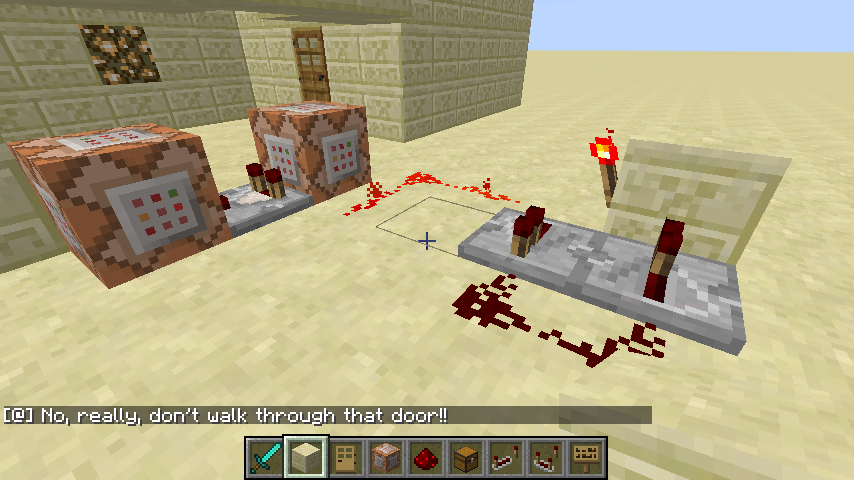
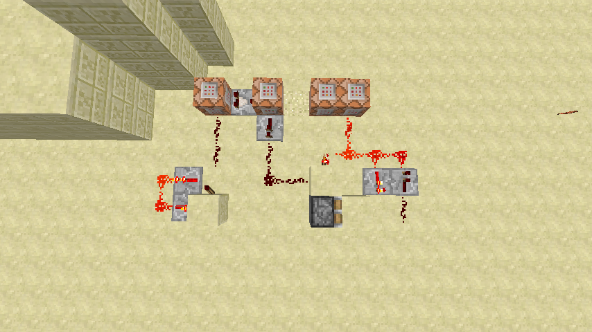

# Command Blocks

> A command block is a redstone component that can execute commands when activated. It cannot be obtained legitimately in survival mode, and is primarily used on multiplayer servers and in custom maps.

## Practicing the basic commands available to command blocks

Create a new creative world.

To obtain a command block type the command ```/give <playername> command_block```.

Place the command block and right-click it. Now do the /give command again. This will give the nearest player an iron pickaxe, for example:

```/give @p 257```

Click "done" and then put a button on the command block by holding the button and shift clicking on the command block. Then activate the command block by right-clicking the button.

## Command block reference

Some of the other more useful commands for use in command blocks are:

* ```say```, ```tell```, ```msg``` and ```w``` (whisper) to communicate messages to a player(s).
  ```tell <player> <message>```
* ```clear <player> [item] [data] [maxCount] [dataTag]``` clears a players inventory, or just the items specified in the arguments
* ```effect <player> <effect> [seconds] [amplifier] [hideParticles]``` gives the targeted player or entity the specified effect for the specified time (default is 30 seconds). There is also ```effect <player> clear```
* ```gamemode <mode> [player]```
* ```playsound <sound> <player> [x] [y] [z] [volume] [pitch] [minimumVolume]```
* ```setblock <x> <y> <z> <TileName> [dataValue]```
* ```summon <EntityName> [x] [y] [z]```
* ```testfor <player> [dataTag]```
* ```time set <value>```
* ```toggledownfall```
* ```tp [target player] <destination player>``` or ```tp [target player] <x> <y> <z>```
* ```weather <clear|rain|thunder> [duration in seconds]```
* ```xp <amount> [player]```

There are some additional new commands coming in the 1.8 release. We will update the electronic version of this book when that version is released.

## Communicating to a player with command blocks

This exercise is going to use command blocks to warn a player of impending doom. We've provided a map with the trap already set. Try it out, then observe how it works.

The first circuit involves a clock, a ```testfor``` block which then powers a ```say``` block when a player enters a specific radius:



The second circuit involves the same configuration as above, with the addition of a switched clock and two ```setblock``` blocks:



Change the messages the ```say``` command blocks output. Change the type of block that is dropped on the player (hint: there are only a few types of blocks that will fall, and two of them won't require the clock circuit). If you have time, recreate the trap. (If you don't, don't worry, we're going to create another trap later.)

The map for this exercise is called "It's a trap!".

## Moving a player around a map with command blocks

Let's take a look at how to build a simple security system for your house, using a command block and a pressure plate.

* First, place a pressure plate in front of your door.
* Make sure that the player will step on it when walking to the door.
* Now, place a command block under the pressure plate somewhere so that it will be powered when the plate is stepped on.
* Now go to the command block and enter ```/tp @p[r=<radius>,name=!<yourname>] <x> <y> <z>```

Breaking this command down we have ```/tp```, which is the command for teleporting players. Then we have the ```@p``` specifier, which says that this command block acts on players. The ```@p``` command takes arguments, ```r=``` for radius and ```name=``` for which players to teleport. Setting the radius is straightforward. Setting the name, however is a little interesting. Here, we use the ```!``` operation, which means ```NOT```. Just like in redstone, this inverts the output of a command. Right now, we're using it to make sure any player that is ```NOT``` you gets teleported, while you remain safe. The final part of the command is the location to teleport to, which you put in place of the ```<x> <y> <z>``` in the command.

## Giving a player items with command blocks

The ```/give``` command is one of the more versatile commands available for use in Command Blocks. In this section, we'll list a few good uses.

#### Public Lottery

```
/give @r
```

Add the ```@r``` specifier to the ```/give``` command to make the block give the player a random item. Be careful, since this can give items that are not otherwise available.

#### Starter Kits

```
/give @p[r=2 m=2] <item>
/gamemode 0 @p[r=2]
```

These two commands need to be activated in sequence. The first command only activates if the player is in gamemode 2. The second command changes the players mode to survival so that they can't activate the block a second time. These commands use the same ```@p``` specifier as the pervious commands.
