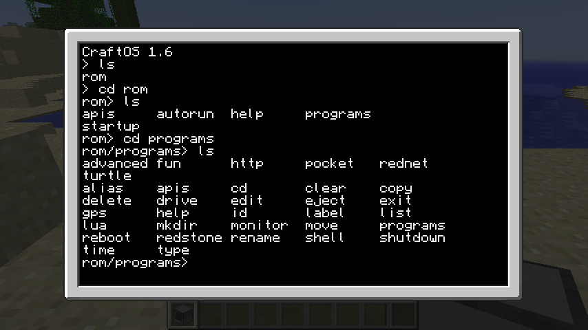
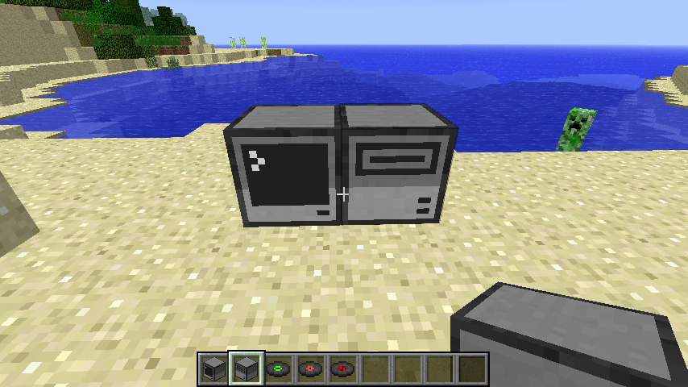
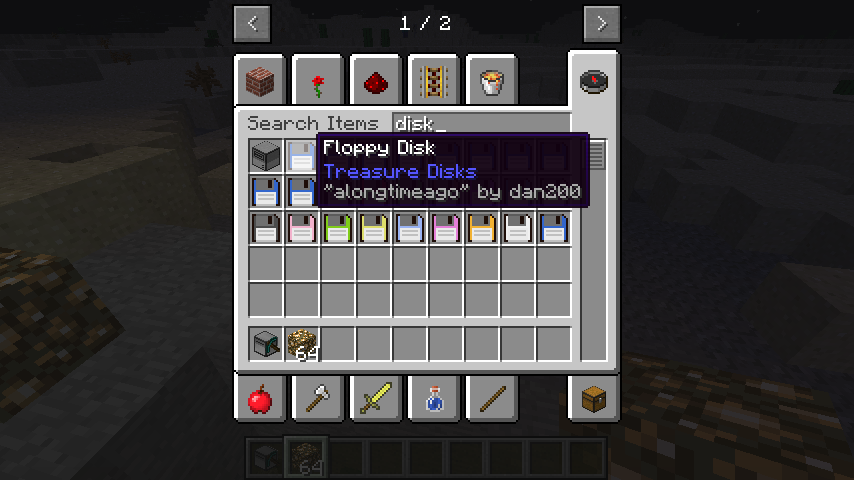
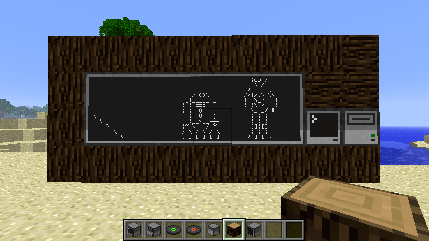

# ComputerCraft

## Introduction

> [ComputerCraft](http://www.computercraft.info/) is a modification for Minecraft that’s all about computer programming. It allows you to build in-game Computers and Turtles, and write programs for them using the Lua programming language. The addition of programming to Minecraft opens up a wide variety of new possibilities for automation and creativity. If you’ve never programmed before, it also serves as excellent way to learn a real world skill in a fun, familiar environment.

## Getting familiar with ComputerCraft

1. Open the ComputerCraft world
1. Open your inventory and search for ```computer```
1. Place a computer on the ground and right-click on it  
 
1. Navigate to programs
 1. the ```ls``` command lists the contents of the current directory
 1. the ```cd``` command changes directories, e.g. ```cd rom```  
 
1. Play text adventure Minecraft inside a ComputerCraft computer
  1. type ```adventure```
  1. some of the commands available in the Adventure program:
    1. ```punch```
    1. ```take``` or ```grab```
    1. ```craft``` or ```make```
    1. ```go```
    1. ```eat```
    1. ```inventory```  
      
    In case you haven't noticed by now, Adventure is really just text-based Minecraft. You're playing Minecraft on a computer inside Minecraft.  
1. Add disk drive
  1. Open your inventory and search for ```disk drive```
  1. Place the disk drive next to the computer  
  
1. Add a music disk to the disk drive
1. Play the music with the ```dj``` program
1. Create a monitor
  1. Open your inventory and search for ```monitor```
  1. Place 12 monitors in a 6 wide by 2 high pattern to create a giant widescreen monitor
  1. Place a computer next to the monitor
  1. Place a disk drive next to the computer
1. Watch a movie on the monitor
  1. Open your inventory and search for ```disk```
  1. Find a disk labeled ```alongtimeago``` and place it into the disk drive  
    
  1. Right click on the computer and run the ```alongtimeago``` program  
    1. To run a program on the disk, specify the full path to the program like this: ```disk/alongtimeago```  
    1. To run the program on the monitor, specify the monitor first, so this: ```monitor [top|bottom|left|right|front|back] disk/alongtimeago```
      The syntax ```[top|bottom|left|right|front|back]``` means pick which side your monitor is on and only type that direction, of those six shown. So you command would be something like ```monitor left disk/alongtimeago```.
  1. Sit back and enjoy the show  
  
  1. To quit any running program, hold down ```ctrl + r```

# Turtles

## Intro

Turtles are programmable robots that you can use to collect resources, clear terrain, and other such tasks.  They run an OS called turtleOS and the programs they run can be stored on internal memory or floppy disks.  There are farming, mining, crafting, and melee turtles.  They are categorized based on the Diamond tool* you equip them with.

*Note: Tools equipped to turtles will not wear out and turtles themselves are indestructible (unless you break them yourself).  This makes them one of the safest ways to utilize diamond tools, not to mention the time they will save you.

Like any robot, turtles recquire fuel.  They can get energy from anything that would work in a furnace as well as other more advanced options we'll get to later.  Different types of fuel will yield different _fuel counts_ which is the number of blocks the turtle can move with that amount of fuel.  For example, coal will give the turtle 80 fuel, so the turtle can now move 80 blocks.

1. Add some dancing turtles
  1. Open your inventory and search for ```turtle```
  1. Place a turtle or two on the ground
  1. Right-click on the turtle
  1. Run the ```dance``` program

## Make it move!

Turtles have several default programs including the "go" program.

1. Select a turtle and put a _coal_ in its inventory.
2. type ```refuel```
  1. Notice it says _Fuel level is 80_
3. type ```go forward 10``` and watch it go!
  1. type ```refuel``` and notice that the fuel level is now 70.
  2. Whenever there is no fuel source in the turtle's inventory, you can type ```refuel``` to check its fuel level.

The "go" program has the following format:
```go <direction> <distance>```

Note: For fast/mass refueling, type ```refuel all```
